# SitePilot AI — Software Architecture

**Your AI-powered Website Intelligence Platform.**

| | |
|---|---|
| **Document Type** | Software Architecture Specification (Master) |
| **Product** | SitePilot AI |
| **Document** | `ARCHITECTURE.md` |
| **Version** | 1.0.0 |
| **Status** | `Draft — Architecture Authority` |
| **Owner** | Platform Architecture |
| **Audience** | Architects, Backend, Frontend, DevOps, AI Engineers |
| **Last Updated** | 2026-07-12 |
| **Companion Docs** | [PRD.md](./PRD.md), [DOMAIN_MODEL.md](./DOMAIN_MODEL.md), [ENGINE_SPEC.md](./ENGINE_SPEC.md), [DATABASE_SPEC.md](./DATABASE_SPEC.md), [API_SPEC.md](./API_SPEC.md), [GRAPH_ARCHITECTURE_SPEC.md](./GRAPH_ARCHITECTURE_SPEC.md), [SECURITY.md](./SECURITY.md) |

> [!NOTE]
> This document is the **master technical architecture** for SitePilot AI. Domain meaning lives in DOMAIN_MODEL; engine algorithms in ENGINE_SPEC; schemas in DATABASE_SPEC / GRAPH_ARCHITECTURE_SPEC; HTTP contracts in API_SPEC. When those conflict with this overview, open an RFC — do not silently fork the design.

> [!WARNING]
> SitePilot AI is an **engine-orchestrated modular monolith** for MVP (API + workers in one deployable boundary, clear packages). Do not prematurely split into microservices until scale or team boundaries demand it.

---

## Table of Contents

1. [System Overview](#1-system-overview)
2. [Architecture Principles](#2-architecture-principles)
3. [High-Level Architecture](#3-high-level-architecture)
4. [Monorepo Structure](#4-monorepo-structure)
5. [Frontend Architecture](#5-frontend-architecture)
6. [Backend Architecture](#6-backend-architecture)
7. [Engine Architecture](#7-engine-architecture)
8. [Data Flow](#8-data-flow)
9. [Database Architecture](#9-database-architecture)
10. [External Integrations](#10-external-integrations)
11. [Deployment Architecture](#11-deployment-architecture)
12. [Security Architecture](#12-security-architecture)
13. [Observability](#13-observability)
14. [CI/CD](#14-cicd)
15. [Scalability](#15-scalability)
16. [Failure Recovery](#16-failure-recovery)
17. [Performance](#17-performance)
18. [Implementation Roadmap](#18-implementation-roadmap)
19. [Future Architecture](#19-future-architecture)
20. [Best Practices](#20-best-practices)

---

## 1. System Overview

### 1.1 Business Vision

SitePilot AI helps businesses understand **why** their websites underperform — not only **that** they underperform — by translating technical audit signals into prioritized, confidence-scored, business-framed recommendations and executive-ready reports.

### 1.2 Technical Vision

Deliver a production SaaS platform that:

1. Accepts a public Website URL  
2. Runs a pipeline of **independent Engines**  
3. Persists every Engine Result and Finding  
4. Gates AI behind Data Quality  
5. Assembles a single Report for Dashboard + PDF  
6. Evolves into continuous monitoring and graph-powered intelligence  

### 1.3 Architecture Goals

| Goal | Measure |
|---|---|
| Ship MVP audit loop fast | URL → Report ≤ 45s p95 |
| Preserve technical truth | Engines never invent Findings; AI explains only |
| Stay evolveable | Engine replaceability; versioned contracts |
| Multi-tenant ready | Org → Project → Website from day one |
| Operable | Logs, metrics, traces, health, backups |
| Cost-aware | Cache crawls/PSI; soft-fail expensive providers |

### 1.4 Quality Attributes

| Attribute | Target (initial) |
|---|---|
| **Performance** | p95 analysis ≤ 45s |
| **Availability** | API 99.5% monthly |
| **Reliability** | ≥ 99% successful audits for reachable sites |
| **Security** | SSRF-safe fetches; secrets in vault/env; least privilege |
| **Maintainability** | Clear bounded contexts; FSD frontend; engine packages |
| **Scalability** | Horizontal API/workers; Postgres + Redis; optional Neo4j |
| **Observability** | Structured logs + OTel traces + golden signals |
| **Testability** | Contract tests, golden fixtures, SSRF suites |

---

## 2. Architecture Principles

### 2.1 SOLID

| Principle | Application |
|---|---|
| SRP | One Engine = one responsibility |
| OCP | New Engines via contracts, not edits to siblings |
| LSP | Engine interface substitutable (PSI ↔ Lighthouse path) |
| ISP | Narrow input/output schemas per engine |
| DIP | Domain/application depend on ports; adapters in infrastructure |

### 2.2 Domain-Driven Design (DDD)

Ubiquitous Language, bounded contexts, aggregates, domain events — see [DOMAIN_MODEL.md](./DOMAIN_MODEL.md).

### 2.3 Clean Architecture

Dependency rule: **domain ← application ← infrastructure/interfaces**.

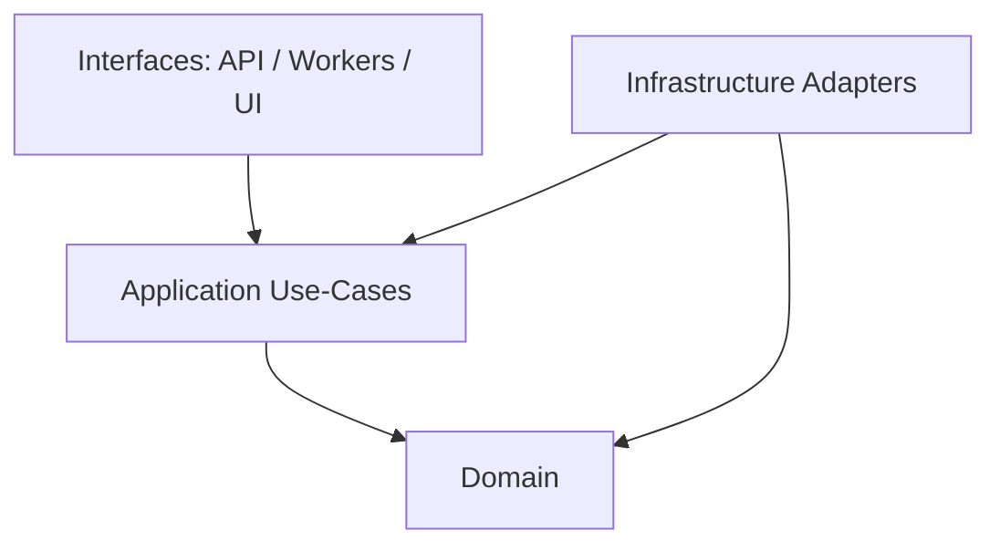
```mermaid
flowchart TB
    UI[Interfaces: API / Workers / UI]
    APP[Application Use-Cases]
    DOM[Domain]
    INF[Infrastructure Adapters]

    UI --> APP
    APP --> DOM
    INF --> APP
    INF --> DOM
```

### 2.4 Engine-Based Design

Pipeline of independently testable Engines with typed I/O. Orchestrator only fans out/in. See [ENGINE_SPEC.md](./ENGINE_SPEC.md).

### 2.5 Hexagonal Architecture

Ports: `AuditRunRepository`, `PageSpeedClient`, `LlmClient`, `ObjectStorage`, `Cache`, `Queue`.  
Adapters: SQLAlchemy, httpx/PSI, OpenAI/Gemini, S3, Redis, RQ/Celery.

### 2.6 Separation of Concerns

| Concern | Owner |
|---|---|
| HTTP | FastAPI routers |
| Use-cases | Application services |
| Business rules | Domain |
| Algorithms | Engines |
| Persistence | Repositories |
| UI composition | `apps/web` FSD |

### 2.7 Scalability

Scale workers and API horizontally; keep Postgres primary + replicas; cache aggressively; defer microservices.

### 2.8 Observability

Every Engine Execution emits duration, status, and correlation ids (`report_id` / `audit_id`, `trace_id`).

---

## 3. High-Level Architecture

### 3.1 C4 Context (Level 1)

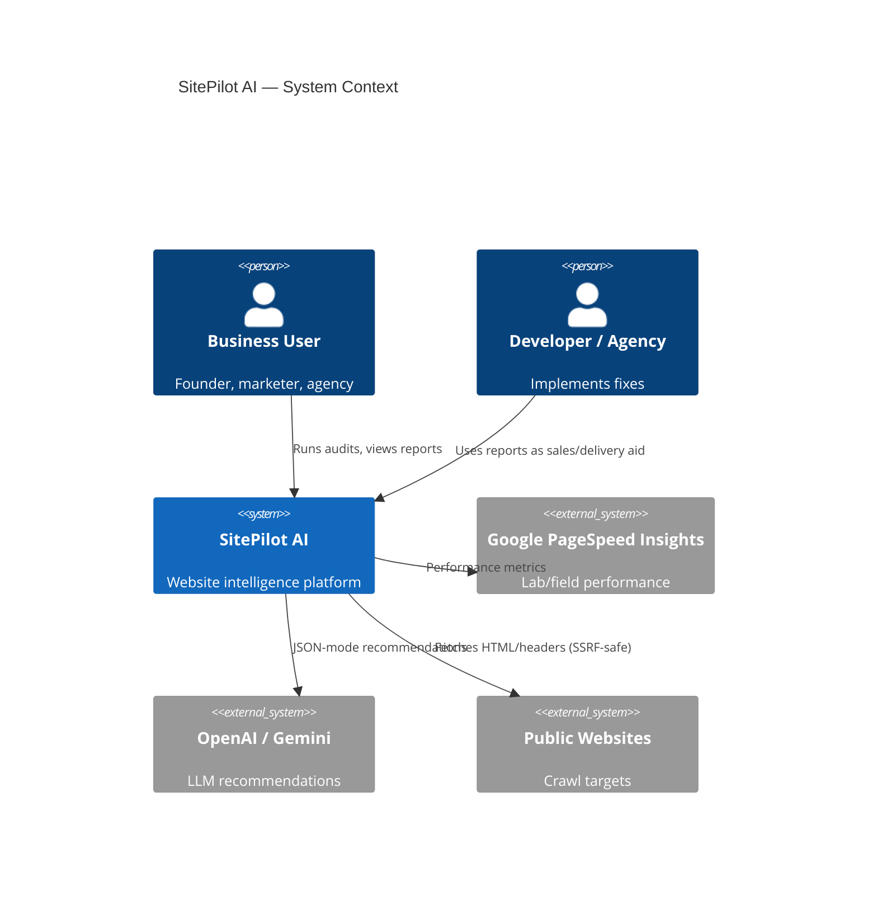
```mermaid
C4Context
    title SitePilot AI — System Context

    Person(user, "Business User", "Founder, marketer, agency")
    Person(dev, "Developer / Agency", "Implements fixes")

    System(sp, "SitePilot AI", "Website intelligence platform")

    System_Ext(psi, "Google PageSpeed Insights", "Lab/field performance")
    System_Ext(openai, "OpenAI / Gemini", "LLM recommendations")
    System_Ext(dns, "Public Websites", "Crawl targets")

    Rel(user, sp, "Runs audits, views reports")
    Rel(dev, sp, "Uses reports as sales/delivery aid")
    Rel(sp, dns, "Fetches HTML/headers (SSRF-safe)")
    Rel(sp, psi, "Performance metrics")
    Rel(sp, openai, "JSON-mode recommendations")
```

### 3.2 C4 Container (Level 2)

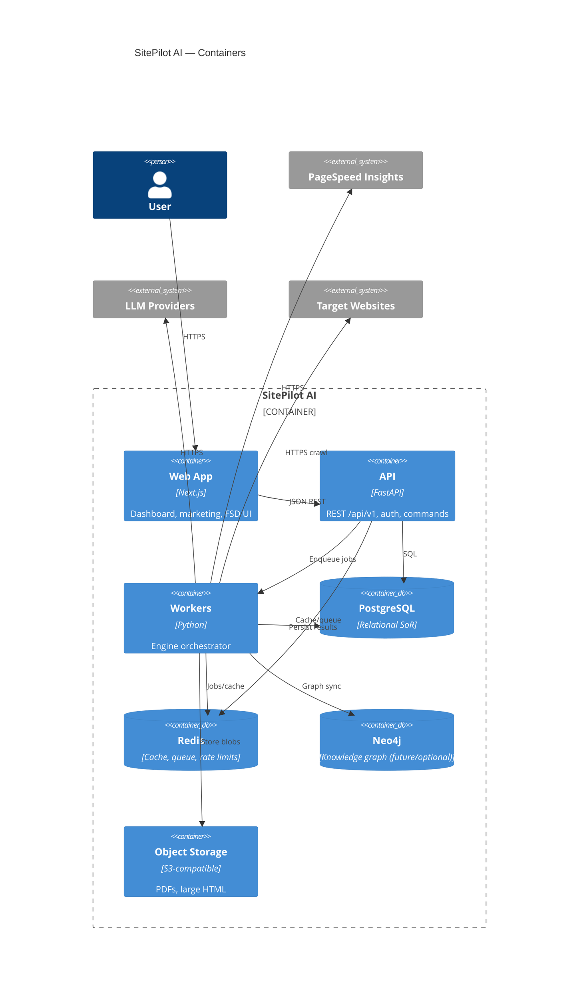
```mermaid
C4Container
    title SitePilot AI — Containers

    Person(user, "User")

    Container_Boundary(c1, "SitePilot AI") {
        Container(web, "Web App", "Next.js", "Dashboard, marketing, FSD UI")
        Container(api, "API", "FastAPI", "REST /api/v1, auth, commands")
        Container(worker, "Workers", "Python", "Engine orchestrator")
        ContainerDb(pg, "PostgreSQL", "Relational SoR")
        ContainerDb(redis, "Redis", "Cache, queue, rate limits")
        ContainerDb(neo, "Neo4j", "Knowledge graph (future/optional)")
        Container(obj, "Object Storage", "S3-compatible", "PDFs, large HTML")
    }

    System_Ext(psi, "PageSpeed Insights")
    System_Ext(llm, "LLM Providers")
    System_Ext(site, "Target Websites")

    Rel(user, web, "HTTPS")
    Rel(web, api, "JSON REST")
    Rel(api, pg, "SQL")
    Rel(api, redis, "Cache/queue")
    Rel(api, worker, "Enqueue jobs")
    Rel(worker, pg, "Persist results")
    Rel(worker, redis, "Jobs/cache")
    Rel(worker, neo, "Graph sync")
    Rel(worker, obj, "Store blobs")
    Rel(worker, psi, "HTTPS")
    Rel(worker, llm, "HTTPS")
    Rel(worker, site, "HTTPS crawl")
```

### 3.3 Logical Stack Flow

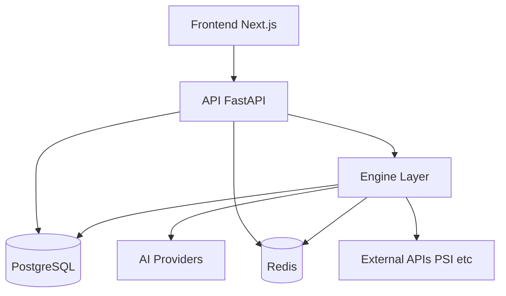
```mermaid
flowchart TD
    FE[Frontend Next.js]
    API[API FastAPI]
    ENG[Engine Layer]
    PG[(PostgreSQL)]
    RD[(Redis)]
    AI[AI Providers]
    EXT[External APIs PSI etc]

    FE --> API
    API --> ENG
    ENG --> PG
    ENG --> RD
    ENG --> AI
    ENG --> EXT
    API --> PG
    API --> RD
```

### 3.4 C4 Component — API & Workers (Level 3 excerpt)

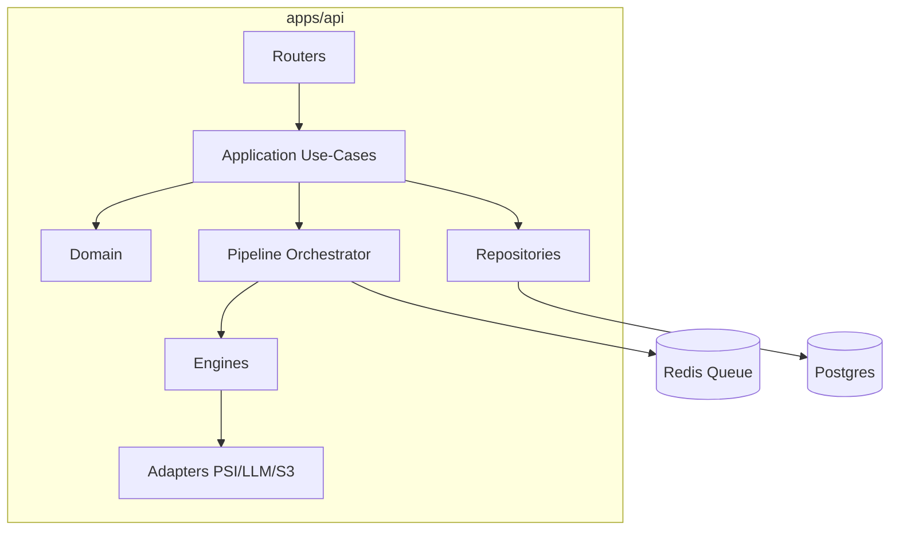
```mermaid
flowchart TB
    subgraph API["apps/api"]
        R[Routers]
        UC[Application Use-Cases]
        DOM[Domain]
        ORCH[Pipeline Orchestrator]
        ENG[Engines]
        REPO[Repositories]
        ADP[Adapters PSI/LLM/S3]
    end

    R --> UC
    UC --> DOM
    UC --> ORCH
    ORCH --> ENG
    UC --> REPO
    ENG --> ADP
    REPO --> PG[(Postgres)]
    ORCH --> Q[(Redis Queue)]
```

---

## 4. Monorepo Structure

```text
sitepilot-ai/
├── apps/
│   ├── web/                 # Next.js (FSD)
│   └── api/                 # FastAPI + workers entrypoints
├── packages/
│   ├── ui/                  # Design system
│   ├── types/               # Shared TS / JSON Schema contracts
│   ├── config/              # ESLint, TS, Tailwind presets
│   └── utils/               # Pure helpers
├── docs/                    # PRD, architecture, specs
├── scripts/                 # Dev/CI helpers
├── infrastructure/          # Docker, Nginx, Terraform
├── assets/                  # Brand assets
├── .github/workflows/       # CI/CD
├── turbo.json
├── package.json
├── pnpm-workspace.yaml
└── docker-compose.yml
```

| Path | Responsibility |
|---|---|
| `apps/` | Deployable runtimes |
| `packages/` | Shared libraries; no business orchestration |
| `docs/` | Spec authority |
| `scripts/` | `run-web`, `run-api`, lint/format helpers |
| `infrastructure/` | IaC and runtime topology |

**Tooling:** pnpm workspaces + Turborepo for task graph (`build`, `lint`, `test`, `dev`).

---

## 5. Frontend Architecture

### 5.1 Feature-Sliced Design

```text
apps/web/
├── app/           # Next.js routes (composition only)
├── features/      # audit, report, landing, marketing, …
├── entities/      # website, audit, report
├── widgets/       # hero, navbar, audit-dashboard, charts
├── shared/        # ui, hooks, services, lib, config, providers
├── styles/
├── public/
└── middleware/
```

**Import rule:** `app → widgets → features → entities → shared` (never upward).

### 5.2 Routing

App Router routes: `/`, `/audit`, `/audit/analyzing`, `/report/[auditId]`, `/share/[token]`, `/dashboard`, and public marketing/legal pages (`/about`, `/contact`, `/help`, `/faq`, `/privacy`, `/terms`; `/docs` redirects to `/help`). Thin `page.tsx` shells compose widgets/features under Feature-Sliced Design. Sprint 28 wires live API: URL → `POST /websites` → `POST /audits` (returns `pending`) → poll `GET /audits/{id}` → `/report/{auditId}`.

### 5.3 State Management

| Kind | Approach |
|---|---|
| Server state | React Query against FastAPI (`shared/hooks/*`) |
| Audit progress | Soft UI progress during sync `POST /audits`; poll `GET /audits/{id}` when status is non-terminal |
| UI state | Local component state; URL search params for filters |
| Theme | ThemeProvider |

Avoid duplicating Health Score math in the client — **API Report is source of truth**.

### 5.4 API Layer

`shared/services/*` + `shared/lib/api.ts` / axios client:

- Typed DTOs in `shared/types/*` (snake_case matching FastAPI)
- Central `ApiError` envelope handling
- Auth header injection when logged in (future)

### 5.5 UI Layer

- `shared/ui` primitives + `@sitepilot/ui` package
- Widgets for page sections
- Accessibility: WCAG 2.1 AA for our own product UI

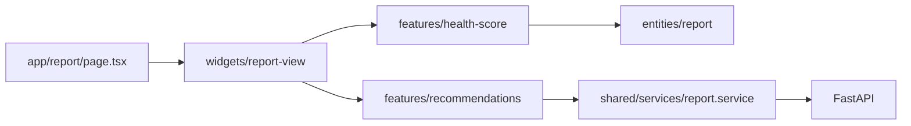
```mermaid
flowchart LR
    PAGE[app/report/page.tsx] --> W[widgets/report-view]
    W --> F1[features/health-score]
    W --> F2[features/recommendations]
    F1 --> E[entities/report]
    F2 --> S[shared/services/report.service]
    S --> API[FastAPI]
```

---

## 6. Backend Architecture

### 6.1 FastAPI Layout

Target modular layout (Clean Architecture packages):

```text
apps/api/app/
├── interfaces/          # HTTP routers, workers (target name; routers live under api/ today)
├── application/         # use-cases (e.g. StartAuditUseCase)
├── domain/              # aggregates, VOs, events (e.g. AuditStatus)
├── engines/             # independent engines (stubs until engine sprints)
├── infrastructure/      # db adapters, redis, psi, llm, s3
├── repositories/        # SQLAlchemy persistence adapters
├── models/              # ORM entities (Organization, Project, Website, AuditRun, …)
└── main.py
```

**Current Audit orchestration (implemented — Sprint 16):** HTTP `api/v1/audits` → `RunAuditUseCase` → `AuditPipelineService` → `AuditPipeline` (Validation→…→Health→Recommendation) → persist executions / findings / health_scores / recommendations. **After** the pipeline, `ReportComposer` assembles a UI-ready `AuditReportDTO` via `GET /api/v1/audits/{id}/report` (persisted to `reports`). No new Engine; no pipeline registration. Synchronous in-request (no worker queue / Redis yet).

**Report export (Sprint 30):** `GET /api/v1/audits/{id}/export/{pdf|json|csv}` → `Export*UseCase` → `GetAuditReportUseCase` → DTO exporters under `app/export/`. Attachment downloads only; no AI, no engine re-runs, no composer changes. See `docs/REPORT_COMPOSER.md`.

**Report sharing (Sprint 31):** presentation-only signed links. `POST /api/v1/audits/{id}/share` → `CreateShareLinkUseCase` (HMAC URL-safe token via `SECRET_KEY`, no share table) → `{ share_url, expires_at }`. `GET /api/v1/share/{token}` → `GetSharedReportUseCase` → **reuses** `GetAuditReportUseCase` → `AuditReportDTO`. Frontend `/share/[token]` renders `ReportDashboard` with `readonly=true` (hides AI / export / share / regenerate). Invalid/tampered → `404`; expired → `410`. Does not modify Report Composer, AIService, pipeline, engines, or DTO schemas.

**AI explanation layer (`app/ai/` — not an engine, not in the pipeline):** After a report exists, grounded LLM explanations cover completed artifacts only. Canonical `AIFeature` registry: `FINDING`, `RECOMMENDATION`, `EXECUTIVE_SUMMARY`, `BUSINESS_SUMMARY`, `QUICK_WIN`. Canonical `AIProvider` registry (`providers/provider_enum.py`): `OPENAI`, `OPENROUTER`, `GEMINI`, `ANTHROPIC`, `OLLAMA` — env/JSON still use string values (`openai`, `openrouter`, …) via `resolve_provider()`. Flow:

```
Mapper → Builder → BuiltPrompt → GenerationSession
  → generation_id → Provider → Grounding → AIQualityMetadata → AIResponse
```

`generation_id` is minted once in `GenerationSession.start()` and propagated to
`AIResponse`, telemetry, and provider metadata (never into cache keys).
Quick Win explanations use `entity_id = recommendation_id` and never invent or
reprioritize recommendations. See `apps/api/app/ai/README.md`.

**AI HTTP API (Sprint 23–26):** Thin feature-split routers under `api/v1/ai/` call application use cases only. Routers never build prompts, call OpenAI, or bypass grounding. Sync responses are live `AIResponse[T]`. Successful responses also expose `X-Generation-ID` / `X-AI-*` headers. After grounding, use cases **best-effort persist** immutable rows to `ai_generations` (versioned by `response_hash`); persistence failures never fail the API. Sprint 25 adds controlled **regeneration** plus read-only **latest / versions** endpoints. Sprint 26 adds **async jobs**: `POST …/ai/generate*` → `202` + `job_id`, poll `GET /jobs/{id}`, result `GET /jobs/{id}/result` via `InMemoryQueue` + `BackgroundWorker` + `AIJobRunner` (still calls existing generate use cases). Sprint 26.1 adds job **progress** (0–100), **timing metrics** (derived), **retry metadata** (schema only), centralized **worker** id (`local-worker-1`), **cancel_reason**, and completed-job `latest_version` + `result_url`. Sprint 26.2 adds **phase_history**, **failure_category**, derived **events** / **summary** / **health**, and mirrored **provider diagnostics** on job poll DTOs. Sprint 26.3 adds **expires_at**, retention constants, **cleanup_candidate**, **stale** detection, **age_ms**, and **duration_class** / **queue_class** presentation helpers (no automatic deletion). Sprint 27 replaces process-local-only processing with a selectable **QueuePort** backend: `InMemoryQueue` (default) or **RedisQueue** + **RedisWorker** (visibility timeout, distributed lock, graceful shutdown). HTTP enqueue **commits the job row before pushing to the queue** so Redis workers never observe an uncommitted id. **Sprint 29 (integration):** in-memory mode drains via `asyncio.create_task` (not only Starlette BackgroundTasks), continues when jobs are enqueued mid-drain, and may kick the worker on job poll while status is `queued`. Job API contracts and AI generation remain unchanged. OpenAPI tag: `AI`.

```
API → QueueGenerationUseCase → ai_generation_jobs + QueuePort → 202
                                         ↓
                    inmemory: BackgroundWorker | redis: RedisWorker
                                         ↓
                              AIJobRunner → Generate*UseCase → AIService
                                         ↓
                              Ground → Persist → mark job completed → ack
```

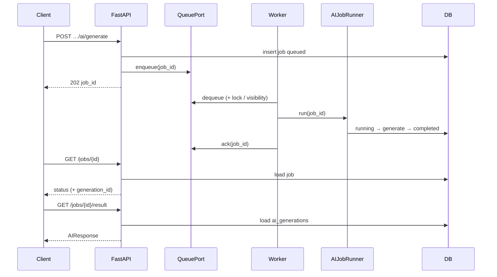
```mermaid
sequenceDiagram
    participant Client
    participant API as FastAPI
    participant Q as QueuePort
    participant W as Worker
    participant R as AIJobRunner
    participant DB as DB

    Client->>API: POST …/ai/generate
    API->>DB: insert job queued
    API->>Q: enqueue(job_id)
    API-->>Client: 202 job_id
    W->>Q: dequeue (+ lock / visibility)
    W->>R: run(job_id)
    R->>DB: running → generate → completed
    W->>Q: ack(job_id)
    Client->>API: GET /jobs/{id}
    API->>DB: load job
    API-->>Client: status (+ generation_id)
    Client->>API: GET /jobs/{id}/result
    API->>DB: load ai_generations
    API-->>Client: AIResponse
```

```
API → Use Case → AIService → … → Grounding → AIResponse
                              ↓
                         Persist / regenerate (best-effort)
                              ↓
                         Return AIResponse
```

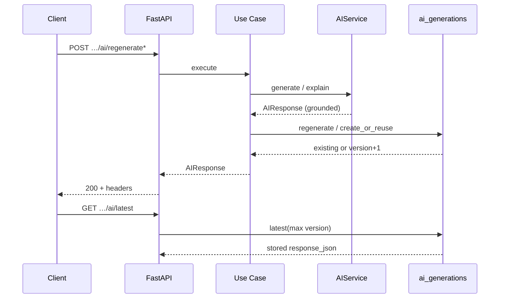
```mermaid
sequenceDiagram
    participant Client
    participant API as FastAPI
    participant UC as Use Case
    participant AI as AIService
    participant DB as ai_generations

    Client->>API: POST …/ai/regenerate*
    API->>UC: execute
    UC->>AI: generate / explain
    AI-->>UC: AIResponse (grounded)
    UC->>DB: regenerate / create_or_reuse
    DB-->>UC: existing or version+1
    UC-->>API: AIResponse
    API-->>Client: 200 + headers

    Client->>API: GET …/ai/latest
    API->>DB: latest(max version)
    DB-->>API: stored response_json
```

| Endpoint | Use case package |
|---|---|
| `GET /audits/{id}/ai/executive-summary` | `application/ai/reports/` |
| `GET /audits/{id}/ai/business-summary` | `application/ai/reports/` |
| `GET /findings/{id}/ai/explanation` | `application/ai/findings/` |
| `GET /recommendations/{id}/ai/explanation` | `application/ai/recommendations/` |
| `GET /recommendations/{id}/ai/quick-win` | `application/ai/recommendations/` |

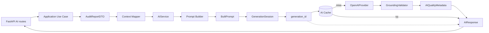
```mermaid
flowchart LR
    API[FastAPI AI routes] --> UC[Application Use Case]
    UC --> DTO[AuditReportDTO]
    DTO --> M[Context Mapper]
    M --> AI[AIService]
    AI --> B[Prompt Builder]
    B --> BP[BuiltPrompt]
    BP --> S[GenerationSession]
    S --> GID[generation_id]
    GID --> C[(AI Cache)]
    C -->|miss| P[OpenAIProvider]
    P --> G[GroundingValidator]
    G --> Q[AIQualityMetadata]
    Q --> R[AIResponse]
    C -->|hit| R
    GID -.-> R
    R --> API
```

### 6.2 Layers

| Layer | Responsibility |
|---|---|
| **Interfaces** | Auth, validation, status codes (`POST/GET /api/v1/audits`) |
| **Application** | `StartAuditUseCase` (create pending); `RunAuditUseCase` (create + execute pipeline) |
| **Services** | `AuditPipelineService` — progress/status updates + persistence hooks on pipeline events |
| **Domain** | Invariants, Audit Run lifecycle / `AuditStatus`, Finding rules |
| **Engines** | Existing engines via `AuditPipeline` / `Engine` protocol (unchanged analysis) |
| **Infrastructure** | SQLAlchemy repos, httpx, Playwright, OpenAI SDK |
| **Repositories** | `AuditRepository`, `EngineExecutionRepository`, `FindingRepository`, `HealthScoreRepository`, … |

### 6.3 Request Path

**Today (synchronous create + pipeline + poll):**

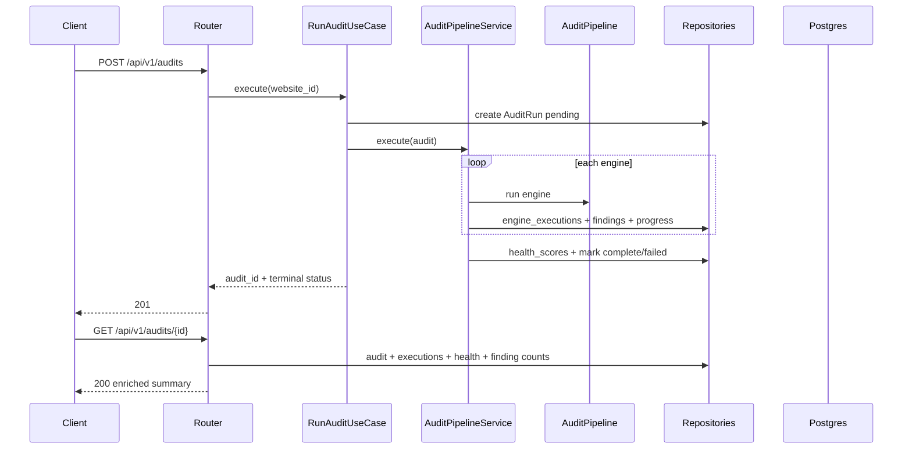
```mermaid
sequenceDiagram
    participant C as Client
    participant R as Router
    participant UC as RunAuditUseCase
    participant Svc as AuditPipelineService
    participant Pipe as AuditPipeline
    participant Repo as Repositories
    participant DB as Postgres
    C->>R: POST /api/v1/audits
    R->>UC: execute(website_id)
    UC->>Repo: create AuditRun pending
    UC->>Svc: execute(audit)
    loop each engine
        Svc->>Pipe: run engine
        Svc->>Repo: engine_executions + findings + progress
    end
    Svc->>Repo: health_scores + mark complete/failed
    UC-->>R: audit_id + terminal status
    R-->>C: 201
    C->>R: GET /api/v1/audits/{id}
    R->>Repo: audit + executions + health + finding counts
    R-->>C: 200 enriched summary
```

> Legacy note: earlier sprints documented create-only `StartAuditUseCase` without pipeline execution. Sprint 14 wires the pipeline synchronously; async workers may later move execution out of the request and return `202`.

**Target (async pipeline — future):**

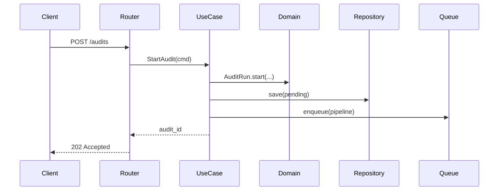
```mermaid
sequenceDiagram
    participant C as Client
    participant R as Router
    participant UC as UseCase
    participant Dom as Domain
    participant Repo as Repository
    participant Q as Queue

    C->>R: POST /audits
    R->>UC: StartAudit(cmd)
    UC->>Dom: AuditRun.start(...)
    UC->>Repo: save(pending)
    UC->>Q: enqueue(pipeline)
    UC-->>R: audit_id
    R-->>C: 202 Accepted
```

> When a queue is introduced, prefer `202 Accepted` for “accepted for processing” while keeping the same pollable AuditRun resource.
### 6.4 Worker Path

Workers execute the Pipeline Orchestrator: load Audit Run → run Engines → persist Executions/Results/Findings → DQ → AI → Report Builder → optional PDF.

---

## 7. Engine Architecture

### 7.1 Engine Catalog

| Engine | Role |
|---|---|
| URL Validation | Normalize, SSRF, reachability |
| Crawler | Fetch HTML/headers/robots/sitemap |
| HTML Parser | Structured DOM extraction |
| SEO Intelligence | SEO Findings |
| Performance | PSI/Lighthouse metrics + Findings |
| Security | TLS/headers/mixed content Findings |
| Accessibility | WCAG-oriented Findings + confidence |
| Health Score | Weighted scores |
| Business Impact | Business framing + Priority |
| ROI | Effort/value bands |
| Data Quality | Gate + `ai_payload` |
| AI Recommendation | Grounded explanations |
| Report Builder | Report aggregate projection |
| PDF | Branded export |

### 7.2 Orchestration

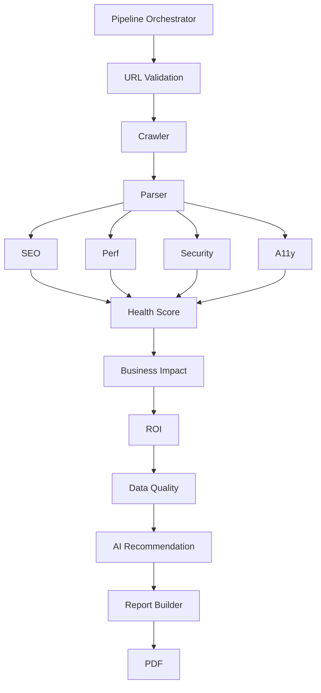
```mermaid
flowchart TD
    O[Pipeline Orchestrator]
    O --> V[URL Validation]
    V --> C[Crawler]
    C --> P[Parser]
    P --> SEO[SEO]
    P --> PERF[Perf]
    P --> SEC[Security]
    P --> A11Y[A11y]
    SEO --> HS[Health Score]
    PERF --> HS
    SEC --> HS
    A11Y --> HS
    HS --> BI[Business Impact]
    BI --> ROI[ROI]
    ROI --> DQ[Data Quality]
    DQ --> AI[AI Recommendation]
    AI --> RB[Report Builder]
    RB --> PDF[PDF]
```

**Rules:** Engines never import siblings. Soft-fail Performance when configured. AI only after DQ success.

---

## 8. Data Flow

### 8.1 End-to-End

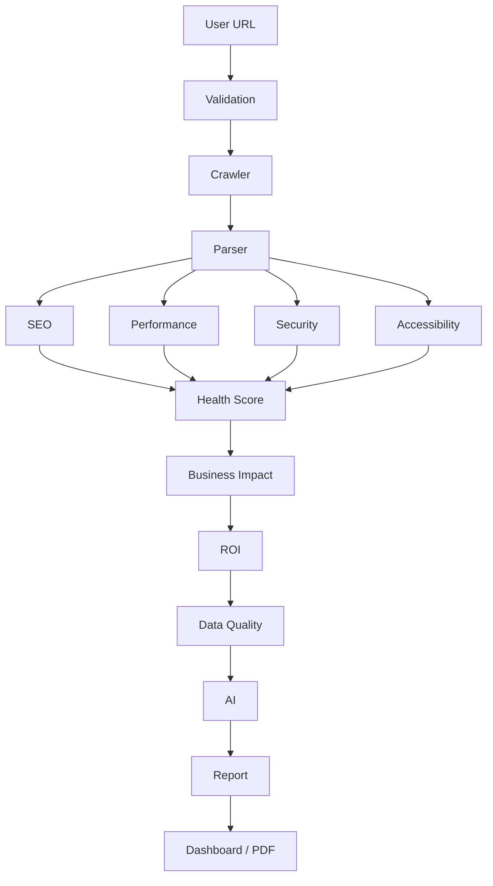
```mermaid
flowchart TD
    A[User URL] --> B[Validation]
    B --> C[Crawler]
    C --> D[Parser]
    D --> E[SEO]
    D --> F[Performance]
    D --> G[Security]
    D --> H[Accessibility]
    E --> I[Health Score]
    F --> I
    G --> I
    H --> I
    I --> J[Business Impact]
    J --> K[ROI]
    K --> L[Data Quality]
    L --> M[AI]
    M --> N[Report]
    N --> O[Dashboard / PDF]
```

### 8.2 Persistence Touchpoints

| Stage | Writes |
|---|---|
| Start | `audit_runs` pending |
| Each engine | `engine_executions`, `engine_results`, optional findings |
| Scoring | denormalized scores on `audit_runs` |
| AI | `recommendations` |
| Assemble | `reports.report_json` |
| PDF | object storage + `reports.pdf_url` |
| Graph sync (optional) | Neo4j projection via outbox |

### 8.3 Read Path

Frontend polls audit status → fetches report JSON → renders widgets. PDF / JSON / CSV export uses attachment downloads from `/audits/{id}/export/*` (Sprint 30). Signed-URL PDF storage remains a future enhancement.

---

## 9. Database Architecture

### 9.1 PostgreSQL (System of Record)

Owns users/orgs/projects/websites, audit runs, engine artifacts, findings, recommendations, reports, subscriptions, API keys, audit logs.

See [DATABASE_SPEC.md](./DATABASE_SPEC.md).

### 9.2 Redis

| Use | Pattern |
|---|---|
| Job queue | RQ/Celery broker |
| Rate limiting | Token buckets per IP/user/key |
| Cache | crawl, report, status, entitlements |
| Idempotency | POST `/audits` keys |

### 9.3 Neo4j (Future / Optional)

Knowledge graph for similarity, tech dependencies, AI context packs. **Derived** from Postgres via outbox. See [GRAPH_ARCHITECTURE_SPEC.md](./GRAPH_ARCHITECTURE_SPEC.md).

### 9.4 Object Storage

PDFs and large HTML artifacts; DB stores URIs + hashes.

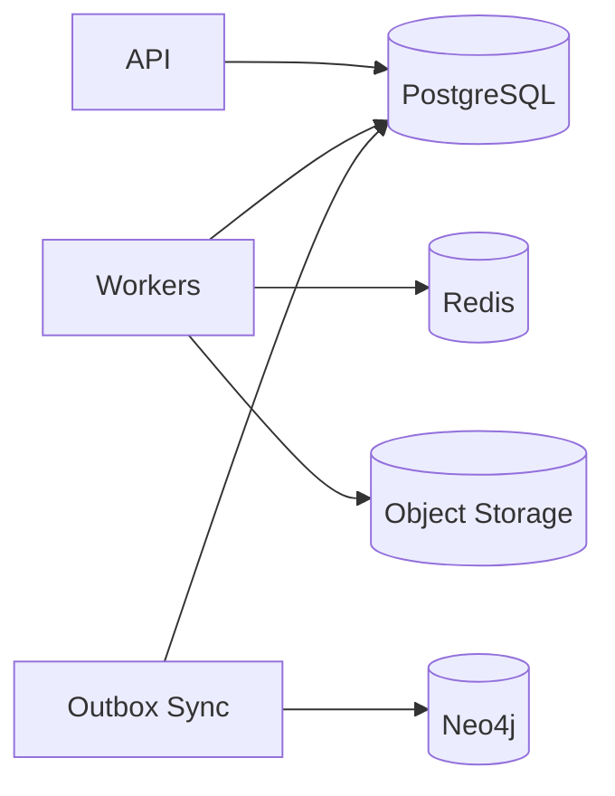
```mermaid
flowchart LR
    API --> PG[(PostgreSQL)]
    W[Workers] --> PG
    W --> RD[(Redis)]
    W --> S3[(Object Storage)]
    SYNC[Outbox Sync] --> PG
    SYNC --> N4J[(Neo4j)]
```

---

## 10. External Integrations

| Integration | Purpose | Failure mode |
|---|---|---|
| **Google PageSpeed Insights** | Perf lab/field | Fall back to Lighthouse; soft-fail |
| **Lighthouse + Playwright** | Local audits | Soft-fail Performance category |
| **OpenAI** | Primary LLM (`AIProvider.OPENAI`) for grounded explanations | Fail over Gemini → templates (future) |
| **Gemini** | Default (`AIProvider.GEMINI`) via `AI_DEFAULT_PROVIDER=gemini` | All AI features; fallback OpenRouter → OpenAI |
| **OpenRouter** | Fallback gateway (`AIProvider.OPENROUTER`) | Same grounding / AIService path |
| **OpenAI** | Final fallback (`AIProvider.OPENAI`) | Same grounding / AIService path |
| **Gemini** | Secondary LLM (`AIProvider.GEMINI`) | Templates |
| **Target websites** | Crawl | Hard-fail on unreachable/SSRF |
| **Future** | Stripe billing, email, webhooks, CrUX, axe-core | — |

**Adapter rule:** All externals behind ports with timeouts, retries, circuit breakers.

---

## 11. Deployment Architecture

### 11.1 MVP Topology

| Component | Platform |
|---|---|
| Frontend | **Vercel** |
| Backend API | **Railway** (or equivalent) |
| Workers | Railway worker service |
| PostgreSQL | Railway Postgres / **Supabase** Postgres |
| Redis | **Upstash** or Railway Redis |
| Object storage | S3 / R2 / provider bucket |
| Neo4j | Aura (later) |

### 11.2 Deployment Diagram

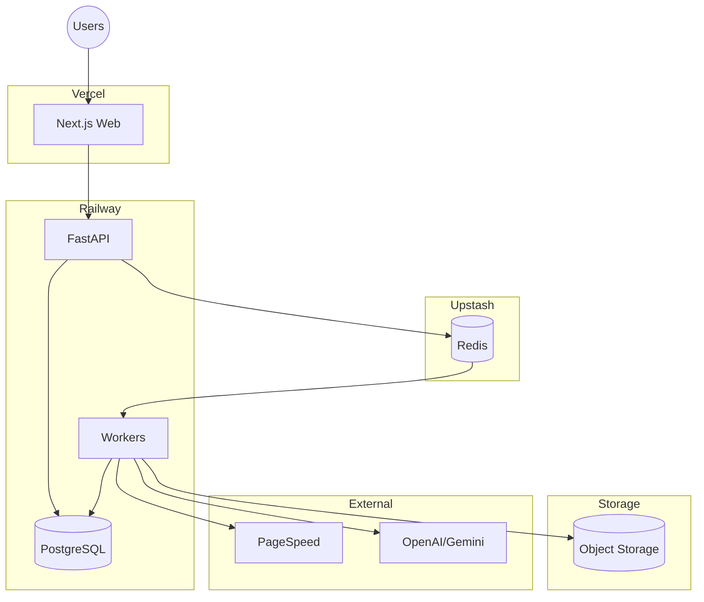
```mermaid
flowchart TB
    subgraph Vercel
        WEB[Next.js Web]
    end
    subgraph Railway
        API[FastAPI]
        WRK[Workers]
        PG[(PostgreSQL)]
    end
    subgraph Upstash
        RD[(Redis)]
    end
    subgraph Storage
        S3[(Object Storage)]
    end
    subgraph External
        PSI[PageSpeed]
        LLM[OpenAI/Gemini]
    end

    Users((Users)) --> WEB
    WEB --> API
    API --> PG
    API --> RD
    RD --> WRK
    WRK --> PG
    WRK --> S3
    WRK --> PSI
    WRK --> LLM
```

### 11.3 Future AWS

ECS/EKS for API/workers, RDS Postgres, ElastiCache Redis, S3, CloudFront, WAF — when multi-region or compliance requires.

### 11.4 Environments

`local` (docker-compose) → `preview` → `staging` → `production`  
Separate credentials, databases, and PSI/LLM keys per env.

---

## 12. Security Architecture

### 12.1 Authentication

- Anonymous audits (IP limited) for MVP  
- JWT access + refresh for users  
- API keys (hashed) for M2M  

### 12.2 Authorization

- Org membership roles (`owner/admin/member/viewer`)  
- Scope checks on every resource id (prevent BOLA)  
- Entitlements from Subscription  

### 12.3 Rate Limiting

Per IP, user, API key — see API_SPEC.

### 12.4 Secrets

Env / platform secret manager only. Never in git. Rotate runbooks.

### 12.5 SSRF

First-class control on all outbound fetches (URL Validation + redirect re-check).

### 12.6 OWASP

Input validation, least privilege DB roles, no raw stack traces, TLS, CORS allowlists, redact PII in logs.

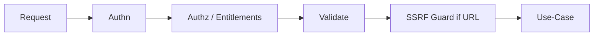
```mermaid
flowchart LR
    REQ[Request] --> AUTH[Authn]
    AUTH --> AUTHZ[Authz / Entitlements]
    AUTHZ --> VAL[Validate]
    VAL --> SSRF[SSRF Guard if URL]
    SSRF --> UC[Use-Case]
```

---

## 13. Observability

### 13.1 Logging

Structured JSON: `service`, `engine`, `audit_id`, `trace_id`, `level`, `event`, `duration_ms`.  
No HTML bodies / secrets / full prompts at info.

### 13.2 Metrics

| Metric | Type |
|---|---|
| `http_request_duration_ms` | histogram |
| `audit_pipeline_duration_ms` | histogram |
| `engine_duration_ms` | histogram{engine} |
| `audit_success_total` | counter |
| `ai_fallback_total` | counter |
| `ssrf_block_total` | counter |
| `queue_depth` | gauge |

### 13.3 Tracing

OpenTelemetry: `POST /audits` → enqueue → each engine span → external HTTP/LLM spans.

### 13.4 Health Checks

| Endpoint | Checks |
|---|---|
| `/api/v1/health` | Process up |
| `/api/v1/ready` | Postgres + Redis |
| Worker heartbeat | Redis key freshness |

### 13.5 Alerting

p95 pipeline latency, error rate, queue backlog, PSI/LLM breaker open, disk/backup failures.

---

## 14. CI/CD

### 14.1 GitHub Actions (planned)

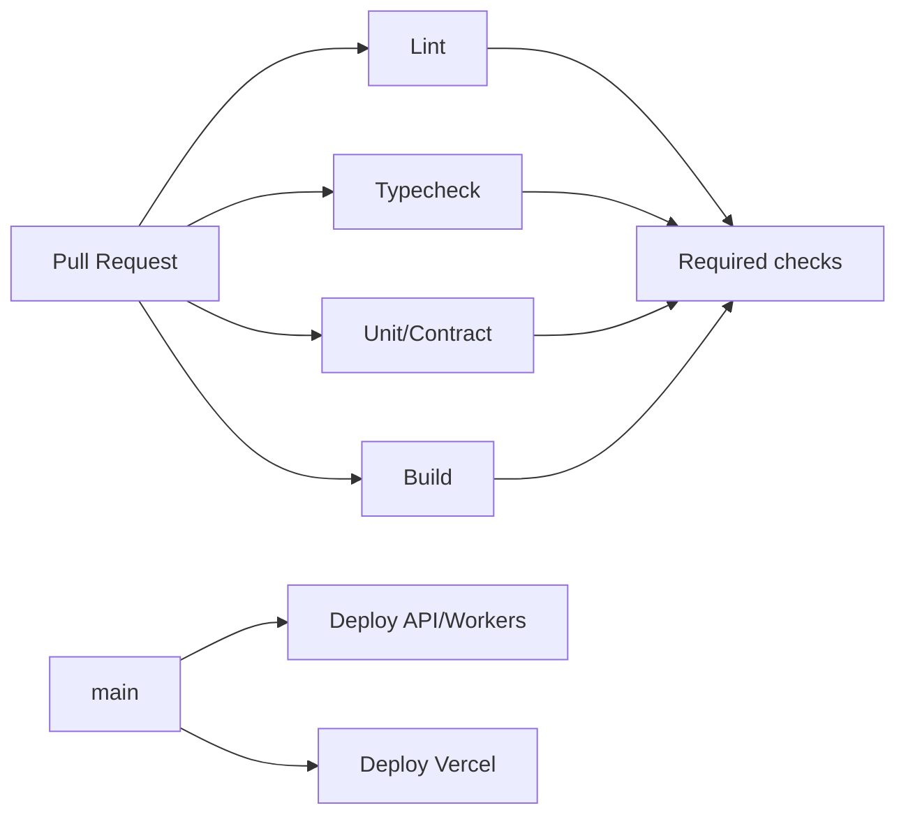
```mermaid
flowchart LR
    PR[Pull Request] --> LINT[Lint]
    PR --> TYPE[Typecheck]
    PR --> TEST[Unit/Contract]
    PR --> BUILD[Build]
    LINT --> GATE[Required checks]
    TYPE --> GATE
    TEST --> GATE
    BUILD --> GATE
    MAIN[main] --> DEPLOY_API[Deploy API/Workers]
    MAIN --> DEPLOY_WEB[Deploy Vercel]
```

### 14.2 Testing in CI

- Python: pytest (domain, engines with fixtures, SSRF)  
- Web: lint + unit  
- Contract: OpenAPI response schemas  
- Migration: `alembic upgrade head` on ephemeral Postgres  

### 14.3 Linting / Formatting

Shared `packages/config`; ruff/black or equivalent for API; ESLint/Prettier for web.

### 14.4 Deployment

- Vercel: preview per PR; prod on main  
- Railway: deploy on main with migrations job before traffic  
- Never apply destructive migrations without expand/contract  

---

## 15. Scalability

### 15.1 Horizontal Scaling

| Tier | Scale unit |
|---|---|
| Web | Vercel edge/serverless |
| API | Multiple Railway replicas behind LB |
| Workers | Replicas consuming Redis queue |
| Postgres | Vertical + read replicas |
| Redis | Managed scaling |

### 15.2 Caching

24h crawl/report caches; status short TTL; entitlement cache.

### 15.3 Queues & Workers

All audits async. Concurrency capped for Playwright browsers.

### 15.4 Future Microservices

Split candidates: Performance browser farm, PDF service, Graph sync — only when CPU/memory isolation required.

---

## 16. Failure Recovery

| Mechanism | Application |
|---|---|
| **Retries** | Transient HTTP 502/503/429 with backoff |
| **Circuit breakers** | PSI → Lighthouse; OpenAI → Gemini → templates |
| **Fallback** | Rule-based recommendations |
| **Graceful degradation** | `complete_with_warnings`; renormalized Health Score |
| **Stuck jobs** | Reaper marks long `running` as failed |
| **Outbox replay** | Graph sync recovery |
| **Backups / PITR** | Postgres RPO/RTO per DATABASE_SPEC |

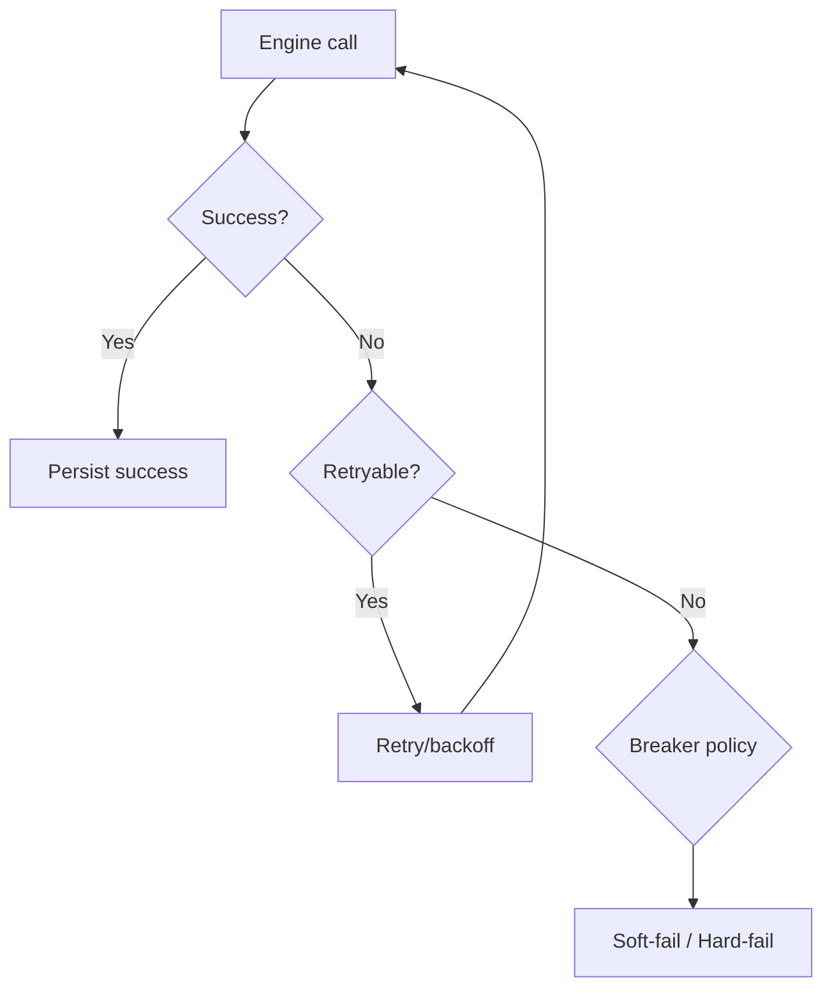
```mermaid
flowchart TD
    E[Engine call] --> OK{Success?}
    OK -- Yes --> P[Persist success]
    OK -- No --> R{Retryable?}
    R -- Yes --> T[Retry/backoff]
    T --> E
    R -- No --> CB{Breaker policy}
    CB --> SF[Soft-fail / Hard-fail]
```

---

## 17. Performance

| Technique | Detail |
|---|---|
| **Async processing** | Create AuditRun then poll; workers do heavy work (`202` when enqueue is wired; `201` today for sync create) |
| **Parallel engines** | SEO/Perf/Sec/A11y fan-out after parse |
| **Caching** | Crawl/PSI/report |
| **Compression** | HTTPS gzip/br for API JSON |
| **Payload control** | Omit `raw_output`; paginate findings |
| **DB** | Indexes, keyset pagination, batch finding inserts |
| **Browser pool** | Bound Playwright concurrency |

**Budget:** Performance Engine dominates wall clock; keep other analyzers cheap.

---

## 18. Implementation Roadmap

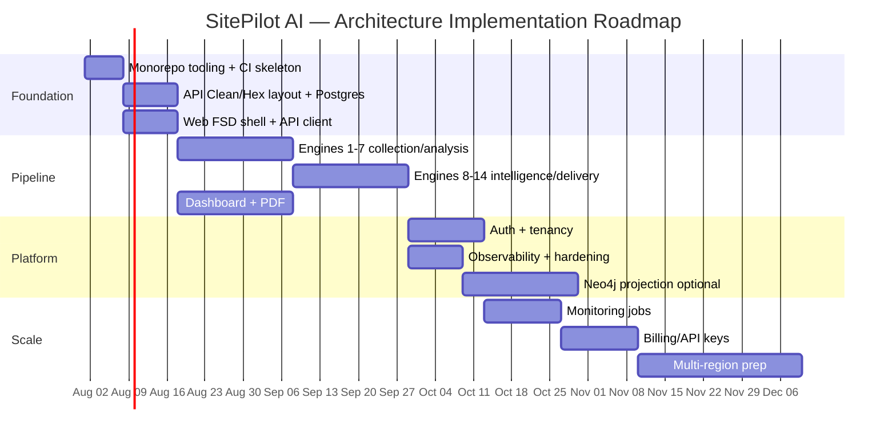
```mermaid
gantt
    title SitePilot AI — Architecture Implementation Roadmap
    dateFormat  YYYY-MM-DD
    axisFormat  %b %d

    section Foundation
    Monorepo tooling + CI skeleton          :a1, 2026-08-01, 7d
    API Clean/Hex layout + Postgres         :a2, after a1, 10d
    Web FSD shell + API client              :a3, after a1, 10d

    section Pipeline
    Engines 1-7 collection/analysis         :b1, after a2, 21d
    Engines 8-14 intelligence/delivery      :b2, after b1, 21d
    Dashboard + PDF                         :b3, after a3, 21d

    section Platform
    Auth + tenancy                          :c1, after b2, 14d
    Observability + hardening               :c2, after b2, 10d
    Neo4j projection optional               :c3, after c2, 21d

    section Scale
    Monitoring jobs                         :d1, after c1, 14d
    Billing/API keys                        :d2, after d1, 14d
    Multi-region prep                       :d3, after d2, 30d
```

---

## 19. Future Architecture

| Capability | Architectural impact |
|---|---|
| **Chrome Extension** | Thin client calling public API; auth via token exchange |
| **Admin Portal** | Separate Next.js app or `/admin` with stricter RBAC |
| **Mobile App** | Same API; push notifications via Notification context |
| **Neo4j** | Outbox sync + AI context packs |
| **AI Agents** | Long-running agent workers; still closed-world on Findings |
| **Auto-Fix PRs** | New bounded context; human approval gate |
| **Multi-region** | Active-passive Postgres; regional workers; UUID keys already safe |

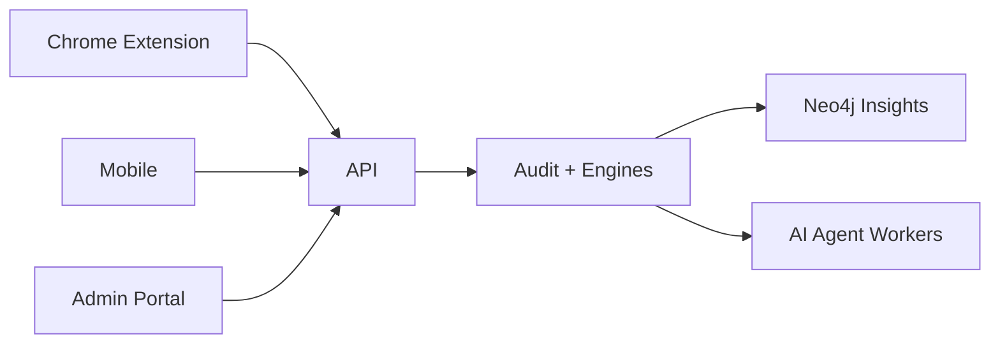
```mermaid
flowchart LR
    EXT[Chrome Extension] --> API
    MOB[Mobile] --> API
    ADM[Admin Portal] --> API
    API --> CORE[Audit + Engines]
    CORE --> GRAPH[Neo4j Insights]
    CORE --> AGENT[AI Agent Workers]
```

---

## 20. Best Practices

### 20.1 Maintainability

- Spec-driven development (docs updated with PRs)  
- Bounded contexts and engine packages  
- No business logic in controllers or React pages  

### 20.2 Security

- SSRF everywhere outbound  
- Hash secrets; redact logs  
- Authorize every id  
- Least privilege DB roles  

### 20.3 Testing

| Layer | Focus |
|---|---|
| Domain | Invariants / state transitions |
| Engines | Fixtures + golden JSON |
| API | Contract + authz |
| E2E | Staging URL → report |
| Security | SSRF redirect suites |

### 20.4 Performance

- Measure engine spans  
- Cache before scaling hardware  
- Bound browser concurrency  

### 20.5 Scalability

- Queue all audits  
- Read replicas before sharding  
- Extract services only with clear SLOs  

### 20.6 Contributor Checklist

- [ ] Aligns with DOMAIN_MODEL language  
- [ ] Engine contracts versioned  
- [ ] Postgres remains SoR  
- [ ] AI gated by Data Quality  
- [ ] Observability fields present  
- [ ] Architecture/spec updated  

> [!NOTE]
> **North star:** A modular, observable, engine-orchestrated platform that turns website signals into trustworthy business decisions — with Clean/Hex boundaries, FSD UI, and Postgres as the system of record.

---

<p align="center">
  <sub>SitePilot AI — Software Architecture — Master Technical Architecture — Confidential</sub>
</p>
