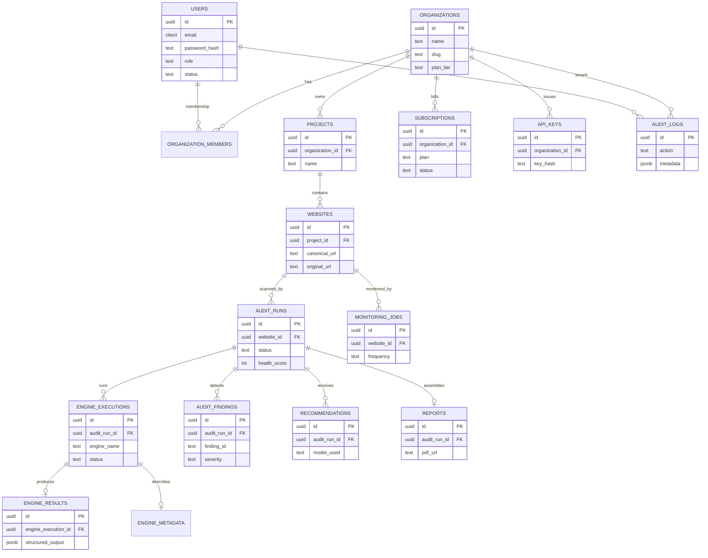
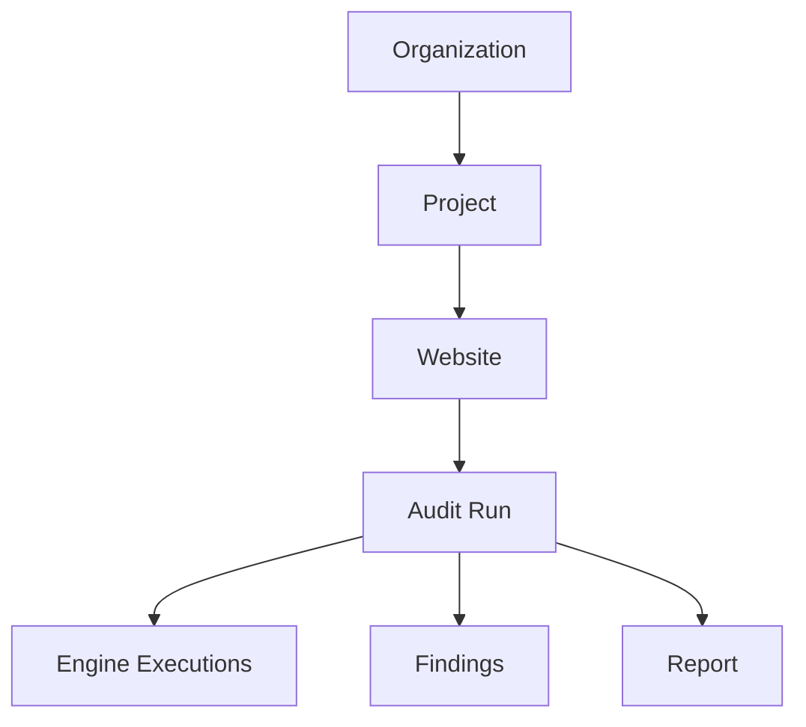
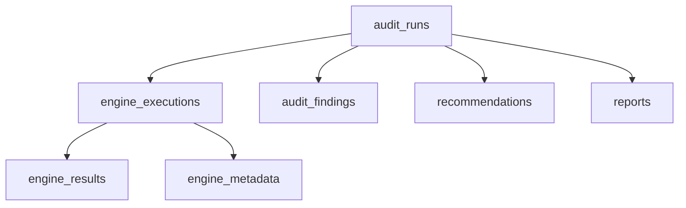
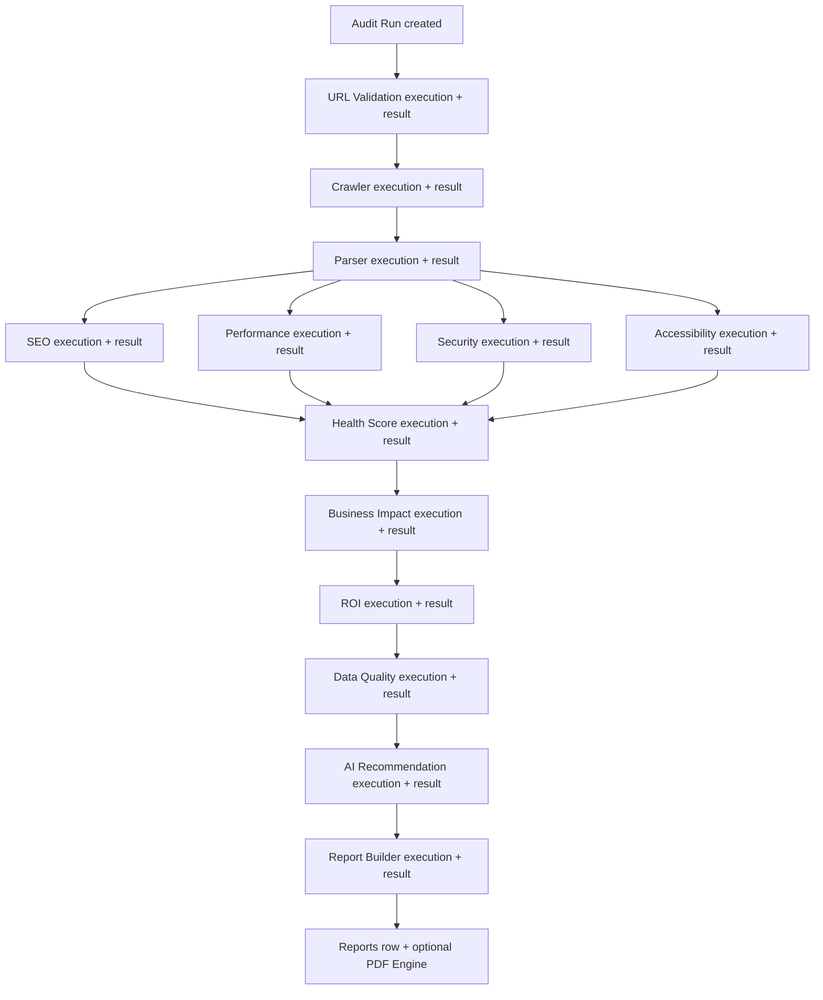
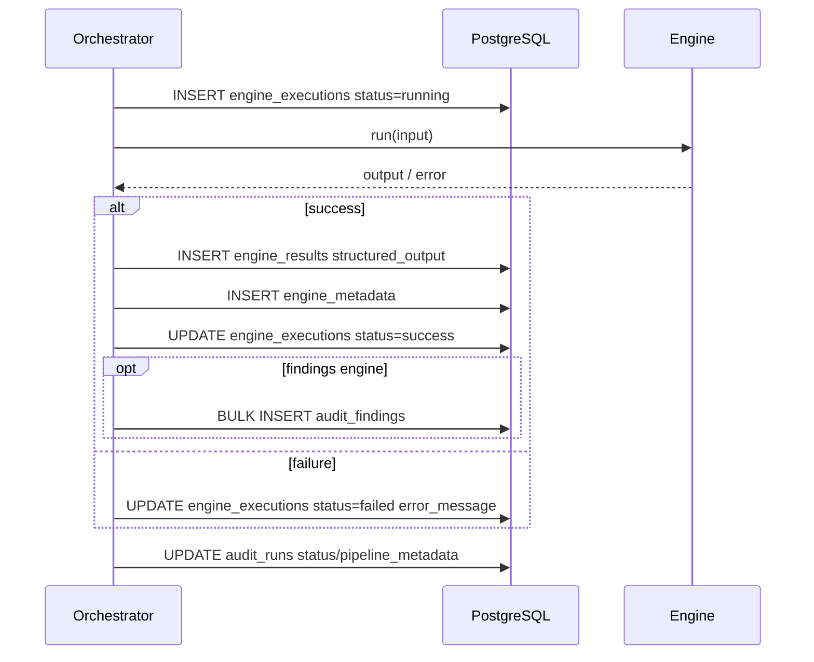
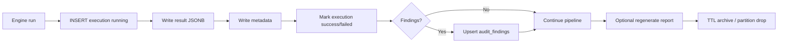
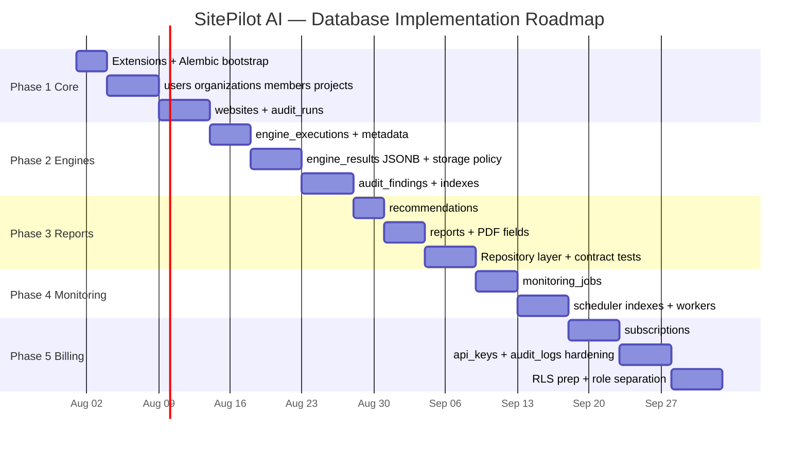

# SitePilot AI — Database Specification

**Your AI-powered Website Intelligence Platform.**

| | |
|---|---|
| **Document Type** | Database Engineering Specification |
| **Product** | SitePilot AI |
| **Document** | `DATABASE_SPEC.md` |
| **Version** | 1.0.0 |
| **Status** | `Draft — Implementation Authority` |
| **Owner** | Platform Engineering / Data |
| **Audience** | Senior Backend Engineers, DBAs, SRE |
| **Primary Store** | PostgreSQL 16+ |
| **Cache / Queue** | Redis 7+ |
| **Migrations** | Alembic |
| **Last Updated** | 2026-07-12 |
| **Companion Docs** | [PRD.md](./PRD.md), [ENGINE_SPEC.md](./ENGINE_SPEC.md), [ARCHITECTURE.md](./ARCHITECTURE.md), [API_SPEC.md](./API_SPEC.md), [SECURITY.md](./SECURITY.md) |

> [!NOTE]
> This document is the **implementation authority** for SitePilot AI’s relational data model. Application code, ORMs, and migrations must conform to these contracts. Spec changes require an RFC and a versioned Alembic migration.

> [!WARNING]
> Do **not** persist only a final report blob. Every engine execution and finding must be queryable independently. Collapsing the pipeline into a single JSON document is an architecture violation for MVP-forward production design.

---

## Table of Contents

1. [Database Overview](#1-database-overview)
2. [Database Design Principles](#2-database-design-principles)
3. [Database Architecture](#3-database-architecture)
4. [Core Entities](#4-core-entities)
5. [Users](#5-users)
6. [Organizations](#6-organizations)
7. [Projects](#7-projects)
8. [Websites](#8-websites)
9. [Audit Runs](#9-audit-runs)
10. [Engine Execution Architecture](#10-engine-execution-architecture)
11. [Engine Executions](#11-engine-executions)
12. [Engine Results](#12-engine-results)
13. [Engine Metadata](#13-engine-metadata)
14. [Audit Findings](#14-audit-findings)
15. [Recommendations](#15-recommendations)
16. [Reports](#16-reports)
16A. [AI Generations](#16a-ai-generations)
16B. [AI Generation Jobs](#16b-ai-generation-jobs)
17. [Monitoring Jobs](#17-monitoring-jobs)
18. [Subscriptions](#18-subscriptions)
19. [API Keys](#19-api-keys)
20. [Audit Logs](#20-audit-logs)
21. [Physical Database Design](#21-physical-database-design)
22. [Indexing Strategy](#22-indexing-strategy)
23. [JSONB Storage Strategy](#23-jsonb-storage-strategy)
24. [Engine Data Storage](#24-engine-data-storage)
25. [Database Transactions](#25-database-transactions)
26. [Alembic Migration Strategy](#26-alembic-migration-strategy)
27. [Redis Caching Strategy](#27-redis-caching-strategy)
28. [Performance Optimization](#28-performance-optimization)
29. [Security](#29-security)
30. [Backup Strategy](#30-backup-strategy)
31. [Disaster Recovery](#31-disaster-recovery)
32. [Scaling Strategy](#32-scaling-strategy)
33. [Database Folder Structure](#33-database-folder-structure)
34. [Implementation Roadmap](#34-implementation-roadmap)
35. [Best Practices](#35-best-practices)

---

## 1. Database Overview

### 1.1 Purpose

SitePilot AI persists:

- Multi-tenant workspace identity (users, organizations, projects)
- Website inventory and normalized crawl targets
- Audit runs and **per-engine execution artifacts**
- Findings, recommendations, and assembled reports
- Future monitoring schedules, billing subscriptions, and API keys
- Immutable operational audit logs

The database is the system of record for product state. Object storage holds large binaries (PDFs, optional raw HTML blobs). Redis holds ephemeral cache and job queues.

### 1.2 Why PostgreSQL

| Criterion | Rationale |
|---|---|
| **ACID** | Audit pipelines require atomic stage transitions; billing and API keys require strong consistency |
| **Scalability** | Proven vertical scale + read replicas; partitioning for high-volume `audit_runs` / `audit_findings` |
| **JSONB** | First-class semi-structured storage for engine payloads, Lighthouse JSON, AI responses — indexable via GIN |
| **Performance** | Mature planner, parallel query, BRIN/GIN/BTREE, connection pooling via PgBouncer |
| **Full-text Search** | `tsvector` / GIN for searching findings, report summaries, website URLs |
| **Extensions** | `pgcrypto`, `uuid-ossp` / `pgcrypto.gen_random_uuid()`, `pg_trgm`, `pg_stat_statements`, optional `pgvector` later |
| **Future Cloud Support** | Portable across Railway, RDS, Cloud SQL, Neon, Supabase, AlloyDB with minimal dialect lock-in |

### 1.3 Philosophy

1. **Relational core, JSONB edges** — identity, FKs, scores, and statuses are columns; bulky/variable engine payloads are JSONB.
2. **Engine-native persistence** — store every engine run, not only the final report.
3. **Tenant-ready from day one** — org/project FKs even if MVP auth is deferred.
4. **Append-friendly analytics** — findings and engine executions grow fast; design for partition + archive.
5. **Rebuildable artifacts** — reports can be regenerated from engine results + findings without re-crawling when inputs are intact.
6. **Security by schema** — least-privilege roles, hashed secrets, soft deletes for recovery, hard deletes only via controlled jobs.

> [!TIP]
> Prefer **narrow typed columns** for anything you filter, sort, join, or alert on. Prefer **JSONB** for anything you mostly store, version, and occasionally dig into.

---

## 2. Database Design Principles

### 2.1 UUID Primary Keys

| Rule | Detail |
|---|---|
| Type | `UUID` |
| Generation | `gen_random_uuid()` (pgcrypto) server-side default |
| Format in APIs | Prefixed strings optional at API layer (`rep_`, `usr_`) mapped to UUID internally **or** store prefixed ids as `TEXT` — **MVP chooses UUID columns + API prefixes as presentation only** |
| Why | Merge-safe across regions, non-enumerable vs serial integers |

```sql
id UUID PRIMARY KEY DEFAULT gen_random_uuid()
```

### 2.2 Soft Deletes

| Column | Type | Meaning |
|---|---|---|
| `deleted_at` | `TIMESTAMPTZ NULL` | Soft-deleted when non-null |

- Default queries filter `WHERE deleted_at IS NULL`.
- Unique constraints that must ignore deleted rows use **partial unique indexes**.
- Hard delete only via retention jobs or legal erasure workflows.

### 2.3 Timestamps

| Column | Rule |
|---|---|
| `created_at` | `TIMESTAMPTZ NOT NULL DEFAULT now()` |
| `updated_at` | `TIMESTAMPTZ NOT NULL DEFAULT now()`; maintained by trigger or ORM `onupdate` |

All timestamps are **UTC** (`TIMESTAMPTZ`).

### 2.4 Audit Trail

- Domain tables carry `created_at` / `updated_at` / optional `created_by_user_id`.
- Cross-cutting events go to `audit_logs` (immutable append-only).
- Engine executions form a technical audit trail of pipeline work.

### 2.5 Foreign Keys

- Every relationship uses an explicit FK with a named constraint.
- Prefer `ON DELETE RESTRICT` for tenant roots; `ON DELETE CASCADE` only for true ownership children (e.g., findings → audit run).
- Document cascade choice per table (see physical design).

### 2.6 Constraints

| Kind | Use |
|---|---|
| `NOT NULL` | Required business fields |
| `CHECK` | Status enums, score ranges 0–100, confidence 0–100 |
| `UNIQUE` | Email, org slug, API key hash |
| `EXCLUDE` / partial unique | Soft-delete-aware uniqueness |

### 2.7 Cascading

| Parent | Child | On Delete |
|---|---|---|
| `organizations` | `projects` | `CASCADE` or soft-delete propagation job |
| `projects` | `websites` | `RESTRICT` if audits exist; else `CASCADE` |
| `audit_runs` | `engine_executions`, `audit_findings`, `reports` | `CASCADE` |
| `users` | authored rows | `SET NULL` on nullable `created_by` |

### 2.8 JSONB Strategy

Store in JSONB when:

- Shape varies by engine version
- Payload is large and rarely filtered as a whole
- You need to retain raw provider responses for debugging

Do **not** put primary filter keys only inside JSONB (status, scores, website_id, engine name).

### 2.9 Normalization

3NF for identity and tenancy graphs. Avoid duplicating user email onto every audit run.

### 2.10 Denormalization Strategy

Allowed denormalization:

- Scores on `audit_runs` (copied from Health Score engine for list queries)
- `canonical_url` on `websites` and echoed on `audit_runs` for history if site URL changes later
- Materialized `reports.executive_summary` for read APIs

Denormalized fields must declare a **source of truth** engine/table.

### 2.11 Partitioning

Candidates (when row counts justify):

- `audit_findings` by `created_at` (monthly)
- `engine_results` by `created_at` (monthly)
- `audit_logs` by `created_at` (monthly)

Do not partition early; add when a table exceeds ~50–100M rows or vacuum pain appears.

### 2.12 Indexing

Index FKs, status filters, tenant scopes, and JSONB paths you query in product features. See §22.

### 2.13 Event Logging

`audit_logs` is append-only. No updates. No soft deletes. Retention via partition drop.

---

## 3. Database Architecture

### 3.1 Logical ER Diagram



### 3.2 Tenancy Model



### 3.3 MVP vs Auth Note

> [!NOTE]
> PRD MVP may ship **without end-user authentication**. Still create `users`, `organizations`, and `projects` schemas now. Anonymous audits may use a system org (`org_public_mvp`) and nullable `created_by_user_id`. This avoids a breaking tenancy migration when auth lands in V2.

---

## 4. Core Entities

| Entity | Table | Purpose |
|---|---|---|
| Users | `users` | Human identities |
| Organizations | `organizations` | Billing + workspace tenant |
| Org Members | `organization_members` | User↔org membership ( foreseen ) |
| Projects | `projects` | Group websites under an org |
| Websites | `websites` | Canonical crawl targets |
| Audit Runs | `audit_runs` | One scan instance |
| Engine Executions | `engine_executions` | One engine invocation |
| Engine Results | `engine_results` | Structured/raw engine output |
| Engine Metadata | `engine_metadata` | Config/version/timing adjunct |
| Audit Findings | `audit_findings` | Normalized issues |
| Recommendations | `recommendations` | AI/rule recommendations |
| Reports | `reports` | Assembled customer artifact |
| Monitoring Jobs | `monitoring_jobs` | Scheduled rescans (future) |
| Subscriptions | `subscriptions` | SaaS billing state |
| API Keys | `api_keys` | Programmatic access |
| Audit Logs | `audit_logs` | Security/ops event stream |

---

## 5. Users

### 5.1 Purpose

Authenticate and authorize humans. Support roles for future admin/agency workflows.

### 5.2 Columns

| Column | Type | Nullable | Default | Constraints |
|---|---|---|---|---|
| `id` | `UUID` | NO | `gen_random_uuid()` | PK |
| `email` | `CITEXT` | NO | — | UNIQUE where not deleted |
| `password_hash` | `TEXT` | YES | NULL | Nullable for SSO-future / magic-link |
| `avatar_url` | `TEXT` | YES | NULL | HTTPS URL |
| `full_name` | `TEXT` | YES | NULL | |
| `role` | `TEXT` | NO | `'member'` | CHECK ∈ `owner,admin,member,viewer,system` |
| `status` | `TEXT` | NO | `'active'` | CHECK ∈ `active,invited,suspended,deleted` |
| `last_login_at` | `TIMESTAMPTZ` | YES | NULL | |
| `email_verified_at` | `TIMESTAMPTZ` | YES | NULL | |
| `created_at` | `TIMESTAMPTZ` | NO | `now()` | |
| `updated_at` | `TIMESTAMPTZ` | NO | `now()` | |
| `deleted_at` | `TIMESTAMPTZ` | YES | NULL | Soft delete |

### 5.3 Relationships

- M:N with `organizations` via `organization_members`
- 1:N optional actor on `audit_logs`, `audit_runs.created_by_user_id`

### 5.4 Indexes

```sql
CREATE UNIQUE INDEX users_email_active_uidx
  ON users (email) WHERE deleted_at IS NULL;
CREATE INDEX users_status_idx ON users (status) WHERE deleted_at IS NULL;
CREATE INDEX users_last_login_idx ON users (last_login_at DESC NULLS LAST);
```

### 5.5 Future Fields

`mfa_enabled`, `locale`, `timezone`, `sso_subject`, `github_id`

### 5.6 Estimated Growth

| Horizon | Rows |
|---|---|
| Year 1 | 10k–100k |
| Year 3 | 1M |

---

## 6. Organizations

### 6.1 Purpose

Tenant root for **Team Workspaces**, billing, API keys, and project ownership.

### 6.2 Columns

| Column | Type | Nullable | Default | Constraints |
|---|---|---|---|---|
| `id` | `UUID` | NO | `gen_random_uuid()` | PK |
| `name` | `TEXT` | NO | — | |
| `slug` | `CITEXT` | NO | — | UNIQUE active |
| `plan_tier` | `TEXT` | NO | `'free'` | CHECK plan enum |
| `status` | `TEXT` | NO | `'active'` | `active,suspended,closed` |
| `billing_email` | `CITEXT` | YES | NULL | |
| `settings` | `JSONB` | NO | `'{}'` | Feature flags, branding |
| `created_at` | `TIMESTAMPTZ` | NO | `now()` | |
| `updated_at` | `TIMESTAMPTZ` | NO | `now()` | |
| `deleted_at` | `TIMESTAMPTZ` | YES | NULL | |

### 6.3 Membership Table `organization_members`

| Column | Type | Notes |
|---|---|---|
| `id` | UUID PK | |
| `organization_id` | UUID FK → organizations | CASCADE |
| `user_id` | UUID FK → users | CASCADE |
| `role` | TEXT | `owner,admin,member,viewer` |
| `created_at` | TIMESTAMPTZ | |
| UNIQUE | (`organization_id`,`user_id`) WHERE deleted_at IS NULL | |

### 6.4 Indexes / Growth

- Unique slug partial index
- Growth: 5k–50k orgs Y1; scales with B2B motion

---

## 7. Projects

### 7.1 Purpose

Each organization owns multiple projects (e.g., “Client A”, “Marketing Sites”).

### 7.2 Columns

| Column | Type | Nullable | Default | Constraints |
|---|---|---|---|---|
| `id` | `UUID` | NO | `gen_random_uuid()` | PK |
| `organization_id` | `UUID` | NO | — | FK organizations |
| `name` | `TEXT` | NO | — | |
| `slug` | `CITEXT` | NO | — | Unique per org |
| `description` | `TEXT` | YES | NULL | |
| `status` | `TEXT` | NO | `'active'` | |
| `created_by_user_id` | `UUID` | YES | NULL | FK users SET NULL |
| `created_at` | `TIMESTAMPTZ` | NO | `now()` | |
| `updated_at` | `TIMESTAMPTZ` | NO | `now()` | |
| `deleted_at` | `TIMESTAMPTZ` | YES | NULL | |

```sql
CREATE UNIQUE INDEX projects_org_slug_uidx
  ON projects (organization_id, slug) WHERE deleted_at IS NULL;
CREATE INDEX projects_org_idx ON projects (organization_id) WHERE deleted_at IS NULL;
```

### 7.3 Future Fields

`default_scoring_config_id`, `branding_profile_id`

### 7.4 Growth

Tens of projects per org typical; hundreds for agencies.

---

## 8. Websites

### 8.1 Purpose

Canonical representation of a site under a project — the durable entity audits attach to.

### 8.2 Columns

| Column | Type | Nullable | Default | Constraints |
|---|---|---|---|---|
| `id` | `UUID` | NO | `gen_random_uuid()` | PK |
| `project_id` | `UUID` | NO | — | FK projects |
| `canonical_url` | `TEXT` | NO | — | Normalized URL |
| `original_url` | `TEXT` | NO | — | User-entered |
| `host` | `TEXT` | NO | — | Derived host |
| `technology_stack` | `JSONB` | NO | `'[]'` | Detected stack tags |
| `language` | `TEXT` | YES | NULL | `html[lang]` / detected |
| `country` | `TEXT` | YES | NULL | ISO country guess (future) |
| `industry` | `TEXT` | YES | NULL | Optional taxonomy |
| `favicon_url` | `TEXT` | YES | NULL | |
| `title_last_seen` | `TEXT` | YES | NULL | Denorm convenience |
| `is_https` | `BOOLEAN` | YES | NULL | Last known |
| `created_at` | `TIMESTAMPTZ` | NO | `now()` | |
| `updated_at` | `TIMESTAMPTZ` | NO | `now()` | |
| `deleted_at` | `TIMESTAMPTZ` | YES | NULL | |

```sql
CREATE UNIQUE INDEX websites_project_canonical_uidx
  ON websites (project_id, canonical_url) WHERE deleted_at IS NULL;
CREATE INDEX websites_host_idx ON websites (host);
CREATE INDEX websites_canonical_trgm_idx ON websites USING GIN (canonical_url gin_trgm_ops);
```

### 8.3 Future Fields

`robots_policy`, `preferred_strategy` (`mobile`/`desktop`), `tags[]`

### 8.4 Growth

Y1: 50k–500k websites depending on anonymous vs authenticated usage.

---

## 9. Audit Runs

### 9.1 Purpose

**One row per website scan.** Orchestrator lifecycle + denormalized scores for list/detail APIs.

### 9.2 Columns

| Column | Type | Nullable | Default | Constraints |
|---|---|---|---|---|
| `id` | `UUID` | NO | `gen_random_uuid()` | PK |
| `website_id` | `UUID` | NO | — | FK websites |
| `organization_id` | `UUID` | NO | — | Denorm tenant scope FK |
| `project_id` | `UUID` | NO | — | Denorm FK |
| `created_by_user_id` | `UUID` | YES | NULL | FK users |
| `requested_url` | `TEXT` | NO | — | |
| `canonical_url` | `TEXT` | NO | — | Snapshot |
| `status` | `TEXT` | NO | `'pending'` | CHECK status enum (§9.2.1) |
| `current_engine` | `TEXT` | YES | NULL | Active engine name for progress UI / workers |
| `progress_percent` | `SMALLINT` | NO | `0` | CHECK 0–100; frontend polling progress |
| `failure_code` | `TEXT` | YES | NULL | |
| `failure_message` | `TEXT` | YES | NULL | Public-safe |
| `started_at` | `TIMESTAMPTZ` | YES | NULL | |
| `completed_at` | `TIMESTAMPTZ` | YES | NULL | |
| `duration_ms` | `INTEGER` | YES | NULL | CHECK ≥ 0 |
| `health_score` | `SMALLINT` | YES | NULL | 0–100 |
| `seo_score` | `SMALLINT` | YES | NULL | 0–100 |
| `performance_score` | `SMALLINT` | YES | NULL | 0–100 |
| `security_score` | `SMALLINT` | YES | NULL | 0–100 |
| `accessibility_score` | `SMALLINT` | YES | NULL | 0–100 |
| `business_score` | `SMALLINT` | YES | NULL | Optional composite |
| `roi_score` | `SMALLINT` | YES | NULL | Optional index band |
| `confidence_score` | `SMALLINT` | YES | NULL | Aggregate confidence |
| `scoring_config_version` | `TEXT` | YES | NULL | e.g. `scoring_config@3` |
| `engine_versions` | `JSONB` | NO | `'{}'` | Map engine→version |
| `pipeline_metadata` | `JSONB` | NO | `'{}'` | Warnings, gaps, flags |
| `client_ip_hash` | `TEXT` | YES | NULL | Privacy-preserving |
| `created_at` | `TIMESTAMPTZ` | NO | `now()` | |
| `updated_at` | `TIMESTAMPTZ` | NO | `now()` | |
| `deleted_at` | `TIMESTAMPTZ` | YES | NULL | |

#### 9.2.1 Status enum

Allowed values (lowercase snake_case; matches `AuditStatus` in application code):

| Status | Meaning |
|---|---|
| `pending` | AuditRun created; pipeline not started |
| `validating` | URL Validation engine in progress |
| `crawling` | Crawler fetching pages/artifacts |
| `analyzing` | Analysis engines running (SEO, Performance, Security, Accessibility, etc.) |
| `scoring` | Health Score (and related score aggregation) in progress |
| `enriching` | Business Impact, ROI, Data Quality, and/or AI enrichment |
| `building_report` | Report Builder assembling customer-facing report |
| `complete` | Terminal success; mandatory engines satisfied |
| `complete_with_warnings` | Terminal success with soft gaps / non-blocking warnings |
| `failed` | Terminal failure; see `failure_code` / `failure_message` |
| `cancelled` | Terminal; cancelled before completion |

Obsolete coarse values such as `processing`, `queued`, or `running` are **not** stored. Map product language as needed: queued → `pending`; running → an in-pipeline status (`analyzing`, etc.); completed → `complete`.

#### 9.2.2 Progress tracking columns

These first-class columns support **frontend polling** (`GET /api/v1/audits/{audit_id}`) so the analyzing UI can show live progress without parsing `pipeline_metadata`. Future workers also update them for coordination and observability.

| Column | Type | Nullable | Default | Validation | Purpose |
|---|---|---|---|---|---|
| `progress_percent` | `SMALLINT` | NO | `0` | `CHECK (progress_percent BETWEEN 0 AND 100)` | Overall pipeline progress 0–100 exposed as API `progress` |
| `current_engine` | `TEXT` | YES | `NULL` | Free-text engine key (e.g. `seo_intelligence`, `performance`) | Which engine is active; frontend progress label; worker handoff hint |

Rules:

- On create: `progress_percent = 0`, `current_engine = NULL`, `status = pending`.
- Orchestrator / workers may update both columns as the pipeline advances.
- On successful completion helpers set `progress_percent = 100`.
- Do not use these columns as the system of record for engine outcomes — that remains `engine_executions` / `engine_results` once those tables exist.

```sql
ALTER TABLE audit_runs ADD CONSTRAINT audit_runs_score_chk CHECK (
  health_score BETWEEN 0 AND 100 OR health_score IS NULL
);
-- repeat pattern for other scores
ALTER TABLE audit_runs ADD CONSTRAINT audit_runs_progress_chk CHECK (
  progress_percent >= 0 AND progress_percent <= 100
);
CREATE INDEX audit_runs_website_created_idx ON audit_runs (website_id, created_at DESC);
CREATE INDEX audit_runs_org_status_idx ON audit_runs (organization_id, status);
CREATE INDEX audit_runs_status_idx ON audit_runs (status) WHERE deleted_at IS NULL;
```

### 9.3 Relationships

Parent of `engine_executions`, `audit_findings`, `recommendations`, `reports`.

### 9.4 Future Fields

`trigger_source` (`api,ui,monitor,cli`), `parent_audit_run_id` (diff runs)

### 9.5 Estimated Growth

| Horizon | Audit runs |
|---|---|
| MVP 90d | 5k–50k |
| Y1 | 1M–10M |
| Y3 | 50M+ → partition by month |

---

## 10. Engine Execution Architecture

### 10.1 Why Persist Every Engine Separately

Storing only a final report is insufficient for a multi-engine SaaS.

| Benefit | Explanation |
|---|---|
| **Debugging** | Inspect exact SEO output when AI prose looks wrong |
| **Re-run one engine** | Recompute Business Impact without re-crawling |
| **Compare engine versions** | Diff `seo@1.2` vs `seo@1.3` on same crawl artifact |
| **Historical analytics** | Trend crawler latency, PSI failure rates |
| **Regenerating reports** | Report Builder reads findings + recommendations, not HTML |
| **Partial execution** | Resume pipeline after Performance soft-fail |

> [!WARNING]
> If you only save `reports.report_json`, you cannot prove whether a bug was in Performance, DQ, or AI — and you cannot cheaply regenerate after a prompt fix.

### 10.2 Persistence Model



### 10.3 Pipeline Persistence Flow



### 10.4 Tables Involved

| Table | Stores |
|---|---|
| `engine_executions` | Lifecycle of one engine call |
| `engine_results` | Structured (+ optional raw) output |
| `engine_metadata` | Config snapshot, resource stats, provider ids |
| `audit_findings` | Normalized issues extracted for product queries |
| `recommendations` | AI/rule recommendation rows |
| `reports` | Customer-facing assembly |

### 10.5 Sequence — Persist One Engine



---

## 11. Engine Executions

### 11.1 Purpose

Track each engine invocation bound to an audit run.

### 11.2 Columns

| Column | Type | Nullable | Default | Constraints |
|---|---|---|---|---|
| `id` | `UUID` | NO | `gen_random_uuid()` | PK |
| `audit_run_id` | `UUID` | NO | — | FK audit_runs CASCADE |
| `engine_name` | `TEXT` | NO | — | CHECK known engine set |
| `engine_version` | `TEXT` | NO | — | semver / git sha |
| `attempt` | `SMALLINT` | NO | `1` | Retry count |
| `status` | `TEXT` | NO | `'pending'` | `pending,running,success,partial,failed,skipped` |
| `started_at` | `TIMESTAMPTZ` | YES | NULL | |
| `completed_at` | `TIMESTAMPTZ` | YES | NULL | |
| `execution_time_ms` | `INTEGER` | YES | NULL | |
| `error_code` | `TEXT` | YES | NULL | |
| `error_message` | `TEXT` | YES | NULL | |
| `configuration` | `JSONB` | NO | `'{}'` | Effective config snapshot |
| `input_artifact_ref` | `TEXT` | YES | NULL | Pointer to prior result id/key |
| `created_at` | `TIMESTAMPTZ` | NO | `now()` | |
| `updated_at` | `TIMESTAMPTZ` | NO | `now()` | |

**Engine name CHECK includes:**  
`url_validation,crawler,parser,html_parser,seo,seo_intelligence,accessibility,security,performance,business,business_impact,health,health_score,roi,data_quality,ai_recommendation,report_builder,pdf`

> **Sprint 14:** Pipeline engine names (`parser`, `seo`, `health`, …) are accepted alongside longer DATABASE aliases (`html_parser`, `seo_intelligence`, `health_score`).

```sql
CREATE UNIQUE INDEX engine_executions_run_engine_attempt_uidx
  ON engine_executions (audit_run_id, engine_name, attempt);
CREATE INDEX engine_executions_run_idx ON engine_executions (audit_run_id);
CREATE INDEX engine_executions_name_status_idx ON engine_executions (engine_name, status);
```

### 11.3 Growth

14 engines × audit runs ≈ order-of-magnitude larger than `audit_runs`.

---

### 11.4 Table: `health_scores` (Sprint 14)

1:1 snapshot of Health Score Engine output per audit run (in addition to denormalized score columns on `audit_runs`).

| Column | Type | Nullable | Notes |
|---|---|---|---|
| `id` | `UUID` | NO | PK |
| `audit_run_id` | `UUID` | NO | FK CASCADE, UNIQUE |
| `overall_score` | `SMALLINT` | NO | 0–100 |
| `seo_score` / `accessibility_score` / `security_score` / `performance_score` / `business_score` | `SMALLINT` | YES | |
| `grade` | `TEXT` | NO | Letter grade |
| `confidence` | `SMALLINT` | NO | 0–100 |
| `category_scores` | `JSONB` | NO | `{seo, accessibility, …}` |
| `breakdown` | `JSONB` | NO | Explainable ScoreBreakdown |
| `penalties` | `JSONB` | NO | Penalty list / wrapper |
| `configuration_version` | `TEXT` | NO | e.g. `scoring_config@sprint13` |
| `created_at` / `updated_at` | `TIMESTAMPTZ` | NO | |

> Finding rows live in `audit_findings` (not `analysis_findings`). Sprint 14 persists title→`issue`, description→`technical_detail`; recommendation / ROI enrichment columns remain null until later sprints.

## 12. Engine Results

### 12.1 Purpose

Persist structured (and optionally raw) engine outputs for replay and debugging.

### 12.2 Columns

| Column | Type | Nullable | Default | Constraints |
|---|---|---|---|---|
| `id` | `UUID` | NO | `gen_random_uuid()` | PK |
| `audit_run_id` | `UUID` | NO | — | FK CASCADE (denorm for partition-friendly queries) |
| `engine_execution_id` | `UUID` | NO | — | FK engine_executions CASCADE UNIQUE |
| `schema_version` | `TEXT` | NO | — | e.g. `engine.seo.output.v1` |
| `structured_output` | `JSONB` | NO | — | Contractual output |
| `raw_output` | `JSONB` | YES | NULL | Provider raw (PSI, LLM) |
| `confidence` | `SMALLINT` | YES | NULL | 0–100 rollup if applicable |
| `artifact_uri` | `TEXT` | YES | NULL | S3 URI for huge HTML |
| `content_hash` | `TEXT` | YES | NULL | sha256 of structured_output |
| `metadata` | `JSONB` | NO | `'{}'` | Non-config misc |
| `created_at` | `TIMESTAMPTZ` | NO | `now()` | |

```sql
CREATE UNIQUE INDEX engine_results_execution_uidx ON engine_results (engine_execution_id);
CREATE INDEX engine_results_audit_idx ON engine_results (audit_run_id);
CREATE INDEX engine_results_structured_gin ON engine_results USING GIN (structured_output jsonb_path_ops);
```

> [!TIP]
> Store crawler HTML in object storage when `html_bytes > 256KB`; keep `artifact_uri` + truncated preview in JSONB.

### 12.3 Future Fields

`compressed_raw BYTEA`, `encoding`

### 12.4 Growth

≈ 1 row per successful/partial execution; largest table by storage bytes.

---

## 13. Engine Metadata

### 13.1 Purpose

Side-channel descriptive data: provider request ids, token usage, browser pool stats, cache hit flags — separated so `engine_results.structured_output` stays schema-pure.

### 13.2 Columns

| Column | Type | Nullable | Default | Constraints |
|---|---|---|---|---|
| `id` | `UUID` | NO | `gen_random_uuid()` | PK |
| `engine_execution_id` | `UUID` | NO | — | FK UNIQUE CASCADE |
| `audit_run_id` | `UUID` | NO | — | FK CASCADE |
| `provider` | `TEXT` | YES | NULL | `psi,openai,gemini,playwright,none` |
| `provider_request_id` | `TEXT` | YES | NULL | |
| `cache_hit` | `BOOLEAN` | NO | `false` | |
| `token_usage` | `JSONB` | YES | NULL | `{prompt,completion,total}` |
| `resource_usage` | `JSONB` | NO | `'{}'` | CPU/mem hints |
| `warnings` | `JSONB` | NO | `'[]'` | |
| `extras` | `JSONB` | NO | `'{}'` | |
| `created_at` | `TIMESTAMPTZ` | NO | `now()` | |

---

## 14. Audit Findings

### 14.1 Purpose

Normalized, queryable issues detected by any analysis engine (and enriched by Business Impact / ROI / AI fields over time).

### 14.2 Columns

| Column | Type | Nullable | Default | Constraints |
|---|---|---|---|---|
| `id` | `UUID` | NO | `gen_random_uuid()` | PK |
| `audit_run_id` | `UUID` | NO | — | FK CASCADE |
| `engine_execution_id` | `UUID` | YES | NULL | FK SET NULL |
| `engine_name` | `TEXT` | NO | — | Origin engine |
| `finding_id` | `TEXT` | NO | — | Stable id `seo.meta_description.missing` |
| `category` | `TEXT` | NO | — | seo/performance/... |
| `severity` | `TEXT` | NO | — | critical/high/medium/low/info |
| `priority` | `TEXT` | YES | NULL | Critical/High/Medium/Low |
| `confidence` | `SMALLINT` | NO | — | 0–100 |
| `status` | `TEXT` | NO | `'fail'` | pass/fail/warn/skip/error |
| `issue` | `TEXT` | NO | — | Human title |
| `technical_detail` | `TEXT` | YES | NULL | |
| `business_impact` | `TEXT` | YES | NULL | |
| `expected_outcome` | `TEXT` | YES | NULL | |
| `recommendation` | `TEXT` | YES | NULL | May mirror AI action |
| `estimated_effort` | `TEXT` | YES | NULL | |
| `estimated_roi` | `TEXT` | YES | NULL | Hedged / band |
| `roi_index` | `NUMERIC(10,4)` | YES | NULL | |
| `impact_domain` | `TEXT` | YES | NULL | seo/revenue/... |
| `wcag` | `TEXT` | YES | NULL | |
| `evidence` | `JSONB` | NO | `'{}'` | |
| `resolution_status` | `TEXT` | NO | `'open'` | open,accepted,resolved,wontfix,reopened |
| `resolved_at` | `TIMESTAMPTZ` | YES | NULL | |
| `created_at` | `TIMESTAMPTZ` | NO | `now()` | |
| `updated_at` | `TIMESTAMPTZ` | NO | `now()` | |

```sql
CREATE UNIQUE INDEX audit_findings_run_finding_uidx
  ON audit_findings (audit_run_id, finding_id);
CREATE INDEX audit_findings_run_priority_idx
  ON audit_findings (audit_run_id, priority, confidence DESC);
CREATE INDEX audit_findings_category_sev_idx
  ON audit_findings (category, severity);
CREATE INDEX audit_findings_evidence_gin
  ON audit_findings USING GIN (evidence jsonb_path_ops);
```

### 14.3 Growth

10–100 findings per run × millions of runs → **partition candidate #1**.

---

## 15. Recommendations

### 15.1 Purpose

Store AI (or fallback template) recommendation payloads per audit run / finding.

### 15.2 Columns (Sprint 15 rule-based recommendations)

| Column | Type | Nullable | Default | Constraints |
|---|---|---|---|---|
| `id` | `UUID` | NO | `gen_random_uuid()` | PK |
| `audit_run_id` | `UUID` | NO | — | FK CASCADE |
| `engine_execution_id` | `UUID` | YES | NULL | FK SET NULL |
| `recommendation_id` | `TEXT` | NO | — | Stable template id `rec.seo.add_document_title` |
| `finding_id` | `TEXT` | YES | NULL | Primary/first affected finding |
| `title` | `TEXT` | NO | — | Template title |
| `recommendation_text` | `TEXT` | NO | — | Template description / action |
| `technical_reason` | `TEXT` | YES | NULL | |
| `business_explanation` | `TEXT` | YES | NULL | Template business_reason |
| `category` | `TEXT` | NO | — | SEO/Accessibility/… |
| `priority` | `TEXT` | NO | — | Critical/High/Medium/Low |
| `estimated_effort` | `TEXT` | NO | — | Very Low…Very High |
| `estimated_impact` | `TEXT` | NO | — | Critical/High/Medium/Low |
| `priority_score` | `FLOAT` | NO | `0` | 0–100 sort key |
| `confidence` | `SMALLINT` | NO | — | 0–100 |
| `status` | `TEXT` | NO | `'open'` | open/accepted/in_progress/done/dismissed |
| `is_quick_win` | `BOOLEAN` | NO | `false` | |
| `affected_findings` | `JSONB` | NO | `'[]'` | Finding id list |
| `related_rules` | `JSONB` | NO | `'[]'` | |
| `prompt_version` | `TEXT` | NO | — | `recommendation_rules@sprint15` |
| `model_used` | `TEXT` | NO | — | `rules:v1` (Sprint 15; AI later) |
| `provider` | `TEXT` | NO | — | `rules` |
| `version` | `INTEGER` | NO | `1` | Regeneration counter |
| `raw_response` | `JSONB` | YES | NULL | Serialized Recommendation |
| `is_fallback` | `BOOLEAN` | NO | `false` | Prefix/generic template |
| `created_at` | `TIMESTAMPTZ` | NO | `now()` | |
| `updated_at` | `TIMESTAMPTZ` | NO | `now()` | |

```sql
CREATE INDEX recommendations_run_idx ON recommendations (audit_run_id);
CREATE UNIQUE INDEX recommendations_run_rec_ver_uidx
  ON recommendations (audit_run_id, recommendation_id, version);
CREATE INDEX recommendations_priority_idx ON recommendations (audit_run_id, priority);
```

### 15.3 Table: `recommendation_sources` (Sprint 15)

Links each recommendation row to contributing findings (dedup evidence).

| Column | Type | Nullable | Notes |
|---|---|---|---|
| `id` | `UUID` | NO | PK |
| `audit_run_id` | `UUID` | NO | FK CASCADE |
| `recommendation_row_id` | `UUID` | NO | FK CASCADE |
| `finding_id` | `TEXT` | NO | |
| `source_engine` | `TEXT` | YES | |
| `severity` | `TEXT` | YES | |
| `evidence` | `JSONB` | NO | `'{}'` |
| `created_at` / `updated_at` | `TIMESTAMPTZ` | NO | |

```sql
CREATE UNIQUE INDEX recommendation_sources_row_finding_uidx
  ON recommendation_sources (recommendation_row_id, finding_id);
```

> Sprint 15 uses **deterministic templates** (`provider=rules`). Future AI Recommendation Engine may write additional versions with `provider=openai|gemini` without inventing new findings.

## 16. Reports

### 16.1 Purpose

Customer-facing assembled artifact metadata + pointers to JSON/PDF.

### 16.2 Columns

| Column | Type | Nullable | Default | Constraints |
|---|---|---|---|---|
| `id` | `UUID` | NO | `gen_random_uuid()` | PK |
| `audit_run_id` | `UUID` | NO | — | FK UNIQUE CASCADE |
| `version` | `INTEGER` | NO | `1` | |
| `status` | `TEXT` | NO | `'ready'` | `ready,generating_pdf,failed` |
| `executive_summary` | `TEXT` | YES | NULL | |
| `business_summary` | `JSONB` | NO | `'{}'` | quick_wins, etc. |
| `report_json` | `JSONB` | NO | — | Full dashboard payload |
| `report_hash` | `TEXT` | YES | NULL | SHA-256 of canonical report content |
| `report_json_uri` | `TEXT` | YES | NULL | External if oversized |
| `pdf_url` | `TEXT` | YES | NULL | Signed URL or path |
| `pdf_content_hash` | `TEXT` | YES | NULL | |
| `pdf_expires_at` | `TIMESTAMPTZ` | YES | NULL | |
| `charts` | `JSONB` | NO | `'{}'` | Chart series |
| `schema_version` | `TEXT` | NO | `'report.v1'` | JSON contract version |
| `created_at` | `TIMESTAMPTZ` | NO | `now()` | |
| `updated_at` | `TIMESTAMPTZ` | NO | `now()` | |

```sql
CREATE UNIQUE INDEX reports_audit_run_uidx ON reports (audit_run_id);
CREATE INDEX reports_json_gin ON reports USING GIN (report_json jsonb_path_ops);
CREATE INDEX reports_hash_idx ON reports (report_hash);
```

> [!NOTE]
> `report_json` is a **projection**. Source of truth for technical findings remains `audit_findings` + `engine_results`.
> `version` is the **report generation counter** (`report_version` in the DTO). `schema_version` is the JSON contract (`report.v1`). `report_hash` enables smart regeneration (skip write when content unchanged).

---

## 16A. AI Generations

### 16A.1 Purpose

Persist grounded OpenAI explanations as **immutable, versioned business artifacts**. Live API responses remain `AIResponse[T]`; persistence is best-effort and transparent (Sprint 24).

Does **not** replace recommendations or findings — AI explains completed deterministic artifacts only.

### 16A.2 Columns (`ai_generations`)

| Column | Type | Nullable | Default | Constraints |
|---|---|---|---|---|
| `id` | `UUID` | NO | `gen_random_uuid()` | PK |
| `generation_id` | `UUID` | YES | NULL | Execution id from `AIResponse` |
| `feature` | `TEXT` | NO | — | `finding,recommendation,executive_summary,business_summary,quick_win` |
| `entity_type` | `TEXT` | NO | — | Same closed set as `feature` (`AIEntityType`) |
| `entity_id` | `TEXT` | NO | — | Business entity id (finding_id / recommendation_id / audit_id) |
| `audit_id` | `UUID` | YES | NULL | FK `audit_runs` CASCADE |
| `provider` | `TEXT` | NO | — | e.g. `openai` |
| `model` | `TEXT` | NO | — | |
| `schema_version` | `TEXT` | NO | — | AI schema id |
| `builder_version` | `INTEGER` | NO | — | |
| `prompt_version` | `TEXT` | NO | — | |
| `prompt_hash` | `TEXT` | YES | NULL | |
| `report_hash` | `TEXT` | NO | `''` | Ties generation to report content |
| `input_hash` | `TEXT` | YES | NULL | Prompt variables hash |
| `response_hash` | `TEXT` | NO | — | SHA-256 of canonical AIResponse (excludes volatile ids/timestamps) |
| `locale` | `TEXT` | NO | `'en'` | |
| `response_json` | `JSONB` | NO | — | Full `AIResponse` dump |
| `telemetry_json` | `JSONB` | YES | NULL | |
| `diagnostics_json` | `JSONB` | YES | NULL | |
| `status` | `TEXT` | NO | `'success'` | `success,cached,error` |
| `version` | `INTEGER` | NO | `1` | Immutable content version |
| `created_at` | `TIMESTAMPTZ` | NO | `now()` | |
| `updated_at` | `TIMESTAMPTZ` | NO | `now()` | |

```sql
CREATE UNIQUE INDEX ai_generations_feature_entity_report_ver_uidx
  ON ai_generations (feature, entity_id, report_hash, version);
CREATE INDEX ai_generations_audit_idx ON ai_generations (audit_id);
CREATE INDEX ai_generations_feature_idx ON ai_generations (feature);
CREATE INDEX ai_generations_entity_idx ON ai_generations (entity_type, entity_id);
CREATE INDEX ai_generations_report_hash_idx ON ai_generations (report_hash);
CREATE INDEX ai_generations_generation_id_idx ON ai_generations (generation_id);
CREATE INDEX ai_generations_response_hash_idx ON ai_generations (response_hash);
```

### 16A.3 Versioning

- Never update or delete prior rows (append-only).
- Same `feature` + `entity_id` + `report_hash` + `response_hash` → **reuse** existing version.
- Content change (including controlled regeneration) → insert `version + 1`.
- **Latest** = highest `version` for the current report hash (no mutable latest flag).

### 16A.4 Persistence policy

Best-effort after grounding succeeds. Repository failures are logged and must not fail the HTTP response.

### 16A.5 Regeneration (Sprint 25)

`POST …/ai/regenerate*` reuses the same generate → ground → `regenerate()`/`create_or_reuse` path. History endpoints (`latest`, `versions`, `versions/{n}`) are read-only against `ai_generations`.

---

## 16B. AI Generation Jobs

### 16B.1 Purpose

Async AI generation work units (Sprint 26). Separate from `ai_generations` — jobs track lifecycle; generations store immutable narrative artifacts.

### 16B.2 Columns (`ai_generation_jobs`)

| Column | Type | Nullable | Notes |
|---|---|---|---|
| `id` | `UUID` | NO | PK |
| `feature` | `TEXT` | NO | Same closed set as `ai_generations.feature` |
| `entity_type` | `TEXT` | NO | Same closed set |
| `entity_id` | `TEXT` | NO | Business identity (matches generations) |
| `resource_id` | `UUID` | NO | API path UUID (finding/rec row or audit) |
| `audit_id` | `UUID` | YES | FK `audit_runs` |
| `report_hash` | `TEXT` | NO | Report hash at enqueue time |
| `status` | `TEXT` | NO | `queued` \| `running` \| `completed` \| `failed` \| `cancelled` |
| `progress` | `INTEGER` | NO | 0–100 lifecycle checkpoint (Sprint 26.1) |
| `created_at` | `TIMESTAMPTZ` | NO | Row insert time |
| `queued_at` | `TIMESTAMPTZ` | NO | When job entered queue |
| `started_at` | `TIMESTAMPTZ` | YES | When worker began |
| `completed_at` | `TIMESTAMPTZ` | YES | Terminal timestamp |
| `error` | `TEXT` | YES | Failure message (compat) |
| `last_error` | `TEXT` | YES | Retry diagnostics (Sprint 26.1) |
| `generation_id` | `UUID` | YES | Set on success — links to persisted generation |
| `worker` | `TEXT` | YES | Worker id (`local-worker-1`) |
| `attempt` | `INTEGER` | NO | Default 0; incremented on run |
| `max_attempts` | `INTEGER` | NO | Default 1 — retry logic not implemented yet |
| `next_retry_at` | `TIMESTAMPTZ` | YES | Reserved for future retries |
| `priority` | `INTEGER` | NO | Default 0; higher dequeues first |
| `cancel_reason` | `TEXT` | YES | Enum when cancelled; else NULL |
| `phase_history` | `JSONB` | NO | Lightweight phase timing array (Sprint 26.2) |
| `failure_category` | `TEXT` | YES | `UNKNOWN`…`INTERNAL` when failed/cancelled |
| `expires_at` | `TIMESTAMPTZ` | YES | Set on completed jobs (`completed_at + 24h`); null for queued/running |

**Derived (not persisted):** `queue_wait_ms`, `execution_ms`, `total_duration_ms` — computed by the repository from `queued_at` / `started_at` / `completed_at`. Sprint 26.2 also derives `summary`, `events`, `health`, and provider diagnostics (`provider`, `model`, `latency_ms`, `cached`, `finish_reason`, `retry_count`) from job state + stored `ai_generations.response_json` — no duplicate provider columns on jobs. Sprint 26.3 derives `expired`, `cleanup_candidate`, `stale`, `age_ms`, `duration_class`, `queue_class`.

### 16B.3 Lifecycle

```
queued → running → completed
                 → failed
queued → cancelled
```

**Progress checkpoints:** `0` queued → `10` loading → `20` building_prompt → `40` provider_request → `70` grounding → `90` persisting → `100` completed. Failed/cancelled keep the current progress value.

**Cancel reasons:** `USER_REQUESTED`, `TIMEOUT`, `SHUTDOWN`, `PROVIDER_FAILURE`, `DUPLICATE`, `SUPERSEDED`.

**Failure categories (Sprint 26.2):** `UNKNOWN`, `VALIDATION`, `GROUNDING`, `PROVIDER`, `TIMEOUT`, `PERSISTENCE`, `QUEUE`, `USER_CANCELLED`, `INTERNAL`.

**Phase history example:**

```json
[
  {"phase": "loading", "duration_ms": 12},
  {"phase": "provider_request", "duration_ms": 1420}
]
```

### 16B.4 Retention & lifecycle (Sprint 26.3)

Centralized constants in `app/ai/jobs/retention.py`:

| Constant | Default | Purpose |
|---|---|---|
| `JOB_RETENTION_COMPLETED_DAYS` | 1 | Aligns with completed expiry window |
| `JOB_RETENTION_FAILED_DAYS` | 7 | Failed cleanup eligibility |
| `JOB_RETENTION_CANCELLED_DAYS` | 7 | Cancelled cleanup eligibility |
| `JOB_COMPLETED_EXPIRES_AFTER` | 24h | `expires_at` for completed jobs |
| `JOB_STALE_RUNNING_AFTER` | 5m | Stale running diagnostic |

**Expiration:** only `completed` jobs expire (`expires_at`). Queued/running never expire.

**Cleanup candidate (computed, no deletes):** completed ∧ expired, OR failed older than failed retention, OR cancelled older than cancelled retention.

**Duration class:** `FAST` / `NORMAL` / `SLOW` / `VERY_SLOW` from `execution_ms`.

**Queue class:** `IMMEDIATE` / `SHORT` / `NORMAL` / `LONG` from `queue_wait_ms`.

Never delete job rows. The durable system of record is Postgres (`ai_generation_jobs` / `ai_generations`). The job **queue** is ephemeral: `InMemoryQueue` (process-local) or Redis (`RedisQueue`, Sprint 27) — either may lose in-flight claims; visibility timeout reclaims unfinished work. DB job status remains authoritative.

---

## 17. Monitoring Jobs

### 17.1 Purpose

Future scheduled monitoring — frequency, cron, last/next run.

### 17.2 Columns

| Column | Type | Nullable | Default | Constraints |
|---|---|---|---|---|
| `id` | `UUID` | NO | `gen_random_uuid()` | PK |
| `website_id` | `UUID` | NO | — | FK websites |
| `organization_id` | `UUID` | NO | — | FK |
| `frequency` | `TEXT` | NO | — | `daily,weekly,monthly,custom` |
| `cron` | `TEXT` | YES | NULL | When custom |
| `timezone` | `TEXT` | NO | `'UTC'` | |
| `status` | `TEXT` | NO | `'active'` | active,paused,error |
| `last_run_at` | `TIMESTAMPTZ` | YES | NULL | |
| `next_run_at` | `TIMESTAMPTZ` | YES | NULL | |
| `last_audit_run_id` | `UUID` | YES | NULL | FK audit_runs |
| `created_at` | `TIMESTAMPTZ` | NO | `now()` | |
| `updated_at` | `TIMESTAMPTZ` | NO | `now()` | |
| `deleted_at` | `TIMESTAMPTZ` | YES | NULL | |

```sql
CREATE INDEX monitoring_jobs_next_run_idx
  ON monitoring_jobs (next_run_at) WHERE status = 'active' AND deleted_at IS NULL;
```

---

## 18. Subscriptions

### 18.1 Purpose

Prepare for SaaS billing.

### 18.2 Plans

| Plan | Intended entitlements (indicative) |
|---|---|
| **Free** | Limited analyses / month, watermarked PDF |
| **Pro** | Unlimited analyses*, full PDF, priority AI |
| **Business** | Teams, higher limits, shared projects |
| **Agency** | White-label, multi-client, monitoring |
| **Enterprise** | SSO, custom scoring, SLA, API |

\*Subject to fair-use.

### 18.3 Columns

| Column | Type | Nullable | Default | Constraints |
|---|---|---|---|---|
| `id` | `UUID` | NO | `gen_random_uuid()` | PK |
| `organization_id` | `UUID` | NO | — | FK |
| `plan` | `TEXT` | NO | `'free'` | CHECK plan set |
| `status` | `TEXT` | NO | `'active'` | `trialing,active,past_due,canceled` |
| `provider` | `TEXT` | YES | NULL | `stripe` |
| `provider_customer_id` | `TEXT` | YES | NULL | |
| `provider_subscription_id` | `TEXT` | YES | NULL | |
| `current_period_start` | `TIMESTAMPTZ` | YES | NULL | |
| `current_period_end` | `TIMESTAMPTZ` | YES | NULL | |
| `cancel_at` | `TIMESTAMPTZ` | YES | NULL | |
| `seats` | `INTEGER` | YES | NULL | |
| `entitlements` | `JSONB` | NO | `'{}'` | Cached entitlements |
| `created_at` | `TIMESTAMPTZ` | NO | `now()` | |
| `updated_at` | `TIMESTAMPTZ` | NO | `now()` | |

```sql
CREATE UNIQUE INDEX subscriptions_org_active_uidx
  ON subscriptions (organization_id) WHERE status IN ('trialing','active','past_due');
```

---

## 19. API Keys

### 19.1 Purpose

Programmatic access for Enterprise/API customers.

### 19.2 Columns

| Column | Type | Nullable | Default | Constraints |
|---|---|---|---|---|
| `id` | `UUID` | NO | `gen_random_uuid()` | PK |
| `organization_id` | `UUID` | NO | — | FK |
| `name` | `TEXT` | NO | — | |
| `key_prefix` | `TEXT` | NO | — | Display `spk_live_abc…` |
| `key_hash` | `TEXT` | NO | — | UNIQUE; bcrypt/argon2/sha256-pepper |
| `permissions` | `JSONB` | NO | `'[]'` | Scopes |
| `expires_at` | `TIMESTAMPTZ` | YES | NULL | |
| `last_used_at` | `TIMESTAMPTZ` | YES | NULL | |
| `created_by_user_id` | `UUID` | YES | NULL | |
| `revoked_at` | `TIMESTAMPTZ` | YES | NULL | |
| `created_at` | `TIMESTAMPTZ` | NO | `now()` | |
| `updated_at` | `TIMESTAMPTZ` | NO | `now()` | |

> [!WARNING]
> Never store plaintext API keys. Show the secret **once** at creation.

```sql
CREATE UNIQUE INDEX api_keys_hash_uidx ON api_keys (key_hash);
CREATE INDEX api_keys_org_idx ON api_keys (organization_id) WHERE revoked_at IS NULL;
```

---

## 20. Audit Logs

### 20.1 Purpose

Track significant security and product events (immutable).

### 20.2 Columns

| Column | Type | Nullable | Default | Constraints |
|---|---|---|---|---|
| `id` | `UUID` | NO | `gen_random_uuid()` | PK |
| `organization_id` | `UUID` | YES | NULL | |
| `actor_user_id` | `UUID` | YES | NULL | |
| `actor_type` | `TEXT` | NO | — | `user,system,api_key` |
| `action` | `TEXT` | NO | — | `audit.created`, `ssrf.blocked`, … |
| `resource_type` | `TEXT` | YES | NULL | |
| `resource_id` | `UUID` | YES | NULL | |
| `ip_hash` | `TEXT` | YES | NULL | |
| `user_agent` | `TEXT` | YES | NULL | |
| `metadata` | `JSONB` | NO | `'{}'` | |
| `created_at` | `TIMESTAMPTZ` | NO | `now()` | |

**No `updated_at`. No soft delete. No UPDATE permission for app role.**

```sql
CREATE INDEX audit_logs_org_created_idx ON audit_logs (organization_id, created_at DESC);
CREATE INDEX audit_logs_action_created_idx ON audit_logs (action, created_at DESC);
```

---

## 21. Physical Database Design

### 21.1 Extensions

```sql
CREATE EXTENSION IF NOT EXISTS pgcrypto;
CREATE EXTENSION IF NOT EXISTS citext;
CREATE EXTENSION IF NOT EXISTS pg_trgm;
CREATE EXTENSION IF NOT EXISTS pg_stat_statements;
```

### 21.2 Table: `users`

| Column | Type | Null | Default | Constraints |
|---|---|---|---|---|
| id | UUID | N | gen_random_uuid() | PK |
| email | CITEXT | N | | UNIQUE partial |
| password_hash | TEXT | Y | NULL | |
| avatar_url | TEXT | Y | NULL | |
| full_name | TEXT | Y | NULL | |
| role | TEXT | N | `'member'` | CHECK |
| status | TEXT | N | `'active'` | CHECK |
| last_login_at | TIMESTAMPTZ | Y | NULL | |
| email_verified_at | TIMESTAMPTZ | Y | NULL | |
| created_at | TIMESTAMPTZ | N | now() | |
| updated_at | TIMESTAMPTZ | N | now() | |
| deleted_at | TIMESTAMPTZ | Y | NULL | |

**FKs:** none  
**Indexes:** email unique partial, status  
**Growth:** medium  
**Partition:** no  
**Storage:** small rows

### 21.3 Table: `organizations`

(See §6 — physical matches logical.)  
**Growth:** low–medium · **Partition:** no

### 21.4 Table: `organization_members`

| Column | Type | Null | Default | Constraints |
|---|---|---|---|---|
| id | UUID | N | gen_random_uuid() | PK |
| organization_id | UUID | N | | FK CASCADE |
| user_id | UUID | N | | FK CASCADE |
| role | TEXT | N | `'member'` | CHECK |
| created_at | TIMESTAMPTZ | N | now() | |
| deleted_at | TIMESTAMPTZ | Y | NULL | |

**Unique:** (organization_id, user_id) active

### 21.5 Table: `projects`

See §7. FK `organization_id` → `organizations(id)` ON DELETE CASCADE.

### 21.6 Table: `websites`

See §8. FK `project_id` → `projects(id)` ON DELETE RESTRICT.

### 21.7 Table: `audit_runs`

See §9 (includes `progress_percent`, `current_engine` for polling).  
**FKs:** website_id, organization_id, project_id, created_by_user_id  
**Growth:** very high · **Partition strategy:** RANGE on `created_at` monthly when > 20M rows  
**Storage:** moderate; JSONB `pipeline_metadata` / `engine_versions` kept small

### 21.8 Table: `engine_executions`

See §11.  
**ON DELETE CASCADE** from audit_runs  
**Growth:** 10–20× audit_runs · **Partition:** align with audit_runs later

### 21.9 Table: `engine_results`

See §12.  
**Storage considerations:** TOAST for large JSONB; offload HTML to object storage  
**Partition:** monthly on `created_at`

### 21.10 Table: `engine_metadata`

See §13. 1:1 with executions. Small rows.

### 21.11 Table: `audit_findings`

See §14.  
**Growth:** highest row count · **Partition:** monthly  
**Fillfactor:** 90 for append-heavy

### 21.12 Table: `recommendations`

See §15. Medium growth; raw_response JSONB optional.

### 21.13 Table: `reports`

See §16. 1:1 audit_run. Large JSONB — consider externalizing `report_json` > 1MB.

### 21.14 Table: `monitoring_jobs`

See §17. Low growth until V2.

### 21.15 Table: `subscriptions`

See §18. Low growth; high sensitivity.

### 21.16 Table: `api_keys`

See §19. Low growth; high sensitivity.

### 21.17 Table: `audit_logs`

See §20.  
**Growth:** high · **Partition:** monthly · **Retention:** drop partitions

### 21.18 Updated-at Trigger (shared)

```sql
CREATE OR REPLACE FUNCTION set_updated_at()
RETURNS TRIGGER AS $$
BEGIN
  NEW.updated_at = now();
  RETURN NEW;
END;
$$ LANGUAGE plpgsql;
```

Apply to all mutable tables except `audit_logs`.

---

## 22. Indexing Strategy

### 22.1 Primary Keys

UUID BTREE PKs on all tables.

### 22.2 Foreign Keys

Always index FK columns used in joins (`website_id`, `audit_run_id`, `organization_id`, …).

### 22.3 Composite Indexes

Examples:

- `(organization_id, created_at DESC)` on `audit_runs`
- `(audit_run_id, priority, confidence DESC)` on `audit_findings`
- `(website_id, created_at DESC)` for history pages

### 22.4 GIN Indexes

- `JSONB` columns queried by containment (`structured_output`, `evidence`, `report_json`)
- Prefer `jsonb_path_ops` when only `@>` is needed (smaller)

### 22.5 JSONB Indexes (expression)

```sql
CREATE INDEX engine_results_seo_debug_score_idx
  ON engine_results ((structured_output->'data'->>'debug_score'))
  WHERE schema_version LIKE 'engine.seo.output.%';
```

Use sparingly — expression indexes must match query shapes.

### 22.6 Partial Indexes

- Soft-delete filters: `WHERE deleted_at IS NULL`
- Active monitoring: `WHERE status = 'active'`
- Failed runs ops view: `WHERE status = 'failed'`

### 22.7 Search Indexes

```sql
CREATE INDEX audit_findings_issue_trgm_idx
  ON audit_findings USING GIN (issue gin_trgm_ops);

-- Optional FTS
ALTER TABLE reports ADD COLUMN executive_summary_tsv tsvector
  GENERATED ALWAYS AS (to_tsvector('english', coalesce(executive_summary,''))) STORED;
CREATE INDEX reports_summary_fts_idx ON reports USING GIN (executive_summary_tsv);
```

---

## 23. JSONB Storage Strategy

### 23.1 Use JSONB For

| Data | Location |
|---|---|
| Raw Lighthouse / PSI response | `engine_results.raw_output` (performance) |
| Raw AI response | `recommendations.raw_response` / AI engine `raw_output` |
| Engine contractual output | `engine_results.structured_output` |
| Engine configuration snapshot | `engine_executions.configuration` |
| Crawler headers / robots meta | crawler `structured_output` (+ HTML URI) |
| Performance metrics bundle | performance `structured_output.data.metrics` |
| Pipeline warnings / gaps | `audit_runs.pipeline_metadata` |
| Org settings / entitlements | `organizations.settings`, `subscriptions.entitlements` |
| Finding evidence | `audit_findings.evidence` |
| Chart series | `reports.charts` |
| Technology stack | `websites.technology_stack` |

### 23.2 Prefer Columns For

Status, scores, confidence, priority, severity, FKs, timestamps, engine_name, finding_id, URLs used in filters, plan, email.

### 23.3 JSONB Best Practices

1. Validate against JSON Schema in app before insert.  
2. Store `schema_version` beside payload.  
3. Avoid unbounded nesting depth.  
4. Cap size; spill to object storage.  
5. Never put secrets in JSONB (cookies redacted at DQ/crawler).

---

## 24. Engine Data Storage

### 24.1 Mapping

| Engine | `engine_name` | Primary persistence |
|---|---|---|
| URL Validation | `url_validation` | `engine_results.structured_output` = validated URL object |
| Crawler | `crawler` | structured crawl artifact; HTML via `artifact_uri` if large |
| HTML Parser | `html_parser` | parsed document JSON |
| SEO | `seo_intelligence` | findings+metrics; rows also in `audit_findings` |
| Performance | `performance` | metrics+findings; raw PSI/Lighthouse in `raw_output` |
| Security | `security` | findings+header map |
| Accessibility | `accessibility` | findings+metrics |
| Health Score | `health_score` | scores object; **also denorm columns on `audit_runs`** |
| Business Impact | `business_impact` | enriched issues; updates finding business fields |
| ROI | `roi` | roi fields; updates findings + totals in result |
| Data Quality | `data_quality` | `ai_payload` + quality report |
| AI Recommendation | `ai_recommendation` | result + `recommendations` rows |
| Report Builder | `report_builder` | writes `reports` row |
| PDF | `pdf` | updates `reports.pdf_*`; result has URL meta |

### 24.2 Lifecycle of Engine Data



### 24.3 Retention

| Class | Hot | Warm | Cold |
|---|---|---|---|
| audit_runs + findings | 90d | 1y | object archive |
| engine_results.raw_output | 30d | delete/archive | |
| reports.pdf | storage lifecycle 7–90d signed | | |

---

## 25. Database Transactions

### 25.1 Atomic Operations

Examples that **must** be transactional:

- Create `audit_run` + first `engine_execution`
- Persist execution result + status update + findings bulk insert
- Finalize report: insert `reports` + set `audit_runs.status=complete`

```sql
BEGIN;
-- insert results, update execution, upsert findings, touch audit_run
COMMIT;
```

### 25.2 Rollback

On mid-engine failure: commit the **failed execution row** (for observability), then advance pipeline policy — do not leave `running` forever.

### 25.3 Consistency

- Scores on `audit_runs` updated only from Health Score / Report Builder outputs.
- `reports.report_json` regenerated as a new version when inputs change.

### 25.4 Isolation

| Workload | Level |
|---|---|
| Default app | `READ COMMITTED` |
| Billing reconciliation | `REPEATABLE READ` or idempotent upserts |
| Avoid | Long `SERIALIZABLE` transactions around crawls |

> [!WARNING]
> Do not hold open transactions across HTTP calls to PSI/OpenAI/Playwright. Persist `running`, **commit**, call external IO, then open a new transaction to store results.

---

## 26. Alembic Migration Strategy

### 26.1 Layout

```text
apps/api/
  alembic.ini
  alembic/
    env.py
    versions/
```

### 26.2 Naming

```text
YYYYMMDDHHMM_<rev>_<slug>.py
202607120900_001_create_orgs_projects_websites.py
202607121000_002_create_audit_runs.py
202607121100_003_create_engine_tables.py
```

### 26.3 Versioning

- Single linear chain for MVP.
- `down_revision` always set.
- Never edit applied migrations on shared environments — write a forward fix.

### 26.4 Rollback

- Every migration implements `downgrade()`.
- Destructive changes: expand → migrate → contract.
- JSONB shape changes: dual-read in app before dropping old keys.

### 26.5 Best Practices

1. One logical change per migration.  
2. Create indexes `CONCURRENTLY` in production via carefully reviewed ops migrations (Alembic autocommit pattern).  
3. Prefer additive columns with defaults.  
4. Seed system org/user in a controlled seeder, not in schema migrations when avoidable.  
5. CI runs `alembic upgrade head` on ephemeral Postgres.

---

## 27. Redis Caching Strategy

### 27.1 Role

Cache hot reads + job queue; **not** system of record.

### 27.2 Cache Keys

| Key | Value | TTL |
|---|---|---|
| `report:v1:{audit_run_id}` | report JSON | 24h |
| `audit:status:{id}` | status blob | 5m |
| `website:{id}` | website row projection | 15m |
| `crawl:v1:{url_hash}` | crawl artifact meta | 24h |
| `org:entitlements:{org_id}` | entitlements JSON | 10m |
| `ratelimit:ip:{hash}` | counter | window |

### 27.3 Invalidation

| Event | Invalidate |
|---|---|
| Report rebuilt | `report:v1:*` for run |
| Audit status change | status key |
| Subscription change | entitlements |
| Website update | website key |

### 27.4 Frequently Accessed Records

- In-flight audit statuses (polling)
- Completed report JSON
- Org plan entitlements

---

## 28. Performance Optimization

### 28.1 Connection Pooling

- PgBouncer transaction pooling in front of Postgres
- SQLAlchemy async pool sizes tuned per worker
- Avoid idle-in-transaction

### 28.2 Batch Inserts

```sql
INSERT INTO audit_findings (...)
VALUES (...), (...), ...
ON CONFLICT (audit_run_id, finding_id) DO UPDATE ...;
```

Use `COPY` for large backfills.

### 28.3 Pagination

Keyset pagination on `(created_at, id)` — not `OFFSET` for deep pages.

### 28.4 Read Optimization

- List endpoints read denormalized `audit_runs` scores — not JSONB reports
- Optional read replica for dashboards/analytics

### 28.5 Write Optimization

- Commit per engine, not per finding row without batching
- Async PDF generation off request path

### 28.6 Partitioning

When justified:

```sql
CREATE TABLE audit_findings (
  ...
  created_at TIMESTAMPTZ NOT NULL DEFAULT now()
) PARTITION BY RANGE (created_at);
```

Include `audit_run_id` in common queries; add PK `(id, created_at)` when partitioning.

---

## 29. Security

### 29.1 Encryption

| Layer | Approach |
|---|---|
| In transit | TLS to Postgres |
| At rest | Cloud volume encryption (RDS/Railway disk) |
| App-level | Encrypt highly sensitive JSON if ever stored (avoid storing) |

### 29.2 Password Hashing

Argon2id or bcrypt via passlib; cost parameters documented in SECURITY.md.

### 29.3 Secrets

DB credentials in env/secret manager. Rotate runbooks. Separate roles: `migrator`, `app_rw`, `app_ro`, `analytics_ro`.

### 29.4 PII

- Email in `users`
- IP stored only as **hash** on audits/logs
- Redact cookies from crawler JSON before persist

### 29.5 Row-Level Security (Future)

Enable RLS on tenant tables when auth ships:

```sql
ALTER TABLE projects ENABLE ROW LEVEL SECURITY;
-- policies using current_setting('app.organization_id')
```

MVP may defer RLS but **must not** design schemas that prevent it.

### 29.6 Least Privilege

App role: DML on app tables; no DDL. No `SUPERUSER`. Revoke UPDATE/DELETE on `audit_logs`.

---

## 30. Backup Strategy

| Cadence | Method |
|---|---|
| **Continuous** | WAL archiving / PITR-capable managed backup |
| **Daily** | Full snapshot / automated backup |
| **Weekly** | Verified dump to secondary bucket |

Retain daily 7–14d; weekly 4–8w; monthly 6–12m (policy-dependent).

### 30.1 Point-in-Time Recovery

Required RPO ≤ 5–15 minutes for production. Test restore quarterly.

---

## 31. Disaster Recovery

| Objective | Target (initial) |
|---|---|
| **RPO** | ≤ 15 minutes |
| **RTO** | ≤ 4 hours |

### 31.1 Backup Validation

Quarterly restore to isolated instance; run schema checksum + sample query suite.

### 31.2 Failover

- Managed provider automatic failover where available
- Document DNS/connection string cutover
- Redis rebuildable from DB; queues may lose in-flight jobs (reconcile stuck `running` executions)

---

## 32. Scaling Strategy

### 32.1 Millions of Audit Runs

1. Indexes + keyset pagination first  
2. Partition `audit_findings` / `engine_results` / `audit_logs`  
3. Archive raw_output early  
4. Move heavy analytics to replica or warehouse (future)

### 32.2 Read Replicas

Route `GET /report`, list endpoints, and admin analytics to replicas; keep writes on primary.

### 32.3 Horizontal Scaling

App/workers horizontal; Postgres primary vertical + partitions. Sharding by `organization_id` only if single-primary limits are hit (late-stage).

### 32.4 Multi-region (Future)

- UUID PKs already merge-safe
- Active-active needs conflict rules — prefer active-passive + regional caches first

---

## 33. Database Folder Structure

Recommended production backend layout:

```text
apps/api/
├── alembic/
│   ├── env.py
│   ├── script.py.mako
│   └── versions/
├── app/
│   ├── db/
│   │   ├── session.py
│   │   ├── base.py
│   │   └── rls.py                 # future
│   ├── models/                    # SQLAlchemy models
│   │   ├── user.py
│   │   ├── organization.py
│   │   ├── project.py
│   │   ├── website.py
│   │   ├── audit_run.py
│   │   ├── engine_execution.py
│   │   ├── engine_result.py
│   │   ├── engine_metadata.py
│   │   ├── audit_finding.py
│   │   ├── recommendation.py
│   │   ├── report.py
│   │   ├── monitoring_job.py
│   │   ├── subscription.py
│   │   ├── api_key.py
│   │   └── audit_log.py
│   ├── repositories/              # data access only
│   │   ├── audit_run_repository.py
│   │   ├── engine_repository.py
│   │   ├── finding_repository.py
│   │   └── report_repository.py
│   └── seeders/
│       ├── system_org.py
│       └── demo_fixtures.py
└── tests/
    ├── db/
    └── migrations/
```

Alternate monorepo package (optional): `packages/db/` for shared models — only if multiple services need them.

---

## 34. Implementation Roadmap

### 34.1 Phases

| Phase | Scope |
|---|---|
| **Phase 1 — Core Tables** | users, organizations, members, projects, websites, audit_runs |
| **Phase 2 — Engine Tables** | engine_executions, engine_results, engine_metadata, audit_findings |
| **Phase 3 — Reports** | recommendations, reports |
| **Phase 4 — Monitoring** | monitoring_jobs + scheduler integration |
| **Phase 5 — Billing** | subscriptions, api_keys hardening, entitlements cache |

### 34.2 Gantt



---

## 35. Best Practices

### 35.1 Maintainability

- Spec-driven schema; migrations match `DATABASE_SPEC.md`
- Repositories encapsulate SQL/ORM — routers/engines do not sprinkle queries
- Document denormalized field sources

### 35.2 Performance

- Index for actual query plans (`EXPLAIN ANALYZE` in PR checklist for hot paths)
- Batch findings writes
- Keep JSONB lean; archive raw provider payloads

### 35.3 Scalability

- Design partition keys early even if not partitioning yet (`created_at` on hot tables)
- Denormalize list-read fields onto `audit_runs`
- Use read replicas before sharding

### 35.4 Security

- Hash passwords and API keys
- Hash IPs
- Append-only audit logs
- Least-privilege DB roles
- SSRF-related events logged

### 35.5 Testing

| Type | Focus |
|---|---|
| Migration | upgrade/downgrade on clean DB |
| Constraint | CHECK/UNIQUE/FK violations |
| Repository | transactional fixtures |
| Contract | engine JSON ↔ columns mapping |
| Performance | insert 10k findings; list query budgets |

### 35.6 Contributor Rules

1. No merge without Alembic migration for schema changes.  
2. No plaintext secrets in DB.  
3. No final-report-only persistence.  
4. No long transactions around external IO.  
5. Update this document in the same PR as schema changes.

> [!NOTE]
> **Golden rule:** relational columns for decisions and queries; JSONB for engine truth and debugging; object storage for blobs; Redis for speed — never confuse the four.

---

<p align="center">
  <sub>SitePilot AI — Database Specification — Internal Engineering Documentation — Confidential</sub>
</p>
