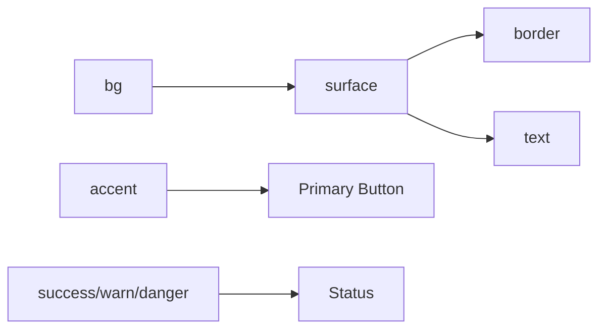
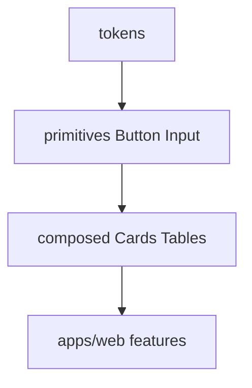
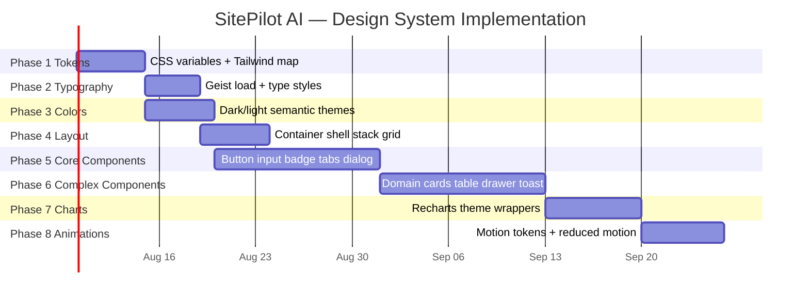

# SitePilot AI — Design System

**Your AI-powered Website Intelligence Platform.**

| | |
|---|---|
| **Document Type** | Design System Specification |
| **Product** | SitePilot AI |
| **Document** | `DESIGN_SYSTEM.md` |
| **Version** | 1.0.0 |
| **Status** | `Draft — Design Language Authority` |
| **Owner** | Design Systems + Frontend Architecture |
| **Audience** | UI/UX Designers, Frontend Engineers, Product Designers, DS Engineers |
| **Last Updated** | 2026-07-12 |
| **Companion Docs** | [UI_SCREEN_SPEC.md](./UI_SCREEN_SPEC.md), [PRD.md](./PRD.md), [ARCHITECTURE.md](./ARCHITECTURE.md), [UI_GUIDELINES.md](./UI_GUIDELINES.md), `packages/ui` |

> [!NOTE]
> This document is the **single source of truth for the SitePilot AI design language**. Tokens, components, motion, and themes implemented in `packages/ui` and `apps/web` must conform. Visual exploration may happen in Figma; **shipping UI follows these tokens and contracts**.

> [!WARNING]
> Do not introduce one-off hex values in feature code. Extend the token layer. Do not use purple-gradient “AI defaults,” warm cream/terracotta editorial kits, or Inter as the **brand display** face — Geist is primary.

---

## Table of Contents

1. [Design Philosophy](#1-design-philosophy)
2. [Design Principles](#2-design-principles)
3. [Brand Identity](#3-brand-identity)
4. [Color System](#4-color-system)
5. [Typography](#5-typography)
6. [Spacing System](#6-spacing-system)
7. [Grid System](#7-grid-system)
8. [Border Radius](#8-border-radius)
9. [Shadows](#9-shadows)
10. [Iconography](#10-iconography)
11. [Component Library](#11-component-library)
12. [Form Design](#12-form-design)
13. [Data Visualization](#13-data-visualization)
14. [Motion Design](#14-motion-design)
15. [Micro Interactions](#15-micro-interactions)
16. [Accessibility](#16-accessibility)
17. [Responsive Design](#17-responsive-design)
18. [Component Architecture](#18-component-architecture)
19. [Component Naming](#19-component-naming)
20. [Design Tokens](#20-design-tokens)
21. [Theme System](#21-theme-system)
22. [Frontend Tech Stack](#22-frontend-tech-stack)
23. [Implementation Roadmap](#23-implementation-roadmap)
24. [Best Practices](#24-best-practices)

---

## 1. Design Philosophy

### 1.1 Visual Identity

SitePilot AI should feel **premium, minimal, modern, fast, intelligent, calm, and professional** — an operator’s instrument, not a marketing carnival.

| Feeling | How it shows up |
|---|---|
| Premium | Precise type, restrained elevation, intentional accent |
| Minimal | One accent color; borders over heavy shadows; no chrome for chrome’s sake |
| Modern | Geist, crisp radii, dark-first surfaces |
| Fast | Skeletons, optimistic UI, ≤200ms feedback |
| Intelligent | Confidence, priority, and scores as first-class visuals |
| Calm | Low motion amplitude; no confetti; no neon glow spam |
| Professional | Agency-ready report density; printable clarity |

### 1.2 Inspiration — Why These References

| Reference | Borrow | Avoid copying |
|---|---|---|
| **Linear** | Issue density, priority semantics, keyboard affordances | Tracker-only aesthetic on marketing |
| **Vercel** | Product calm, status clarity, mono accents sparingly | Dashboard-as-homepage |
| **Stripe** | Documentation-grade clarity, trustworthy forms | Overly skeuomorphic receipts |
| **Notion** | Soft empty states, progressive disclosure | Infinite nesting |
| **Raycast** | Focused input velocity | Command-palette-everywhere day one |
| **GitHub** | Evidence blocks, badges with text | Dev-only jargon as primary copy |
| **Arc** | Tasteful spatial hierarchy | Novelty that hurts scan speed |

---

## 2. Design Principles

| Principle | Rule |
|---|---|
| **Visual Hierarchy** | Score → Priority → Title → Impact → Effort → Evidence |
| **Consistency** | Same Finding row, badges, and tokens everywhere |
| **Whitespace** | Prefer space over boxes; 8px rhythm |
| **Minimalism** | Remove UI that doesn’t change a decision |
| **Accessibility** | WCAG 2.2 AA is a release gate |
| **Performance** | No layout shift from web fonts; lazy charts |
| **Progressive Disclosure** | Summary first; drawers for depth |
| **Action-Oriented UI** | Every Finding answers what / why / fix |
| **Responsive Design** | Mobile stack; desktop enrich |
| **Dark-first Design** | App defaults to dark; light is first-class twin |

---

## 3. Brand Identity

### 3.1 Brand Personality

| Trait | Expression |
|---|---|
| Competent | Accurate scores, visible confidence |
| Direct | Short labels; no hype percentages |
| Composed | Dark surfaces, steady motion |
| Helpful | Clear next actions; Contact CTA without pressure |

### 3.2 Tone

- UI copy: concise, second person (“Fix this”, “Run audit”)
- Errors: calm and specific (“This URL isn’t reachable”)
- AI copy: hedged business language (never guaranteed lifts)

### 3.3 Visual Language

- Neutral zinc/slate foundations
- Single cool accent (teal) for focus/CTA
- Semantic colors only for status
- Hairline borders (`1px`) as primary separation

### 3.4 Illustration Style

- Abstract atmospheric gradients or soft product UI mock fragments
- No emoji as illustration
- Prefer geometric clarity over skeuomorphism

### 3.5 Photography Style

- Real product/context shots when used (desks, browsers) — desaturated slightly to match dark UI
- Full-bleed on marketing heroes; no floating sticker overlays

### 3.6 Icon Style

Lucide React — outline, consistent stroke, optically aligned.

### 3.7 Logo Guidelines

| Rule | Detail |
|---|---|
| Clear space | ≥ 0.5× logo height |
| Min size | 24px digital wordmark height |
| On dark | Light wordmark |
| On light | Dark wordmark |
| Do not | Stretch, recolor arbitrarily, add glow, place on busy photos without scrim |

Wordmark: **SitePilot AI** — brand is hero-level on marketing (see UI_SCREEN_SPEC).

---

## 4. Color System

### 4.1 Brand & Accent

| Token | Dark HEX | Light HEX | Usage |
|---|---|---|---|
| `color.accent.DEFAULT` | `#2EE6A6` | `#0F9F6E` | Primary CTA, links, focus |
| `color.accent.hover` | `#5EF0BC` | `#0B7F58` | Hover |
| `color.accent.muted` | `#2EE6A61A` | `#0F9F6E1A` | Soft fills |
| `color.accent.fg` | `#04140F` | `#FFFFFF` | Text on accent solid |

### 4.2 Neutrals / Surfaces (Dark-first)

| Token | Dark HEX | Light HEX | Usage |
|---|---|---|---|
| `color.bg` | `#09090B` | `#FAFAFA` | App background |
| `color.bg.subtle` | `#0C0C0E` | `#F4F4F5` | Alternating bands |
| `color.surface` | `#121216` | `#FFFFFF` | Panels / elevated |
| `color.surface.hover` | `#1A1A1F` | `#F4F4F5` | Hover row |
| `color.border` | `#27272A` | `#E4E4E7` | Default border |
| `color.border.strong` | `#3F3F46` | `#D4D4D8` | Emphasized |
| `color.text` | `#FAFAFA` | `#18181B` | Primary text |
| `color.text.muted` | `#A1A1AA` | `#71717A` | Secondary |
| `color.text.subtle` | `#71717A` | `#A1A1AA` | Tertiary |
| `color.text.inverse` | `#09090B` | `#FAFAFA` | On solid light/dark inverse |

### 4.3 Semantic

| Token | Dark HEX | Light HEX | Usage |
|---|---|---|---|
| `color.success` | `#22C55E` | `#16A34A` | Pass / healthy |
| `color.warning` | `#F59E0B` | `#D97706` | Medium risk |
| `color.danger` | `#EF4444` | `#DC2626` | Critical / error |
| `color.info` | `#38BDF8` | `#0284C7` | Informational |

### 4.4 Priority / Score Semantics

| Token | HEX (shared) | Usage |
|---|---|---|
| `priority.critical` | `#EF4444` | Critical badge |
| `priority.high` | `#F97316` | High |
| `priority.medium` | `#EAB308` | Medium |
| `priority.low` | `#22C55E` | Low |
| `score.good` | `#22C55E` | ≥ 90 |
| `score.mid` | `#EAB308` | 50–89 |
| `score.poor` | `#EF4444` | < 50 |

### 4.5 Interaction States

| Token | Rule |
|---|---|
| Hover | Lighten/darken surface one step; accent → `accent.hover` |
| Focus | `2px` ring `color.accent` + `2px` offset `color.bg` |
| Disabled | `opacity: 0.5`; `pointer-events: none`; keep readable |
| Muted | Use `accent.muted` / muted text — never low-contrast gray on gray |

### 4.6 Usage Rules

- One accent in a view region for primary action  
- Never encode Priority by color alone — always include text label  
- Charts use semantic + neutral series; avoid rainbow  



---

## 5. Typography

### 5.1 Font Stack

| Role | Font | Fallback |
|---|---|---|
| **Primary UI / Display** | **Geist Sans** | `ui-sans-serif, system-ui, Inter, Segoe UI, sans-serif` |
| **Monospace** | **Geist Mono** | `ui-monospace, SFMono-Regular, Menlo, monospace` |

> Load Geist via `next/font` for zero layout shift. Inter is **fallback only**, not brand identity.

### 5.2 Type Scale

| Token | Size | Weight | Line height | Letter spacing | Use |
|---|---|---|---|---|---|
| `display` | 56 / 48 mobile | 600 | 1.05 | -0.02em | Marketing brand/hero |
| `h1` | 40 | 600 | 1.15 | -0.02em | Page titles |
| `h2` | 32 | 600 | 1.2 | -0.015em | Sections |
| `h3` | 24 | 600 | 1.25 | -0.01em | Cards / modules |
| `h4` | 18 | 600 | 1.35 | 0 | Subheads |
| `body` | 16 | 400 | 1.55 | 0 | Paragraphs |
| `body-sm` | 14 | 400 | 1.5 | 0 | Dense UI |
| `caption` | 12 | 400 | 1.4 | 0.01em | Meta |
| `label` | 12–13 | 500 | 1.3 | 0.02em | Form labels |
| `button` | 14 | 500 | 1 | 0 | Buttons |
| `code` | 13 | 400 | 1.5 | 0 | Evidence / IDs |

### 5.3 Weights

`400` regular · `500` medium · `600` semibold · `700` rare (avoid heavy black).

---

## 6. Spacing System

Base unit **4px**, preferred steps on **8px** rhythm:

| Token | px | Common use |
|---|---|---|
| `space-1` | 4 | Icon gaps, tight |
| `space-2` | 8 | Inline compact |
| `space-3` | 12 | Chip padding |
| `space-4` | 16 | Default control padding |
| `space-5` | 20 | Comfortable control |
| `space-6` | 24 | Card padding |
| `space-8` | 32 | Section gaps (app) |
| `space-10` | 40 | Module gaps |
| `space-12` | 48 | Large module |
| `space-16` | 64 | Marketing section start |
| `space-20` | 80 | Marketing rhythm |
| `space-24` | 96 | Hero padding |
| `space-32` | 128 | Major marketing breaks |

**Usage:** padding inside components ≤ `24`; layout gaps use `24–64`; marketing vertical rhythm `64–128`.

---

## 7. Grid System

| Viewport | Columns | Gutter | Margin | Content max |
|---|---|---|---|---|
| Desktop 1440+ | 12 | 24 | 48–80 | 1200px marketing / fluid app |
| Laptop 1024 | 12 | 20 | 32 | 1120px |
| Tablet 768 | 8 | 16 | 24 | fluid |
| Mobile 390 | 4 | 16 | 16 | fluid |

App shell: sidebar `240px` (collapsed `64px`) + fluid main.

---

## 8. Border Radius

| Token | Value | Use |
|---|---|---|
| `radius-sm` | 6px | Inputs, badges |
| `radius-md` | 10px | Buttons, small cards |
| `radius-lg` | 14px | Panels, dialogs |
| `radius-xl` | 20px | Large marketing surfaces (rare) |
| `radius-pill` | 999px | Chips only when interactive filters need it — use sparingly |

---

## 9. Shadows (Elevation)

Prefer **border + surface** on dark UI. Shadows are subtle:

| Token | Value (dark) | Use |
|---|---|---|
| `shadow-none` | none | Default flat |
| `shadow-sm` | `0 1px 2px rgba(0,0,0,0.4)` | Dropdown |
| `shadow-md` | `0 8px 24px rgba(0,0,0,0.45)` | Dialog |
| `shadow-lg` | `0 16px 48px rgba(0,0,0,0.5)` | Rare |

Light theme: softer black alpha `0.08–0.16`.  
**Do not** stack multi-layer neon glow.

---

## 10. Iconography

### Lucide React

| Spec | Value |
|---|---|
| Default size | 16 / 20 / 24 |
| Stroke width | 1.75 (UI) / 2 (emphasis) |
| Color | `currentColor` inheriting text tokens |
| Alignment | Optical middle with 14–16px text |

**Rules:** Don’t mix filled+outline sets. Decorative icons `aria-hidden`. Interactive icons need accessible names.

---

## 11. Component Library

Convention for each component below: Purpose · Variants · Sizes · States · A11y · Usage · Props · Example.

---

### 11.1 Button (`Button`)

| | |
|---|---|
| **Purpose** | Trigger actions |
| **Variants** | `primary`, `secondary`, `ghost`, `danger`, `link` |
| **Sizes** | `sm` (32) `md` (40) `lg` (44) |
| **States** | default hover focus active disabled loading |
| **A11y** | `aria-busy` when loading; don’t remove focus ring |
| **Usage** | One primary per region |
| **Props** | `variant`, `size`, `loading`, `leftIcon`, `rightIcon`, `asChild` |

```tsx
<Button variant="primary" size="md" loading={isSubmitting}>Run audit</Button>
```

---

### 11.2 Input / Textarea / Select

| | |
|---|---|
| **Purpose** | Text entry |
| **Variants** | default, ghost (rare) |
| **Sizes** | sm/md/lg — URL input uses `lg` |
| **States** | default focus error success disabled readOnly |
| **A11y** | Label via `htmlFor`; error `aria-describedby` |
| **Props** | standard + `error`, `hint` |

URL field: monospace value allowed; prefix adornment optional.

---

### 11.3 Checkbox / Radio / Switch

| | |
|---|---|
| **Purpose** | Boolean / exclusive / toggle settings |
| **States** | unchecked checked indeterminate disabled focus |
| **A11y** | Native or Radix with correct roles |
| **Usage** | Settings, table row select |

---

### 11.4 Badge / Chip

| | |
|---|---|
| **Purpose** | Status / filters |
| **Variants** | `neutral`, `success`, `warning`, `danger`, `info`, `priority-*`, `confidence` |
| **Sizes** | sm/md |
| **A11y** | Text content required |
| **Usage** | Priority always text+color |

---

### 11.5 Avatar

Sizes 24/32/40; image + initials fallback; alt text = user name.

---

### 11.6 Tooltip / Popover / Dropdown

| | |
|---|---|
| **Purpose** | Progressive disclosure |
| **A11y** | Focus trap in menus; Esc closes; tooltips not for critical info |
| **Motion** | 120–160ms fade |

---

### 11.7 Breadcrumb / Tabs / Accordion

Tabs: report categories. Keyboard arrows. Accordion: FAQ. Breadcrumb: report depth.

---

### 11.8 Dialog / Drawer

| | |
|---|---|
| **Dialog** | Confirmations, API key secret reveal |
| **Drawer** | Issue / Recommendation details (right, 480px) |
| **Mobile** | Drawer → full-screen sheet |
| **A11y** | Focus trap, restore focus, `aria-modal` |

---

### 11.9 Toast / Alert

| | |
|---|---|
| **Toast** | Transient success/error (4s) |
| **Alert** | Inline persistent (warnings on report) |
| **Variants** | info success warning danger |

---

### 11.10 Progress Bar / Circular Progress / HealthScoreRing

| Component | Purpose |
|---|---|
| `ProgressBar` | Audit loading % |
| `CircularProgress` | Indeterminate wait |
| `HealthScoreRing` | Overall 0–100 with animated stroke |

**HealthScoreRing props:** `value`, `max=100`, `size`, `label`, `showValue`  
**A11y:** `role="img"` + `aria-label="Health score 82 of 100"`

Wireframe:

```text
    ╭─────╮
   ╱  82   ╲
  │  /100   │
   ╲       ╱
    ╰─────╯
```

---

### 11.11 MetricCard / IssueCard / RecommendationCard / BusinessImpactCard / ROICard / ReportCard

| Component | Primary content |
|---|---|
| `MetricCard` | Label, value, optional delta |
| `IssueCard` | Title, priority, confidence, impact one-liner |
| `RecommendationCard` | Action, difficulty, effort, fallback badge |
| `BusinessImpactCard` | Domain + impact statement |
| `ROICard` | Band + effort + hedged value |
| `ReportCard` | Host, score, date, status |

**States:** default, hover, selected, loading skeleton.  
**Usage:** Cards for **interaction containers** in app; avoid marketing hero cards.

Component tree:

```text
IssueCard
├── Badge(priority)
├── Badge(confidence)
├── Title
├── ImpactLine
└── Meta(effort · category)
```

---

### 11.12 Table / DataGrid / Pagination / SearchBar

Findings table sticky header; sortable; row opens drawer.  
Pagination: cursor “Load more” or numbered.  
SearchBar: audits by host.

---

### 11.13 Navbar / Sidebar / Footer

See UI_SCREEN_SPEC navigation. Tokens drive height: Navbar `64px`, Sidebar width `240/64`.

---

### 11.14 Charts

Recharts wrappers: `BarChart`, `LineChart`, `AreaChart`, `PieChart`, `Gauge`.  
Theme-aware strokes; tooltip surface token; SR table alternative.

---

### 11.15 Skeleton / Loader / Spinner

Skeleton for modules; Spinner in buttons; page Loader rare.

---

### 11.16 Timeline

Audit engine steps on loading screen.

---

### 11.17 EmptyState / ErrorState / SuccessState

Shared layout: icon · title · description · optional action.

---

## 12. Form Design

| State | Visual |
|---|---|
| Default | `surface` + `border` |
| Focus | Accent ring |
| Error | Danger border + message below (`caption`) |
| Success | Optional success hint (rare) |
| Disabled | 50% opacity |
| Loading | Submit button loading; fields readOnly optional |

**Validation:** Zod + React Hook Form; show errors on blur/submit; never only color.

URL rules mirror API: prepend https, length ≤ 2048, friendly SSRF messages.

---

## 13. Data Visualization

### 13.1 Chart Style

| Element | Spec |
|---|---|
| Grid | Hairline `border` |
| Axis labels | `caption` muted |
| Tooltip | `surface` + `shadow-md` |
| Series | Accent + semantic; max 4 series |
| Animation | Once on mount; 400–600ms |

### 13.2 Components

| Viz | Use |
|---|---|
| Bar | Priority breakdown |
| Line/Area | Score history (monitoring) |
| Pie/Donut | Rare — prefer bar |
| Gauge / Score Rings | Health + categories |
| Trend / Metric Cards | Dashboard stats |
| Severity cards | Critical counts |

---

## 14. Motion Design (Framer Motion)

### 14.1 Timing Tokens

| Token | Duration | Easing |
|---|---|---|
| `motion.fast` | 120ms | `easeOut` |
| `motion.base` | 200ms | `easeInOut` |
| `motion.slow` | 320ms | `easeInOut` |
| `motion.score` | 600ms | `easeOut` |

### 14.2 Patterns

| Pattern | Spec |
|---|---|
| Hover | opacity/translateY(-2px) `fast` |
| Click | scale 0.98 `fast` |
| Focus | ring instant |
| Loading | skeleton shimmer 1.2s loop |
| Page transition | opacity + 8px Y `base` |
| Modal/Drawer | opacity + X/Y `slow` spring soft |
| Accordion | height animate |
| Progress | width/strokeDashoffset `score` |
| Chart | data tween once |
| Success/Failure | toast slide `base` — no confetti |

Respect `prefers-reduced-motion: reduce` → opacity only or none.

---

## 15. Micro Interactions

| Target | Behavior |
|---|---|
| Buttons | Hover contrast; loading replaces label with spinner |
| Inputs | Focus ring; error shake **disabled** (prefer static error) |
| Cards | Hover border-strong; cursor pointer if clickable |
| Toast | Auto-dismiss; pause on hover |
| Notifications | Dot + panel; mark read |

---

## 16. Accessibility

| Requirement | Implementation |
|---|---|
| WCAG 2.2 AA | Contrast ratios verified for text/accent pairs |
| Keyboard | Tab order logical; drawers Esc; tabs arrows |
| ARIA | Dialog, tabs, progressbar, live regions for audit progress |
| Focus rings | Never `outline: none` without replacement |
| Color | Priority/score always include text |
| Reduced motion | Motion tokens short-circuit |
| Screen readers | Chart text alternatives; icon buttons named |

---

## 17. Responsive Design

| Breakpoint | Token | Adaptation |
|---|---|---|
| 1440+ | `bp.desktop` | Sidebar + multi-column report |
| 1024 | `bp.laptop` | Compact sidebar / top nav |
| 768 | `bp.tablet` | Single column; sheets |
| 390 | `bp.mobile` | Stacked cards; sticky CTA bar |

**Rules:** Touch targets ≥ 44px; no hover-only actions; tables → cards ≤768.

---

## 18. Component Architecture

```text
packages/ui/
├── src/
│   ├── tokens/           # CSS variables / TS maps
│   ├── typography/
│   ├── icons/            # Lucide re-exports
│   ├── buttons/
│   ├── forms/
│   ├── navigation/       # Navbar Sidebar Breadcrumb Tabs
│   ├── layout/           # Shell Container Stack
│   ├── cards/            # Metric Issue Recommendation …
│   ├── charts/
│   ├── feedback/         # Toast Alert Skeleton Empty Error
│   ├── data-display/     # Table Badge Progress HealthScoreRing
│   └── index.ts
└── package.json
```

`apps/web/shared/ui` may re-export `@sitepilot/ui` for FSD imports.



---

## 19. Component Naming

| Pattern | Examples |
|---|---|
| PascalCase components | `Primary` via `Button variant="primary"` — prefer variant API over `PrimaryButton` unless legacy |
| Domain compounds | `MetricCard`, `HealthScoreRing`, `IssueCard`, `RecommendationCard`, `BusinessImpactCard`, `ROICard`, `ReportCard` |
| Avoid | `MyButton`, `Card2`, `RedText` |

**File names:** `health-score-ring.tsx` or `HealthScoreRing.tsx` — match package convention consistently (recommend kebab file + Pascal export).

---

## 20. Design Tokens

### 20.1 Token Groups

| Group | Examples |
|---|---|
| Colors | §4 |
| Spacing | §6 |
| Radius | §8 |
| Typography | §5 |
| Motion | §14 |
| Shadows | §9 |
| Opacity | `opacity-disabled: 0.5`, `opacity-muted: 0.7` |
| Breakpoints | 390 / 768 / 1024 / 1440 |

### 20.2 CSS Variable Example

```css
:root, [data-theme="dark"] {
  --color-bg: #09090b;
  --color-surface: #121216;
  --color-accent: #2ee6a6;
  --color-text: #fafafa;
  --space-4: 16px;
  --radius-md: 10px;
  --motion-base: 200ms;
}

[data-theme="light"] {
  --color-bg: #fafafa;
  --color-surface: #ffffff;
  --color-accent: #0f9f6e;
  --color-text: #18181b;
}
```

### 20.3 Tailwind Mapping

Map tokens to Tailwind theme extension (`packages/config` / `packages/ui`). Use semantic classnames (`bg-surface`, `text-muted`, `border-border`) not raw zinc in features.

---

## 21. Theme System

| Theme | Default |
|---|---|
| Dark | App default |
| Light | Full twin palette |
| System | Follow `prefers-color-scheme` until user overrides |
| Custom (future) | Agency white-label accent override |

**Switching:** `next-themes` + `data-theme` attribute; persist `localStorage`.  
No flash: set theme script before paint.

---

## 22. Frontend Tech Stack

| Technology | Why |
|---|---|
| **Next.js** | App Router, SSR/marketing, routing |
| **Tailwind CSS** | Token-friendly utility speed |
| **shadcn/ui** | Accessible primitives to wrap — restyle to SitePilot tokens |
| **Framer Motion** | Declarative motion with reduced-motion support |
| **Lucide React** | Consistent outline icons |
| **Recharts** | Simple React charts |
| **React Hook Form** | Performant forms |
| **Zod** | Schema validation shared with API shapes |
| **TanStack Query** | Server state, poll audits, cache reports |
| **next-themes** | Dark/light/system |

> shadcn is a **starting point**, not the visual brand — replace default look with this system.

---

## 23. Implementation Roadmap



| Phase | Exit criteria |
|---|---|
| 1–3 | Demo page shows both themes |
| 5 | Forms + buttons pass a11y smoke |
| 6 | IssueCard/HealthScoreRing used in report stub |
| 7–8 | Charts + motion documented in Storybook/demo |

---

## 24. Best Practices

| Area | Practice |
|---|---|
| **Maintainability** | Tokens first; compose primitives; document new components here |
| **Consistency** | Variant APIs over one-off styles |
| **Accessibility** | AA contrast; keyboard; labels |
| **Scalability** | `packages/ui` owns primitives; features own composition |
| **Performance** | Font subsetting; tree-shake icons; lazy charts |
| **Reusability** | Domain cards shared across dashboard/report/PDF-adjacent UI |

### Do / Don’t

| Do | Don’t |
|---|---|
| Use `HealthScoreRing` for scores | Invent a third gauge style |
| Show confidence text | Rely on color alone |
| Hedge ROI copy | Promise “+34% traffic” |
| Prefer borders on dark | Multi-glow neon stacks |
| Geist for brand | Inter as display identity |

### Contributor checklist

- [ ] Uses design tokens only  
- [ ] Implements all interactive states  
- [ ] A11y documented/tested  
- [ ] Dark + light verified  
- [ ] Reduced motion respected  
- [ ] Named per §19  
- [ ] Spec updated in same PR  

> [!NOTE]
> **North star:** A calm, precise, dark-first system — Geist + teal accent + semantic status — that makes SitePilot AI feel as considered as Linear and as clear as Stripe.

---

<p align="center">
  <sub>SitePilot AI — Design System — Design Language Authority — Confidential</sub>
</p>
