# SitePilot AI — Domain Model

**Your AI-powered Website Intelligence Platform.**

| | |
|---|---|
| **Document Type** | Domain Model Specification (DDD) |
| **Product** | SitePilot AI |
| **Document** | `DOMAIN_MODEL.md` |
| **Version** | 1.0.0 |
| **Status** | `Draft — Domain Authority` |
| **Owner** | Product + Platform Architecture |
| **Audience** | Software Architects, Backend, Frontend, Product, AI Engineers |
| **Last Updated** | 2026-07-12 |
| **Companion Docs** | [PRD.md](./PRD.md), [ENGINE_SPEC.md](./ENGINE_SPEC.md), [DATABASE_SPEC.md](./DATABASE_SPEC.md), [ARCHITECTURE.md](./ARCHITECTURE.md), [API_SPEC.md](./API_SPEC.md) |

> [!NOTE]
> This document is the **single source of truth for the business domain** of SitePilot AI. Code, APIs, schemas, prompts, and UI copy must use the **Ubiquitous Language** defined here. When implementation diverges from this model, either fix the code or open an RFC to change the domain — do not invent parallel vocabulary.

> [!WARNING]
> Technical storage details live in [DATABASE_SPEC.md](./DATABASE_SPEC.md). Engine algorithms live in [ENGINE_SPEC.md](./ENGINE_SPEC.md). This document owns **meaning, boundaries, invariants, and lifecycles** — not SQL column lists or HTTP status codes.

---

## Table of Contents

1. [Domain Overview](#1-domain-overview)
2. [Domain Design Principles](#2-domain-design-principles)
3. [Ubiquitous Language](#3-ubiquitous-language)
4. [Bounded Contexts](#4-bounded-contexts)
5. [Domain Entities](#5-domain-entities)
6. [Value Objects](#6-value-objects)
7. [Aggregates](#7-aggregates)
8. [Domain Services](#8-domain-services)
9. [Domain Events](#9-domain-events)
10. [Entity Lifecycles](#10-entity-lifecycles)
11. [Business Rules](#11-business-rules)
12. [Engine Domain Model](#12-engine-domain-model)
13. [Relationships](#13-relationships)
14. [Domain Invariants](#14-domain-invariants)
15. [Domain Workflows](#15-domain-workflows)
16. [Future Domain Expansion](#16-future-domain-expansion)
17. [Domain Ownership](#17-domain-ownership)
18. [Domain Anti-Patterns](#18-domain-anti-patterns)
19. [Implementation Guidelines](#19-implementation-guidelines)
20. [Best Practices](#20-best-practices)

---

## 1. Domain Overview

### 1.1 The Problem

Business owners can sense that a website is underperforming — slow, invisible in search, untrustworthy, or inaccessible — but they cannot diagnose cause, cost, or priority. Existing tools (Lighthouse, GTmetrix, Ahrefs, SEMrush) produce **technical truth for specialists**, not **business clarity for operators**.

SitePilot AI exists to close that gap: ingest technical signals, score health, translate findings into business impact and ROI framing, explain fixes with AI, and deliver an executive-ready Report.

### 1.2 Why the Domain Exists

| Driver | Domain consequence |
|---|---|
| Technical audits are abundant | “Finding” and “Engine” must be first-class — not hidden inside a PDF blob |
| Business owners need prioritization | “Business Impact”, “ROI”, “Priority”, “Confidence” are core language |
| AI must not invent facts | “Data Quality” gates “Recommendation”; AI explains, never authors Findings |
| SaaS multi-tenancy is inevitable | Organization → Project → Website structure from day one |
| Continuous value requires history | Audit Run is an immutable-ish occurrence; Monitoring Job schedules future Runs |

### 1.3 Core Business Concepts

| Concept | One-line meaning |
|---|---|
| **Website** | A durable digital property under management |
| **Audit Run** | A single, time-bounded analysis of a Website |
| **Engine** | An independent capability that transforms inputs into typed outputs |
| **Finding** | A discrete issue or observation with severity and confidence |
| **Recommendation** | An actionable explanation bound to Findings |
| **Health Score** | Composite 0–100 quality signal |
| **Report** | Customer-facing assembly of scores, Findings, and Recommendations |
| **Organization** | Tenant that owns Projects, billing, and access |

### 1.4 Long-Term Vision

Evolve from one-off Report generation into a continuous **AI Website Intelligence Assistant**: monitor drift, compare Competitors, optimize Content and Keywords, chat grounded in Reports, and propose Auto-Fixes — always under the same Ubiquitous Language and invariants (AI never invents Findings).

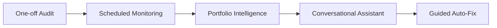

---

## 2. Domain Design Principles

### 2.1 Domain-Driven Design (DDD)

DDD aligns software structure with business meaning. SitePilot AI uses DDD because the product’s differentiator is **semantic** (impact, confidence, recommendation quality), not merely ETL plumbing.

### 2.2 Ubiquitous Language

Engineers, PMs, AI prompt authors, and UI must say **Audit Run**, not “job” or “scan” interchangeably in specs. Synonyms are allowed in marketing copy only when mapped explicitly.

### 2.3 Rich Domain Model

Entities enforce invariants (e.g., an Audit Run cannot transition to `complete` without mandatory Engines). Avoid anemic bags of getters/setters with all rules in controllers.

### 2.4 Separation of Concerns

| Layer | Owns |
|---|---|
| Domain | Meaning, rules, events |
| Application | Use-cases / orchestration |
| Infrastructure | Postgres, Redis, HTTP, LLMs |
| Interface | HTTP/UI |

### 2.5 Single Responsibility

Each Engine, Entity, and Bounded Context has one reason to change.

### 2.6 Aggregates

Consistency boundaries (e.g., Audit Run aggregate ensures Findings belong to that Run). Transactions commit one aggregate at a time unless a Domain Service coordinates explicitly.

### 2.7 Entities vs Value Objects

| | Entity | Value Object |
|---|---|---|
| Identity | Stable ID | Defined by attributes |
| Mutability | Lifecycle changes | Prefer immutable replace |
| Example | Website, Audit Run | Health Score, Email Address |

### 2.8 Domain Services

Stateless operations that don’t naturally belong to a single Entity (e.g., computing Health Score across Findings from multiple Engines).

### 2.9 Domain Events

Facts that happened in the domain (`AuditCompleted`). Downstream contexts react without tight coupling.

> [!TIP]
> If a rule is spoken in product meetings (“AI must not invent issues”), it belongs in this Domain Model as an **invariant** or **business rule** — not only in a prompt comment.

---

## 3. Ubiquitous Language

| Term | Definition |
|---|---|
| **User** | A human identity that can authenticate and act within Organizations |
| **Organization** | The tenant / workspace that owns Projects, Subscriptions, and API Keys |
| **Project** | A named grouping of Websites under one Organization (e.g., a client account) |
| **Website** | A durable managed site identity keyed by a Canonical Website URL within a Project |
| **Website URL** | Value Object representing a normalized, validated URL |
| **Audit** | Product concept of analyzing a Website; in implementation, realized as an **Audit Run** |
| **Audit Run** | A single execution instance of an Audit against one Website at a point in time |
| **Engine** | A named, versioned processing capability with typed Input/Output contracts |
| **Engine Execution** | One invocation of an Engine within an Audit Run |
| **Engine Result** | The typed output (and optional raw payload) of an Engine Execution |
| **Finding** / **Audit Finding** | A discrete observation or issue produced by Engines, with Severity, Confidence, and evidence |
| **Recommendation** | Actionable guidance explaining how to address one or more Findings |
| **Health Score** | Overall 0–100 Website health composite plus category scores |
| **Business Impact** | Business-facing consequence framing of a Finding |
| **Business Score** | Optional aggregate expressing business-risk posture derived from Impacts |
| **ROI** | Effort/value framing used to prioritize Fixes (hedged; never guaranteed lifts) |
| **ROI Score** | Numeric/band signal used for ranking quick wins vs strategic Fixes |
| **Confidence Score** | 0–100 certainty that a Finding is correctly detected/classified |
| **Severity** | Technical seriousness (`critical`…`info`) |
| **Priority** | Business-ordered urgency (`Critical`…`Low`) derived from Severity × Impact × Confidence |
| **Report** | Assembled customer artifact summarizing an Audit Run (dashboard + export source) |
| **Executive Summary** | Short narrative overview of scores and top opportunities |
| **Monitoring Job** | Schedule that triggers future Audit Runs for a Website |
| **Subscription** | Commercial plan binding entitlements to an Organization |
| **API Key** | Credential granting programmatic access within an Organization’s permissions |
| **Audit Log** | Immutable record of a significant security or domain action |
| **Data Quality** | Gate ensuring payloads are complete, normalized, and safe before AI |
| **Prompt Version** | Versioned AI instruction set used to generate Recommendations |
| **Canonical URL** | Normalized Website URL used for identity and caching |
| **Pipeline** | Orchestrated sequence of Engine Executions for one Audit Run |

**Discouraged synonyms (map to official terms):**

| Avoid in specs | Prefer |
|---|---|
| Job / Scan / Task (ambiguous) | Audit Run or Engine Execution |
| Bug / Error (for site issues) | Finding |
| Grade | Health Score |
| Advice | Recommendation |
| Customer account (ambiguous) | Organization |

---

## 4. Bounded Contexts

### 4.1 Context Catalog

| Bounded Context | Responsibility |
|---|---|
| **Identity Context** | Users, authentication, membership, roles |
| **Website Context** | Projects, Websites, URL identity, stack metadata |
| **Audit Context** | Audit Runs, Engine Executions, Engine Results, Findings, pipeline status |
| **Recommendation Context** | Business Impact, ROI framing, Recommendations lifecycle |
| **AI Context** | Prompt Versions, model routing, hallucination controls, fallbacks |
| **Reporting Context** | Reports, Executive Summary assembly, PDF export references |
| **Monitoring Context** | Monitoring Jobs, schedules, drift triggers |
| **Billing Context** | Subscriptions, plans, entitlements, usage limits |
| **Administration Context** | API Keys, Audit Logs, feature flags, operator tooling |

### 4.2 Context Map (Mermaid)

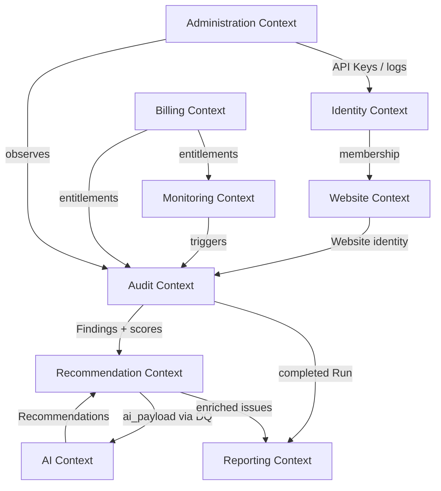

### 4.3 Integration Style

| Upstream → Downstream | Pattern |
|---|---|
| Audit → Recommendation | Domain Events + shared Finding IDs |
| Recommendation → AI | Application service passes DQ-validated payload only |
| Audit → Reporting | `AuditCompleted` / `ReportRequested` |
| Monitoring → Audit | `MonitoringTriggered` creates Audit Run |
| Billing → Audit | Entitlement checks before starting Run |

> [!WARNING]
> Do not let the AI Context own Findings. Findings are born in the Audit Context. AI may only explain them.

---

## 5. Domain Entities

### 5.1 User

| Aspect | Detail |
|---|---|
| **Purpose** | Represent a human actor in the system |
| **Responsibilities** | Authenticate; hold profile; act as member of Organizations |
| **Attributes** | id, Email Address, password credential ref, avatar, role hints, status, last login |
| **Relationships** | Member of many Organizations; may create Audit Runs |
| **Lifecycle** | invited → active → suspended → deleted (soft) |
| **Business Rules** | Email unique among active Users; system User allowed for anonymous MVP Runs |
| **Example** | `user@agency.com` as `admin` of Organization “Acme Agency” |

### 5.2 Organization

| Aspect | Detail |
|---|---|
| **Purpose** | Tenant root for workspace, billing, and ownership |
| **Responsibilities** | Own Projects; hold Subscription; issue API Keys |
| **Attributes** | id, name, slug, plan tier, status, settings |
| **Relationships** | 1→N Projects; 1→N Members; 1→N API Keys; 1→N Subscriptions (history) |
| **Lifecycle** | active → suspended → closed |
| **Business Rules** | Slug unique; at least one owner member when auth is enabled |
| **Example** | Organization “Northwind” on plan `pro` |

### 5.3 Project

| Aspect | Detail |
|---|---|
| **Purpose** | Group Websites for a client or initiative |
| **Responsibilities** | Scope Website inventory; optional branding defaults later |
| **Attributes** | id, organizationId, name, slug, status |
| **Relationships** | Belongs to one Organization; owns many Websites |
| **Lifecycle** | active → archived |
| **Business Rules** | Slug unique within Organization |
| **Example** | Project “Client — Contoso Marketing” |

### 5.4 Website

| Aspect | Detail |
|---|---|
| **Purpose** | Durable digital property under a Project |
| **Responsibilities** | Anchor Audit Runs and Monitoring Jobs; hold Canonical URL |
| **Attributes** | id, projectId, Canonical URL, original URL, host, Technology Stack, Language, Country, Industry |
| **Relationships** | Many Audit Runs; optional many Monitoring Jobs |
| **Lifecycle** | active → paused → archived |
| **Business Rules** | Canonical URL unique within Project; always normalized |
| **Example** | `https://contoso.com/` |

### 5.5 Audit Run

| Aspect | Detail |
|---|---|
| **Purpose** | Single analysis occurrence of a Website |
| **Responsibilities** | Track pipeline status and progress; collect Engine Executions; expose scores |
| **Attributes** | id, websiteId, status, progressPercent (0–100), currentEngine?, timestamps, duration, Health Score + category scores, engineVersions, metadata |
| **Relationships** | N Engine Executions; N Findings; N Recommendations; 0..1 Report |
| **Lifecycle** | See §10 |
| **Business Rules** | Belongs to exactly one Website; mandatory Engines must complete before `complete`; soft-deleted Websites cannot start new Runs |
| **Example** | Run on `contoso.com` finishing with Health Score 82 |

### 5.6 Engine Execution

| Aspect | Detail |
|---|---|
| **Purpose** | One invocation of a named Engine inside an Audit Run |
| **Responsibilities** | Record timing, status, config, errors |
| **Attributes** | id, auditRunId, engineName, engineVersion, attempt, status, timing, configuration |
| **Relationships** | 1→0..1 Engine Result; optional metadata |
| **Lifecycle** | pending → running → success \| partial \| failed \| skipped |
| **Business Rules** | Unique (auditRunId, engineName, attempt); cannot succeed without Result when output required |
| **Example** | `seo_intelligence@1.4.0` success in 842ms |

### 5.7 Engine Result

| Aspect | Detail |
|---|---|
| **Purpose** | Persist typed output of an Engine Execution |
| **Responsibilities** | Hold structured output + optional raw provider payload |
| **Attributes** | id, executionId, schemaVersion, structuredOutput, rawOutput?, confidence?, contentHash |
| **Relationships** | Belongs to one Engine Execution |
| **Lifecycle** | Created immutable; superseded only by new Execution attempt |
| **Business Rules** | schemaVersion required; rawOutput never sent directly to AI |
| **Example** | SEO output `engine.seo.output.v1` |

### 5.8 Audit Finding

| Aspect | Detail |
|---|---|
| **Purpose** | Discrete issue/observation for product and AI consumption |
| **Responsibilities** | Carry Severity, Confidence, evidence; accept enrichment fields |
| **Attributes** | findingId, category, severity, priority?, confidence, issue, technicalDetail, businessImpact?, recommendation?, effort?, roi?, resolutionStatus |
| **Relationships** | Belongs to one Audit Run; referenced by Recommendations |
| **Lifecycle** | open → accepted → resolved \| wontfix → reopened |
| **Business Rules** | Confidence always present; findingId stable; AI cannot create new findingIds |
| **Example** | `seo.meta_description.missing` confidence 100 |

### 5.9 Recommendation

| Aspect | Detail |
|---|---|
| **Purpose** | Actionable explanation for Findings |
| **Responsibilities** | Store prose + model/prompt provenance |
| **Attributes** | id, auditRunId, findingId?, texts, promptVersion, modelUsed, confidence, version, isFallback |
| **Relationships** | References ≥1 Finding (except executive-only summary rows) |
| **Lifecycle** | generated → superseded (by new version) |
| **Business Rules** | Generated only after Data Quality succeeds; must not invent Findings |
| **Example** | Fix meta description — Easy — 5 minutes |

### 5.10 Report

| Aspect | Detail |
|---|---|
| **Purpose** | Customer-facing assembly of an Audit Run |
| **Responsibilities** | Hold Executive Summary, charts, PDF/JSON references |
| **Attributes** | id, auditRunId, version, executiveSummary, businessSummary, reportPayload, pdfUrl? |
| **Relationships** | Exactly one Audit Run |
| **Lifecycle** | See §10 |
| **Business Rules** | Requires completed (or complete_with_warnings) Audit Run |
| **Example** | Dashboard payload + PDF for run `rep_…` |

### 5.11 Monitoring Job

| Aspect | Detail |
|---|---|
| **Purpose** | Schedule recurring Audit Runs |
| **Responsibilities** | Track frequency, next/last run, status |
| **Attributes** | id, websiteId, frequency, cron?, nextRunAt, lastRunAt, status |
| **Relationships** | Belongs to Website; produces Audit Runs |
| **Lifecycle** | active ↔ paused → error → retired |
| **Business Rules** | Requires entitled Subscription plan |
| **Example** | Weekly Monday 09:00 UTC |

### 5.12 Subscription

| Aspect | Detail |
|---|---|
| **Purpose** | Commercial plan for an Organization |
| **Responsibilities** | Gate entitlements (limits, PDF, monitoring, API) |
| **Attributes** | id, organizationId, plan, status, period, entitlements |
| **Relationships** | Belongs to Organization |
| **Lifecycle** | trialing → active → past_due → canceled |
| **Business Rules** | One active-like Subscription per Organization |
| **Example** | Plan `agency` active |

### 5.13 API Key

| Aspect | Detail |
|---|---|
| **Purpose** | Programmatic credential |
| **Responsibilities** | Authenticate automation with scopes |
| **Attributes** | id, organizationId, name, keyPrefix, keyHash, permissions, expiresAt, revokedAt |
| **Relationships** | Owned by Organization |
| **Lifecycle** | active → expired \| revoked |
| **Business Rules** | Secret shown once; store hash only |
| **Example** | `spk_live_ab12…` with scope `audits:write` |

### 5.14 Audit Log

| Aspect | Detail |
|---|---|
| **Purpose** | Immutable security/domain event journal |
| **Responsibilities** | Record who did what to which resource |
| **Attributes** | id, actor, action, resource, metadata, createdAt |
| **Relationships** | References Organization/User optionally |
| **Lifecycle** | append-only |
| **Business Rules** | Never updated or soft-deleted |
| **Example** | `ssrf.blocked` on URL Validation |

---

## 6. Value Objects

| Value Object | Why VO (not Entity) | Notes |
|---|---|---|
| **Email Address** | Equality by normalized string; no independent lifecycle | CITEXT-normalized |
| **Website URL** | Identity of value is the normalized URL string | Includes scheme/host/path rules |
| **Health Score** | 0–100 (+ category map); replaced as a whole | Invariant range |
| **Business Score** | Derived numeric/band without its own identity | Optional |
| **Confidence Score** | 0–100 integer semantics | Always with Findings |
| **ROI Score / ROI Index** | Ranking signal defined by attributes | Not a ledger entity |
| **Severity** | Closed enum value | critical…info |
| **Priority** | Closed enum value | Critical…Low |
| **Engine Version** | Semver/string value attached to Executions | Immutable per Execution |
| **Status** | Enum per aggregate (Audit Run Status, etc.) | Context-specific VOs |
| **Language** | BCP-47 / short code | From HTML lang |
| **Country** | ISO code guess | Optional |
| **Technology Stack** | List/set of tech tags | Value equality by set |
| **Money / Cost Band** | Indicative cost range | Hedged; not invoicing |
| **Prompt Version** | Version identifier value | Traceability |
| **Content Hash** | Hash of payload | Integrity |

> [!NOTE]
> Value Objects should be **validated on construction** (e.g., `HealthScore.of(101)` throws / returns error). Invalid states must be unrepresentable.

---

## 7. Aggregates

### 7.1 Aggregate Roots

| Aggregate Root | Boundary includes | Consistency rule |
|---|---|---|
| **Organization** | Organization profile, memberships (or membership as separate small aggregate), settings | Org invariants (slug, status) |
| **Project** | Project fields under one Organization | Slug unique within org |
| **Website** | Website identity + metadata | Canonical URL unique within project |
| **Audit Run** | Engine Executions, Engine Results refs, Findings, Run scores/status | Pipeline transitions + finding ownership |
| **Report** | Report payload + export refs for one Run | One active Report projection per Run version |
| **Subscription** | Plan/status/entitlements | One active subscription policy |
| **Monitoring Job** | Schedule fields | next_run consistency |

### 7.2 Audit Run Aggregate (Detail)

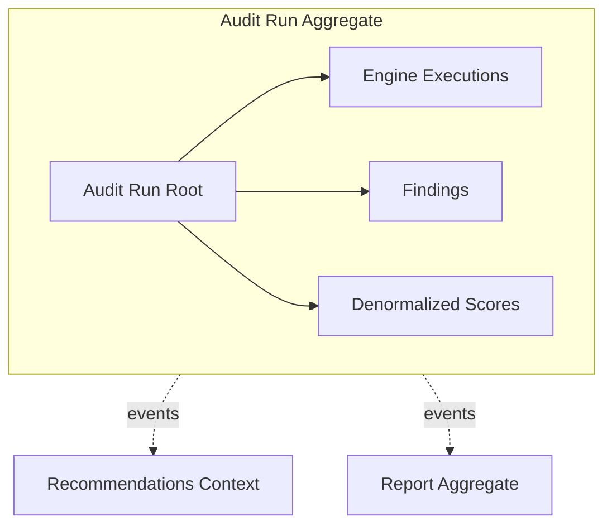

**Transactional consistency:** Creating Findings for a Run happens inside the Audit Run aggregate transaction (or explicitly coordinated application transaction). Recommendations may be a separate aggregate updated after `DataQualitySucceeded`.

### 7.3 Guidelines

- Prefer small aggregates.
- Reference other aggregates by **ID**, not deep object graphs.
- Cross-aggregate rules use Domain Services + Events.

---

## 8. Domain Services

| Domain Service | Responsibility |
|---|---|
| **Audit Service** | Start Audit Run; enforce entitlements; orchestrate high-level lifecycle (delegates to engines via application layer) |
| **Health Score Service** | Compute Health Score from Findings + scoring config |
| **Business Impact Service** | Map Findings → business impact fields + Priority |
| **ROI Service** | Compute effort/value bands and ROI ranking signals |
| **Data Quality Service** | Validate/normalize before AI; build `ai_payload` |
| **Recommendation Service** | Request AI/fallback Recommendations; enforce grounding rules |
| **Monitoring Service** | Evaluate schedules; enqueue Audit Runs |
| **Report Service** | Assemble Report from completed Run + Recommendations |
| **Entitlement Service** | Answer “may this Organization start an Audit / export PDF?” |

Domain Services are **pure regarding business decisions**; IO adapters live in infrastructure.

---

## 9. Domain Events

### 9.1 Event Catalog

| Event | Emitted when | Typical consumers |
|---|---|---|
| `AuditStarted` | Run enters active pipeline | Monitoring metrics, Audit Log |
| `AuditCompleted` | Run reaches complete / complete_with_warnings | Report Service |
| `AuditFailed` | Run fails hard | Notifications (future), UI |
| `EngineStarted` | Execution → running | Observability |
| `EngineCompleted` | Execution success/partial | Orchestrator fan-in |
| `EngineFailed` | Execution failed | Orchestrator degrade policy |
| `FindingDetected` | Finding persisted | Analytics; optional streaming UI |
| `DataQualitySucceeded` | DQ gate passed | AI Context |
| `DataQualityFailed` | DQ gate failed | Block AI; fail/partial Run |
| `RecommendationGenerated` | Recommendations stored | Report Service |
| `ReportGenerated` | Report assembled | PDF, notifications |
| `PdfExported` | PDF available | UI download |
| `MonitoringTriggered` | Schedule fires | Audit Service |
| `SubscriptionUpgraded` | Plan changes | Entitlement cache |
| `SubscriptionCanceled` | Plan ends | Disable monitoring |

### 9.2 Event Flow — Happy Path

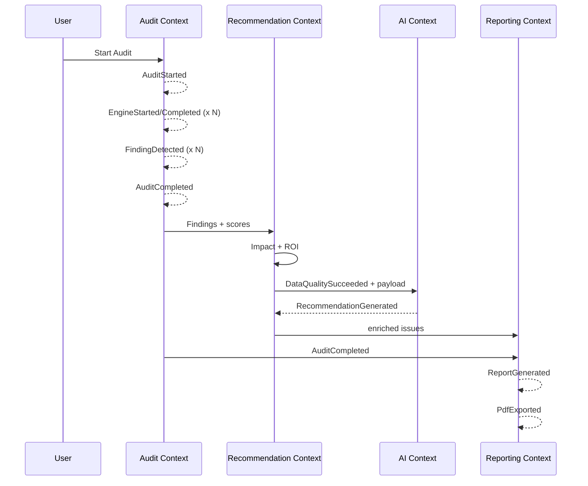

### 9.3 Event Rules

- Events are past-tense facts.
- Events carry IDs + minimal payload; consumers load aggregates as needed.
- Publishing is at-least-once; consumers idempotent.

---

## 10. Entity Lifecycles

### 10.1 Website

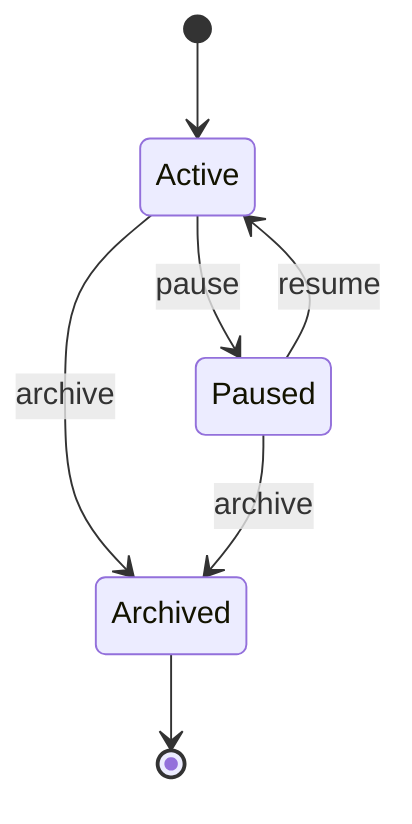

### 10.2 Audit Run

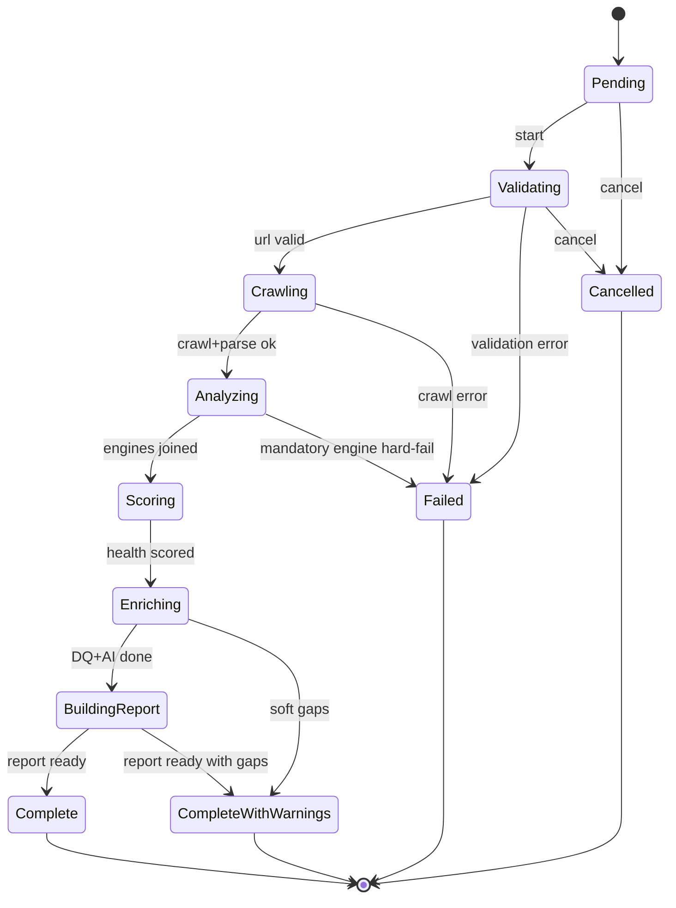

**Persisted status values** (align with [DATABASE_SPEC.md](./DATABASE_SPEC.md) §9.2.1 and API):

| Status | Meaning |
|---|---|
| `pending` | Audit Run created; pipeline not started |
| `validating` | URL Validation in progress |
| `crawling` | Crawl in progress |
| `analyzing` | Analysis engines running |
| `scoring` | Health / category scoring in progress |
| `enriching` | Business Impact, ROI, Data Quality, and/or AI enrichment |
| `building_report` | Report assembly in progress |
| `complete` | Terminal success |
| `complete_with_warnings` | Terminal success with soft gaps |
| `failed` | Terminal failure |
| `cancelled` | Terminal cancellation |

**Progress fields (domain language):** `progressPercent` (0–100) and optional `currentEngine` support UI polling and orchestrator visibility. They are not substitutes for Engine Execution records.

Obsolete coarse labels (`processing`, `queued`, `running`) are not Audit Run statuses.

### 10.3 Recommendation

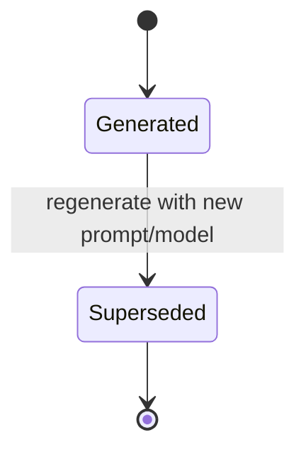

### 10.4 Report

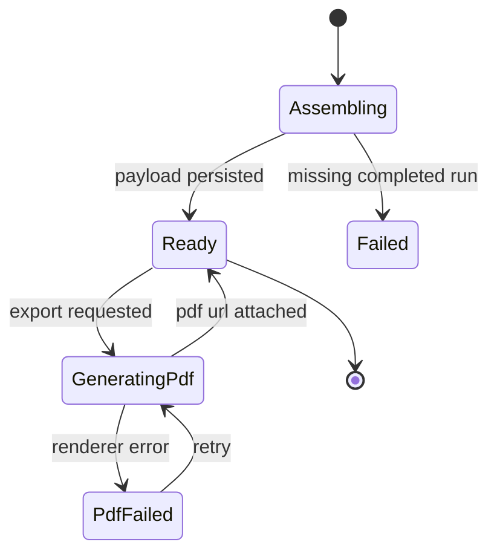

### 10.5 Monitoring Job

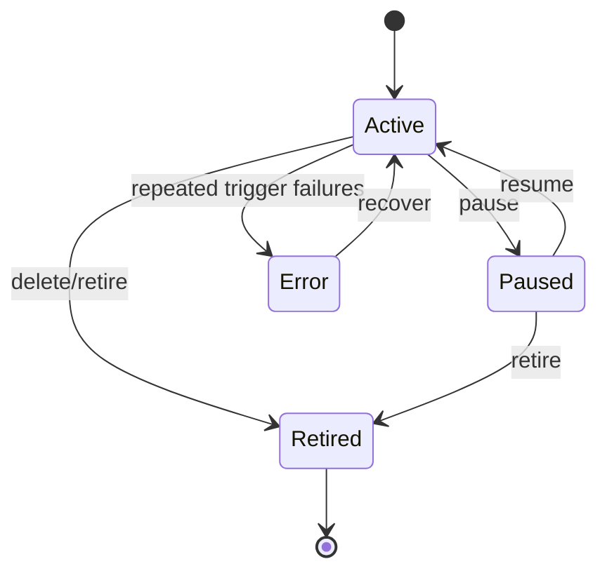

---

## 11. Business Rules

| ID | Rule |
|---|---|
| BR-01 | A Website belongs to exactly one Project |
| BR-02 | A Project belongs to exactly one Organization |
| BR-03 | An Organization owns many Projects |
| BR-04 | An Audit Run belongs to exactly one Website |
| BR-05 | An Audit Run executes multiple Engines |
| BR-06 | One Engine Execution produces at most one Engine Result (per attempt) |
| BR-07 | Multiple Findings belong to one Audit Run |
| BR-08 | One Report summarizes one Audit Run |
| BR-09 | Recommendations are generated only after Data Quality validation succeeds |
| BR-10 | Business Impact enrichment cannot run before Findings exist; Health Score should exist before final Priority presentation |
| BR-11 | Business Impact Score / framing cannot be presented as authoritative without Health Score context on the Report |
| BR-12 | AI Recommendations must never modify Engine Results or invent Findings |
| BR-13 | Confidence Score must always accompany every Finding |
| BR-14 | Every Finding-level Recommendation references at least one Finding |
| BR-15 | Every Report references one completed or complete_with_warnings Audit Run |
| BR-16 | Priority is derived — clients must not supply arbitrary Priority that bypasses Domain Services |
| BR-17 | ROI language must remain hedged; no guaranteed percentage lifts |
| BR-18 | Anonymous MVP Audits still attach to a system Organization/Project for tenancy integrity |
| BR-19 | Soft-deleted Websites cannot start new Audit Runs |
| BR-20 | Monitoring Jobs may run only when Subscription entitlements allow |

---

## 12. Engine Domain Model

Engines are **first-class domain concepts** inside the Audit Context (execution) with specialized meaning described below. Algorithms remain in ENGINE_SPEC; here we define domain role.

### 12.1 Common Engine Pattern

| Dimension | Domain meaning |
|---|---|
| **Purpose** | Transform typed Input → typed Output |
| **Responsibilities** | Validate input assumptions; emit Result; emit domain events; never call sibling Engines |
| **Input** | Value Objects / prior Results referenced by orchestrator |
| **Output** | Engine Result (+ optional Findings) |
| **Dependencies** | Declared only; satisfied by orchestrator |
| **Domain Events** | `EngineStarted`, `EngineCompleted` / `EngineFailed` |
| **Lifecycle** | Bound to Engine Execution states |

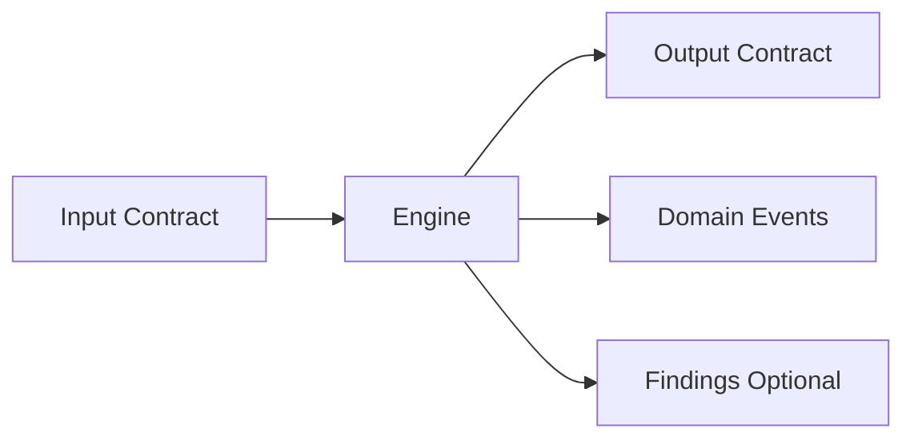

### 12.2 Engine Catalog (Domain View)

| Engine | Purpose | Input (domain) | Output (domain) | Dependencies |
|---|---|---|---|---|
| **URL Validation** | Ensure URL is safe & reachable | raw URL string | Website URL VO + validation facts | SSRF policy |
| **Crawler** | Fetch page artifacts | Website URL | Crawl Artifact | URL Validation |
| **HTML Parser** | Structure HTML meaning | Crawl Artifact | Parsed Document | Crawler |
| **SEO Intelligence** | Detect SEO Findings | Parsed Document + Crawl | SEO Findings | Parser |
| **Performance** | Measure CWV / perf Findings | Website URL | Perf Findings + metrics | Valid URL |
| **Security** | Detect security Findings | Crawl + Parsed | Security Findings | Crawler/Parser |
| **Accessibility** | Detect a11y Findings | Parsed Document | A11y Findings | Parser |
| **Health Score** | Compute Health Score VO | All analysis Findings | Health Score | SEO/Perf/Sec/A11y |
| **Business Impact** | Attach Business Impact + Priority | Findings + scores | Enriched Findings | Health Score preferred |
| **ROI** | Attach effort/value/ROI signals | Enriched Findings | ROI-enriched Findings | Business Impact |
| **Data Quality** | Gate & sanitize for AI | Enriched set | `ai_payload` | ROI/Impact |
| **AI Recommendation** | Explain & recommend | `ai_payload` only | Recommendations | Data Quality success |
| **Report Builder** | Assemble Report | Completed Run + Recs | Report | Audit + Recommendation |
| **PDF** | Export Report | Report | Pdf export refs | Report Ready |

### 12.3 Engine Pipeline (Domain)

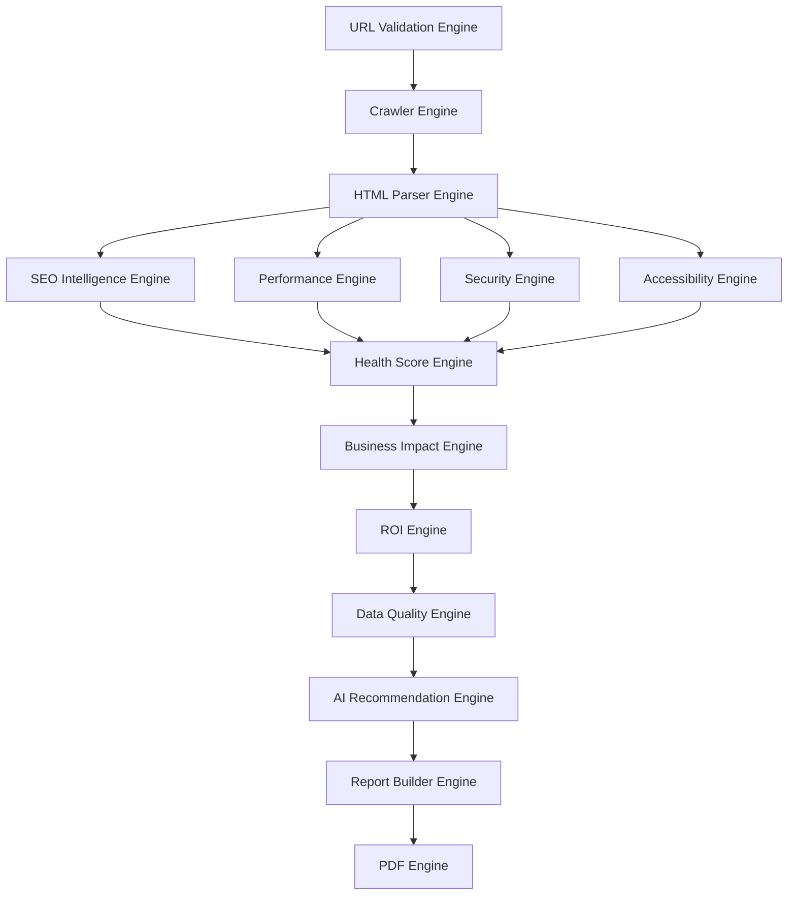

### 12.4 Critical Domain Rule for Engines

> [!WARNING]
> Engines produce **technical or structured truth**. Only Recommendation/AI Context produces **explanatory prose**. No Engine may silently rewrite another Engine’s Result.

---

## 13. Relationships

### 13.1 ER Diagram (Domain Multiplicity)

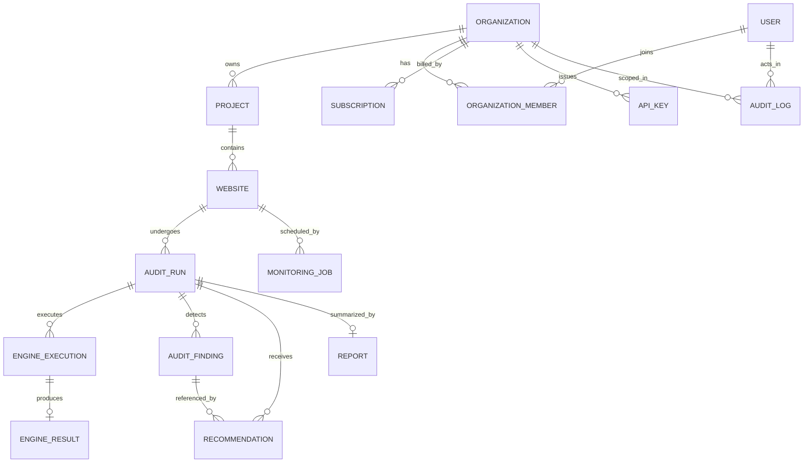

### 13.2 Multiplicity Summary

| Relationship | Multiplicity |
|---|---|
| Organization → Projects | 1 → N |
| Project → Websites | 1 → N |
| Website → Audit Runs | 1 → N |
| Audit Run → Engine Executions | 1 → N |
| Engine Execution → Engine Result | 1 → 0..1 |
| Audit Run → Findings | 1 → N |
| Audit Run → Recommendations | 1 → N |
| Audit Run → Report | 1 → 0..1 (versioned regenerations allowed as versions) |
| Finding → Recommendations | 1 → N |
| Website → Monitoring Jobs | 1 → N |
| Organization → Subscriptions | 1 → N (one active policy) |

---

## 14. Domain Invariants

| ID | Invariant |
|---|---|
| INV-01 | Health Score overall and category scores ∈ [0, 100] when present |
| INV-02 | Confidence Score ∈ [0, 100] for every Finding |
| INV-03 | Audit Run cannot be `complete` unless every **mandatory** Engine Execution is `success` or accepted `partial` per policy |
| INV-04 | AI Recommendation Engine cannot execute before Data Quality succeeds |
| INV-05 | Report generation requires Audit Run in `complete` or `complete_with_warnings` |
| INV-06 | Finding.findingId is immutable after creation |
| INV-07 | Engine Results are append-only per Execution; corrections require new attempt |
| INV-08 | Priority ∈ {Critical, High, Medium, Low} when set |
| INV-09 | Severity ∈ {critical, high, medium, low, info} |
| INV-10 | Recommendations must not introduce findingIds absent from the Audit Run |
| INV-11 | Canonical Website URL uniqueness holds within a Project among non-deleted Websites |
| INV-12 | API Key plaintext never persisted |
| INV-13 | Audit Logs are immutable |
| INV-14 | ROI/Business value statements remain within approved hedged categories |

---

## 15. Domain Workflows

### 15.1 User Starts Audit → PDF Export

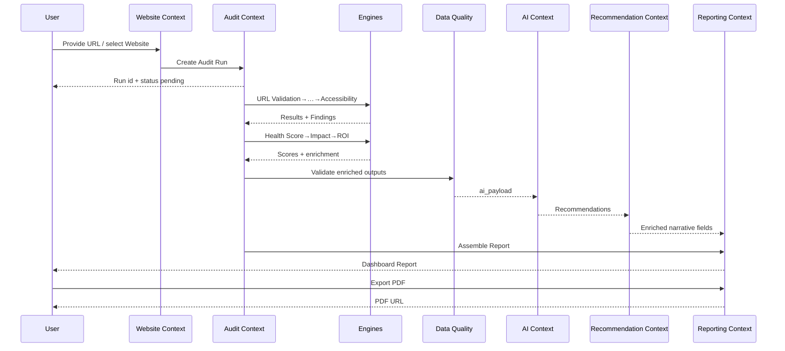

### 15.2 Partial Failure Path (Performance Soft-Fail)

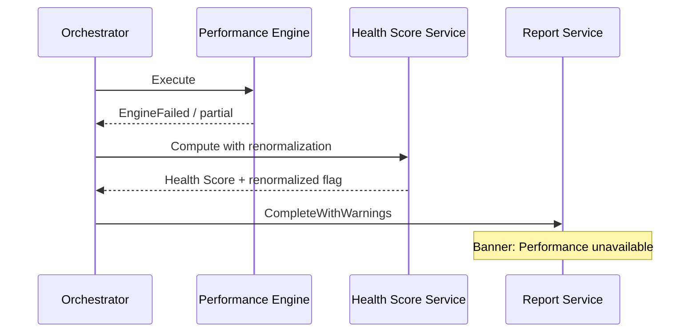

---

## 16. Future Domain Expansion

| Future Entity / Concept | Bounded Context | Notes |
|---|---|---|
| **Competitor** | Website / new Competitive Context | Compare Audit Runs across sites |
| **Keyword** | Keyword Intelligence Context | Opportunity overlays |
| **Content Optimization** | Content Context | On-page guidance beyond SEO checks |
| **AI Chat Session** | AI Context | Grounded Q&A over a Report |
| **Notification** | Administration / Comms | Email/slack on MonitoringTriggered |
| **Webhook** | Administration | Outbound integrations |
| **Team** | Identity | Subgrouping within Organization |
| **Workspace** | Identity/Website | Alias or evolution of Organization/Project |
| **Usage Metrics** | Billing | Metered analyses, seats |
| **Feature Flags** | Administration | Gradual Engine rollout |

All future entities must extend Ubiquitous Language via RFC before coding.

---

## 17. Domain Ownership

| Entity / Concept | Owning Context | Who may modify | Who may read | Dependents |
|---|---|---|---|---|
| User | Identity | Identity services | Many (ID only) | All tenancy checks |
| Organization | Identity / Billing (split carefully) | Org admins | Members | Projects, Billing |
| Project | Website | Project admins | Org members | Websites |
| Website | Website | Project members | Org members | Audit, Monitoring |
| Audit Run / Executions / Results / Findings | Audit | Audit pipeline only | Reporting, Rec, UI | Rec, Reporting, AI(input) |
| Recommendation | Recommendation (+ AI write path) | Recommendation Service | Reporting, UI | Report |
| Report | Reporting | Report Service | UI, PDF | PDF Engine |
| Monitoring Job | Monitoring | Entitled users | Org members | Audit |
| Subscription | Billing | Billing webhooks/admins | Entitlement Service | Audit, Monitoring |
| API Key | Administration | Org admins | Never secret readers | API gateway |
| Audit Log | Administration | System only (append) | Admins | Security/compliance |
| Engine definitions/contracts | Audit (+ shared kernel) | Architecture RFC | All engineers | Orchestrator |

> [!WARNING]
> Frontend and controllers are **never** owners. They are consumers that must respect aggregate boundaries.

---

## 18. Domain Anti-Patterns

| Anti-Pattern | Why harmful | Prefer |
|---|---|---|
| **Anemic Domain Model** | Rules scatter into controllers/prompts | Rich Entities + Domain Services |
| **Business Logic in Controllers** | Undetectable invariants | Application use-cases calling domain |
| **Duplicated Business Rules** | Priority computed differently in UI vs API | Single Domain Service |
| **Leaky Aggregates** | Updating Findings without Run consistency | Modify via Aggregate Root |
| **God Objects** | “Analyzer” that crawls+scores+AI | Engines + contexts |
| **Tight Coupling** | AI imports Crawler HTML | DQ payload only |
| **Shared Database as Integration without boundaries** | Contexts overwrite each other’s meaning | Explicit events/contracts |
| **Invented Ubiquitous Language per team** | “Scan” vs “Audit Run” chaos | This glossary |

---

## 19. Implementation Guidelines

### 19.1 Suggested Folder Structure

```text
apps/api/app/
├── domain/
│   ├── identity/
│   ├── website/
│   ├── audit/
│   │   ├── aggregates/
│   │   ├── entities/
│   │   ├── value_objects/
│   │   ├── services/
│   │   ├── events/
│   │   └── repositories/          # interfaces only
│   ├── recommendation/
│   ├── ai/
│   ├── reporting/
│   ├── monitoring/
│   ├── billing/
│   └── administration/
├── application/                   # use-cases / orchestrators
├── infrastructure/                # SQLAlchemy, Redis, OpenAI, PSI
└── interfaces/                    # API routes, workers
```

Frontend mirrors language in `entities/` and `features/` (FSD) without redefining meaning.

### 19.2 Naming Conventions

| Kind | Convention | Example |
|---|---|---|
| Entity | PascalCase noun | `AuditRun` |
| Value Object | PascalCase | `HealthScore`, `ConfidenceScore` |
| Domain Event | Past tense | `AuditCompleted` |
| Domain Service | Noun + Service | `HealthScoreService` |
| Repository interface | Entity + Repository | `AuditRunRepository` |

### 19.3 Repositories

- One repository per Aggregate Root.
- Methods speak domain (`save(auditRun)`, `get_by_id`), not SQL.

### 19.4 Application Services / Use-Cases

- `StartAudit`, `CompleteEngineExecution`, `GenerateRecommendations`, `AssembleReport`.
- Transaction scripts that **call** domain — not replace it.

### 19.5 Factories

- `AuditRunFactory.start(website, url, actor)` applies initial invariants.
- `FindingFactory.from_engine(result)` ensures Confidence present.

### 19.6 Mappers

- Map between domain and DB models / DTOs at infrastructure boundary only.

### 19.7 DTOs

- Transport shapes for API/UI; never bypass invariants (validate on ingress, rehydrate domain).

### 19.8 Events

- Publish after successful persistence.
- Outbox pattern recommended when moving to multi-service.

---

## 20. Best Practices

### 20.1 Maintainability

- Change rules in domain layer first; update this doc in the same PR.
- Keep ENGINE_SPEC for algorithms; DOMAIN_MODEL for meaning.

### 20.2 Scalability

- Aggregates stay small; don’t load all historical Runs into Website aggregate.
- Event-driven fan-out for notifications/webhooks later.

### 20.3 Testability

| Test | Focus |
|---|---|
| Unit | Value Objects, invariants, state transitions |
| Domain | Aggregate methods reject illegal transitions |
| Contract | Finding IDs stable across versions |
| Golden | Pipeline fixtures → expected Findings (AI mocked) |

### 20.4 Performance

- Don’t perform PSI/LLM inside domain methods; domain decides, infrastructure executes.
- Persist Engine Results for replay instead of recomputing unnecessarily.

### 20.5 Security

- SSRF rules are domain-adjacent policies enforced before Crawl.
- Secrets never appear as domain attributes in plaintext.

### 20.6 Domain Evolution

1. Propose RFC updating Ubiquitous Language.  
2. Update DOMAIN_MODEL.md.  
3. Adjust invariants/tests.  
4. Migrate DB/API.  
5. Update prompts only after DQ contracts update.

### 20.7 Contributor Checklist

- [ ] Uses glossary terms  
- [ ] Respects bounded context ownership  
- [ ] No AI inventing Findings  
- [ ] Confidence on every Finding  
- [ ] Aggregate boundaries preserved  
- [ ] Domain events named past-tense  
- [ ] Spec updated with code  

> [!NOTE]
> **North star:** SitePilot AI’s domain turns technical website signals into trustworthy business decisions. Every Entity, Engine, and Event either protects that trust — or does not belong.

---

<p align="center">
  <sub>SitePilot AI — Domain Model — Internal Domain Authority — Confidential</sub>
</p>
