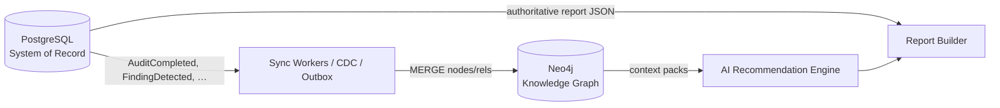
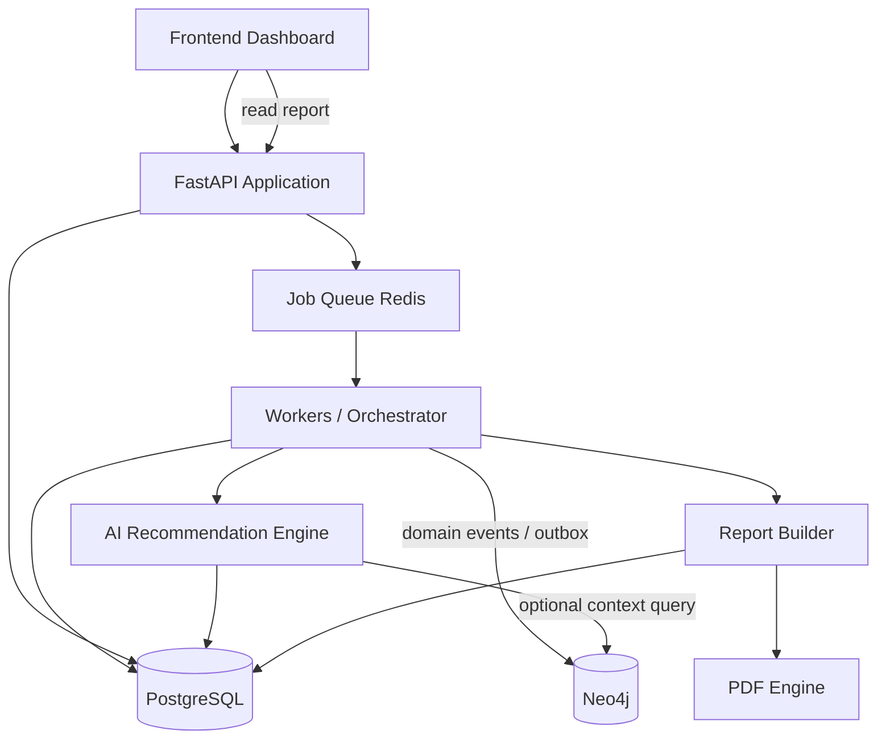
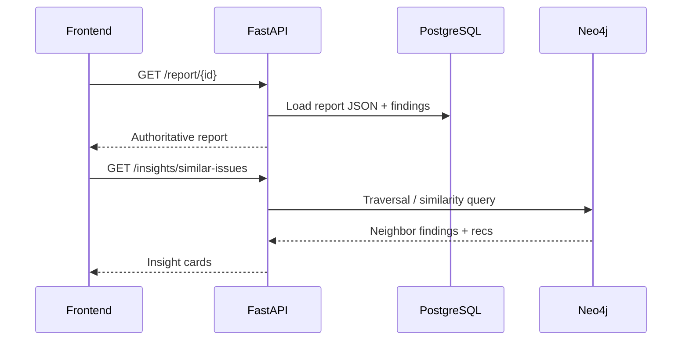
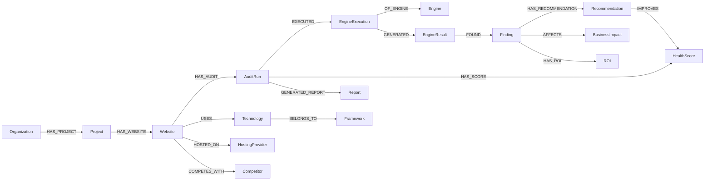
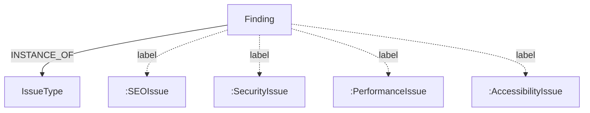
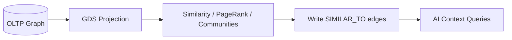
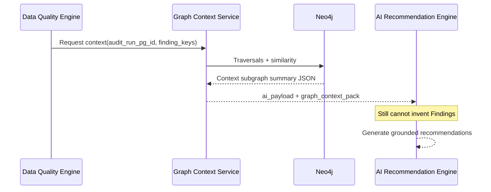
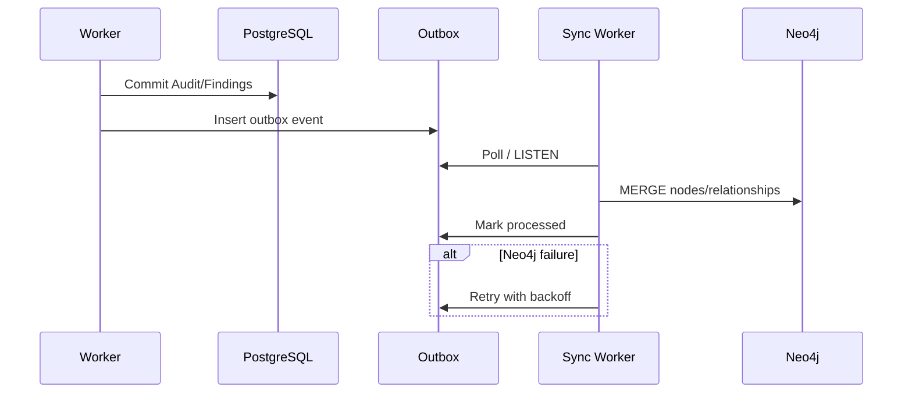
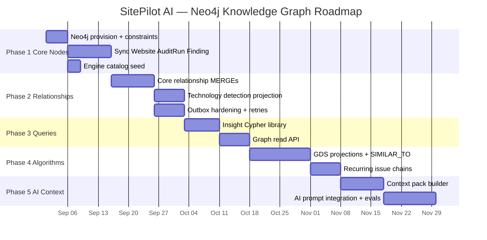

# SitePilot AI — Graph Architecture Specification

**Your AI-powered Website Intelligence Platform.**

| | |
|---|---|
| **Document Type** | Graph / Knowledge Graph Architecture Specification |
| **Product** | SitePilot AI |
| **Document** | `GRAPH_ARCHITECTURE_SPEC.md` |
| **Version** | 1.0.0 |
| **Status** | `Draft — Graph Architecture Authority` |
| **Owner** | Platform Architecture / Data Platform |
| **Graph Store** | Neo4j 5.x (Aura or self-hosted) |
| **System of Record** | PostgreSQL (see [DATABASE_SPEC.md](./DATABASE_SPEC.md)) |
| **Audience** | Software Architects, Backend, Data, AI, Graph Engineers |
| **Last Updated** | 2026-07-12 |
| **Companion Docs** | [DOMAIN_MODEL.md](./DOMAIN_MODEL.md), [ENGINE_SPEC.md](./ENGINE_SPEC.md), [DATABASE_SPEC.md](./DATABASE_SPEC.md), [PRD.md](./PRD.md), [ARCHITECTURE.md](./ARCHITECTURE.md) |

> [!NOTE]
> This document is the **implementation authority** for SitePilot AI’s Knowledge Graph. Neo4j models **relationships, similarity, dependency, and AI context**. PostgreSQL remains the **system of record** for transactional state, billing, and authoritative Audit Run payloads.

> [!WARNING]
> Do **not** treat Neo4j as a second write-primary for subscriptions, API keys, or password hashes. Do **not** invent Findings in the graph that do not exist in PostgreSQL. Graph nodes for Findings/Recommendations must sync from the relational source of truth.

---

## Table of Contents

1. [Purpose](#1-purpose)
2. [Graph Design Principles](#2-graph-design-principles)
3. [High-Level Graph Architecture](#3-high-level-graph-architecture)
4. [Graph Domain Model](#4-graph-domain-model)
5. [Node Types](#5-node-types)
6. [Relationship Types](#6-relationship-types)
7. [Graph Schema](#7-graph-schema)
8. [Cypher Data Model](#8-cypher-data-model)
9. [Graph Traversals](#9-graph-traversals)
10. [Graph Algorithms](#10-graph-algorithms)
11. [AI Context Graph](#11-ai-context-graph)
12. [Graph Queries](#12-graph-queries)
13. [Graph Versioning](#13-graph-versioning)
14. [Graph Security](#14-graph-security)
15. [Graph Performance](#15-graph-performance)
16. [Graph Synchronization](#16-graph-synchronization)
17. [Future Graph Features](#17-future-graph-features)
18. [Implementation Roadmap](#18-implementation-roadmap)
19. [Best Practices](#19-best-practices)

---

## 1. Purpose

### 1.1 Why SitePilot AI Uses a Knowledge Graph

SitePilot AI’s product value is not only “store an audit JSON.” It is **reasoning over connections**:

- Which Findings recur across a Website’s Audit history?
- Which Technologies correlate with which Security/SEO Issues?
- Which Recommendations historically preceded Health Score improvement?
- What graph neighborhood should the AI see before writing advice?

A Knowledge Graph makes those questions **first-class traversals** instead of expensive multi-join archaeology.

### 1.2 Advantages Over Relational Storage Alone

| Capability | Relational strength | Graph strength |
|---|---|---|
| Transactional Audit Run lifecycle | Excellent | Secondary projection |
| Billing / entitlements | Excellent | Not appropriate |
| Multi-hop relationship discovery | Awkward recursive CTEs | Natural traversals |
| Recommendation reasoning context | Flattened JSON payloads | Neighborhood retrieval |
| Dependency tracking (tech → known issues) | Possible but rigid | Flexible typed edges |
| Historical evolution as a path | Time columns + self-joins | Temporal chains / versioned edges |
| Similarity / communities | External ML jobs | Native / GDS algorithms |
| AI context building | Manual prompt packing | Graph-expanded context packs |

### 1.3 Capability Goals

| Goal | Graph contribution |
|---|---|
| **Relationship discovery** | Traverse Website → Technology → Issue patterns |
| **Recommendation reasoning** | Link Finding → prior successful Recommendation outcomes |
| **Dependency tracking** | CMS/Framework/Hosting dependency edges |
| **Historical evolution** | AuditRun chains, recurring Finding identities |
| **AI context building** | Retrieve similar Findings, tech stack, trends for prompts |
| **Future graph analytics** | PageRank on issue graphs, embeddings, competitor maps |

### 1.4 PostgreSQL + Neo4j Complementarity



| Store | Owns |
|---|---|
| **PostgreSQL** | Users, orgs, billing, Audit Run status, Engine Results blobs, Findings rows, Reports |
| **Neo4j** | Relationship topology, similarity edges, tech knowledge, AI context neighborhoods, analytics projections |
| **Object Storage** | Large HTML/PDF binaries |
| **Redis** | Hot cache / queues |

> [!TIP]
> Design rule: **If you must be correct for money or compliance, write Postgres first.** If you must **traverse or reason**, project into Neo4j.

---

## 2. Graph Design Principles

### 2.1 Property Graph Model

Neo4j uses a **Labeled Property Graph**:

- **Nodes** — entities (Website, Finding, Technology, …)
- **Relationships** — typed, directed edges with optional properties
- **Properties** — key/value maps on nodes and relationships
- **Labels** — node classification (`:Website`, `:Finding`)

### 2.2 Nodes

- One business concept per primary label (align with [DOMAIN_MODEL.md](./DOMAIN_MODEL.md)).
- Secondary labels allowed for classification (`:SEOIssue`, `:SecurityIssue`) **in addition to** `:Finding` when useful for query speed.
- Every synced domain node includes `pg_id` (UUID string) linking to Postgres.

### 2.3 Relationships

- Named with **VERBS** in `SCREAMING_SNAKE_CASE`.
- Direction encodes meaning (`Website -[:HAS_AUDIT]-> AuditRun`).
- Relationship properties hold evidence (`detected_at`, `confidence`, `source`).

### 2.4 Properties

| Convention | Rule |
|---|---|
| IDs | `id` (graph element id optional), always `pg_id` for SoR entities |
| Timestamps | ISO-8601 strings or epoch millis; prefer `datetime` Neo4j type |
| Scores | Integers 0–100 |
| Enums | Lowercase strings matching domain glossary |
| Avoid | Storing full Lighthouse JSON in graph (keep in Postgres/object store) |

### 2.5 Labels

Prefer specific labels for hot query sets:

```cypher
(:Finding:SEOIssue)
(:Finding:PerformanceIssue)
```

### 2.6 Indexes

Create indexes on:

- `pg_id`
- Natural lookup keys (`canonical_url`, `finding_key`, `engine_name`)
- Filter properties used in WHERE (`priority`, `resolution_status`, `organization_pg_id`)

### 2.7 Constraints

- Uniqueness on `(label, pg_id)` for synced entities.
- Uniqueness on stable business keys where safe (`Technology.name`).

### 2.8 Graph Traversals

Design schema so common product questions are **2–4 hop** traversals, not 12.

### 2.9 Graph Algorithms

Use Neo4j Graph Data Science (GDS) for analytics projections — never block the Audit request path on heavy algorithms.

### 2.10 Versioning

Prefer **new AuditRun nodes** over mutating historical Finding nodes in place. Use relationship time properties for validity windows when needed.

### 2.11 Scalability

- Partition logical tenants via `organization_pg_id` property filters.
- Batch MERGE from outbox workers.
- Separate OLTP sync graph from analytics graph projection if GDS load grows.

---

## 3. High-Level Graph Architecture

### 3.1 Runtime Topology



### 3.2 Responsibilities

| Component | Responsibility |
|---|---|
| **Frontend** | Render Reports; never writes Neo4j directly |
| **FastAPI** | Auth, commands, reads Postgres; may read graph via service for insights APIs |
| **PostgreSQL** | System of record for Audits, Findings, Recommendations, Reports |
| **Workers** | Run Engines; emit sync events; optionally fetch AI context from Neo4j |
| **Neo4j** | Knowledge topology + AI context retrieval + analytics |
| **AI Recommendation Engine** | Explain Findings using DQ payload **plus** optional graph context pack |
| **Report Builder** | Assemble customer Report from Postgres (authoritative) |

### 3.3 Read Paths



---

## 4. Graph Domain Model

### 4.1 Modeling Philosophy

Map domain aggregates into graph **projections**:

| Domain concept | Graph representation |
|---|---|
| Website | `:Website` node |
| Audit Run | `:AuditRun` node |
| Finding | `:Finding` (+ issue-class label) |
| Recommendation | `:Recommendation` node |
| Engine | `:Engine` catalog node (versioned via properties or `:EngineVersion`) |
| Engine Execution / Result | `:EngineExecution`, `:EngineResult` nodes |
| Technology taxonomy | `:Technology`, `:Framework`, `:ProgrammingLanguage`, `:CMS`, `:HostingProvider` |
| Scores | `:HealthScore`, `:BusinessImpact`, `:ROI` nodes **or** properties — see §5 guidance |
| Tenancy | `:Organization`, `:Project`, `:User` |
| Future | `:Keyword`, `:Competitor` |

### 4.2 Identity Bridge

Every SoR-backed node:

```text
pg_id: String!   // UUID from Postgres
org_pg_id: String // tenant scope denormalized for filtering
```

### 4.3 Lifecycle Overview

1. Postgres commit succeeds  
2. Outbox event written  
3. Sync worker `MERGE`s graph  
4. AI may query graph for context  
5. Report remains Postgres-authoritative  

---

## 5. Node Types

For each node: Purpose, Properties, Indexes, Constraints, Lifecycle, Future Expansion.

### 5.1 Website

| | |
|---|---|
| **Purpose** | Durable site identity in the graph |
| **Properties** | `pg_id`, `org_pg_id`, `project_pg_id`, `canonical_url`, `host`, `language`, `country`, `industry`, `created_at`, `updated_at` |
| **Indexes** | `pg_id`, `canonical_url`, `host`, `org_pg_id` |
| **Constraints** | UNIQUE `pg_id`; UNIQUE (`org_pg_id`,`canonical_url`) optional if enforced in PG |
| **Lifecycle** | Created on first audit; updated on metadata changes; soft-archive via `status` |
| **Future** | Geo, brand entity links |

### 5.2 AuditRun

| | |
|---|---|
| **Purpose** | One analysis occurrence |
| **Properties** | `pg_id`, `website_pg_id`, `status`, `started_at`, `completed_at`, `duration_ms`, `health_score`, `seo_score`, `performance_score`, `security_score`, `accessibility_score`, `scoring_config_version` |
| **Indexes** | `pg_id`, `website_pg_id`, `status`, `completed_at` |
| **Constraints** | UNIQUE `pg_id` |
| **Lifecycle** | Mirrors Audit Run state machine; immutable after terminal state except status sync |
| **Future** | Diff edges to previous run |

### 5.3 Finding

| | |
|---|---|
| **Purpose** | Discrete issue/observation |
| **Properties** | `pg_id`, `audit_run_pg_id`, `finding_key` (e.g. `seo.meta_description.missing`), `category`, `severity`, `priority`, `confidence`, `issue`, `resolution_status`, `engine_name` |
| **Indexes** | `pg_id`, `finding_key`, `priority`, `resolution_status`, `category` |
| **Constraints** | UNIQUE `pg_id` |
| **Lifecycle** | Created when Finding detected; resolution updates synced |
| **Future** | Cross-run `:RECURS_AS` chains |

**Secondary labels:** `:SEOIssue`, `:PerformanceIssue`, `:SecurityIssue`, `:AccessibilityIssue` based on category.

### 5.4 Recommendation

| | |
|---|---|
| **Purpose** | Actionable guidance node |
| **Properties** | `pg_id`, `audit_run_pg_id`, `finding_key`, `prompt_version`, `model_used`, `confidence`, `is_fallback`, `version` |
| **Indexes** | `pg_id`, `finding_key`, `prompt_version` |
| **Constraints** | UNIQUE `pg_id` |
| **Lifecycle** | Created post-AI; superseded versions linked via `:SUPERSEDES` |
| **Future** | Outcome edges `:LED_TO_IMPROVEMENT` |

### 5.5 Engine

| | |
|---|---|
| **Purpose** | Catalog of engine capabilities |
| **Properties** | `name` (unique), `description`, `latest_version` |
| **Indexes / Constraints** | UNIQUE `name` |
| **Lifecycle** | Seeded; rarely changes |
| **Future** | Ownership team metadata |

### 5.6 EngineExecution

| | |
|---|---|
| **Purpose** | One engine invocation in a run |
| **Properties** | `pg_id`, `engine_name`, `engine_version`, `status`, `attempt`, `execution_time_ms`, `started_at`, `completed_at` |
| **Indexes** | `pg_id`, `engine_name`, `status` |
| **Constraints** | UNIQUE `pg_id` |
| **Lifecycle** | Synced from executions table |
| **Future** | Link to infra node (worker pool) |

### 5.7 EngineResult

| | |
|---|---|
| **Purpose** | Lightweight result pointer (not full JSON dump) |
| **Properties** | `pg_id`, `schema_version`, `content_hash`, `confidence`, `artifact_uri` |
| **Indexes** | `pg_id`, `schema_version` |
| **Constraints** | UNIQUE `pg_id` |
| **Lifecycle** | Created with execution success/partial |
| **Future** | Embedding vector property (external index) |

> [!WARNING]
> Do **not** copy multi-MB `structured_output` into Neo4j. Store pointer + hash; keep payload in Postgres/object storage.

### 5.8 Technology

| | |
|---|---|
| **Purpose** | Detected or declared technology tag |
| **Properties** | `name`, `slug`, `category` (`js-lib`,`server`,`cdn`,…) |
| **Constraints** | UNIQUE `slug` |
| **Lifecycle** | Catalog growth over time |
| **Future** | CVE edges |

### 5.9 Framework

| | |
|---|---|
| **Purpose** | Framework taxonomy node (React, Next.js, Laravel, …) |
| **Properties** | `name`, `slug`, `ecosystem` |
| **Constraints** | UNIQUE `slug` |
| **Future** | Version nodes |

### 5.10 ProgrammingLanguage

| | |
|---|---|
| **Purpose** | Language taxonomy (JavaScript, PHP, Python, …) |
| **Properties** | `name`, `slug` |
| **Constraints** | UNIQUE `slug` |

### 5.11 CMS

| | |
|---|---|
| **Purpose** | CMS taxonomy (WordPress, Drupal, Webflow, …) |
| **Properties** | `name`, `slug` |
| **Constraints** | UNIQUE `slug` |

### 5.12 HostingProvider

| | |
|---|---|
| **Purpose** | Hosting/CDN provider node |
| **Properties** | `name`, `slug` |
| **Constraints** | UNIQUE `slug` |

### 5.13 SecurityIssue / SEOIssue / PerformanceIssue / AccessibilityIssue

These are **labels on Finding nodes** (and optionally standalone knowledge nodes for canonical issue types).

**Canonical Issue Type node (recommended):**

```text
(:IssueType {key: 'seo.meta_description.missing', category: 'seo', title: '...'})
```

Findings `[:INSTANCE_OF]-> (:IssueType)`.

### 5.14 BusinessImpact

| | |
|---|---|
| **Purpose** | Business impact concept node or per-finding impact node |
| **Properties** | `domain` (`seo`,`revenue`,…), `label`, `weight` |
| **Usage** | Finding -[:AFFECTS]-> BusinessImpact |
| **Future** | Industry-specific impact ontologies |

### 5.15 ROI

| | |
|---|---|
| **Purpose** | ROI band / index projection |
| **Properties** | `roi_band`, `roi_index`, `effort_band` |
| **Usage** | Finding/Recommendation -[:HAS_ROI]-> ROI |
| **Note** | Prefer properties on Finding if cardinality explodes |

### 5.16 HealthScore

| | |
|---|---|
| **Purpose** | Score snapshot node per AuditRun |
| **Properties** | `overall`, `seo`, `performance`, `security`, `accessibility`, `best_practices`, `config_version` |
| **Lifecycle** | One per completed scoring |
| **Future** | Trend edges between HealthScore nodes |

### 5.17 Report

| | |
|---|---|
| **Purpose** | Report projection for graph navigation |
| **Properties** | `pg_id`, `audit_run_pg_id`, `version`, `has_pdf`, `created_at` |
| **Constraints** | UNIQUE `pg_id` |
| **Note** | Full JSON stays in Postgres |

### 5.18 User / Organization / Project

Tenancy projection nodes for ACL-aware graph queries and portfolio analytics.

| Node | Key properties |
|---|---|
| User | `pg_id`, `email_hash` (prefer hash over raw email in graph) |
| Organization | `pg_id`, `slug`, `plan_tier` |
| Project | `pg_id`, `org_pg_id`, `slug` |

> [!WARNING]
> Minimize PII in Neo4j. Prefer `email_hash` and fetch display email from Postgres when needed.

### 5.19 MonitoringJob / Subscription

| Node | Purpose |
|---|---|
| MonitoringJob | Schedule projection; links Website → future AuditRuns |
| Subscription | Plan tier projection for entitlement-aware analytics (not billing ledger) |

### 5.20 Keyword / Competitor (Future-ready)

| Node | Purpose |
|---|---|
| Keyword | Keyword intelligence graph |
| Competitor | Competing Website or Brand node |

---

## 6. Relationship Types

### 6.1 Core Relationship Catalog

| Relationship | From → To | Properties (examples) |
|---|---|---|
| `HAS_PROJECT` | Organization → Project | |
| `HAS_WEBSITE` | Project → Website | |
| `HAS_AUDIT` | Website → AuditRun | `sequence` |
| `PREVIOUS_AUDIT` | AuditRun → AuditRun | temporal chain |
| `EXECUTED` | AuditRun → EngineExecution | |
| `OF_ENGINE` | EngineExecution → Engine | `version` |
| `GENERATED` | EngineExecution → EngineResult | |
| `FOUND` | EngineResult → Finding | |
| `DETECTED_IN` | Finding → AuditRun | denormalized convenience optional |
| `INSTANCE_OF` | Finding → IssueType | |
| `HAS_RECOMMENDATION` | Finding → Recommendation | |
| `IMPROVES` | Recommendation → HealthScore | `expected` (hedged) |
| `AFFECTS` | Finding → BusinessImpact | `weight` |
| `HAS_ROI` | Finding → ROI | |
| `HAS_SCORE` | AuditRun → HealthScore | |
| `GENERATED_REPORT` | AuditRun → Report | |
| `USES` | Website → Technology | `confidence`, `detected_at` |
| `BELONGS_TO` | Technology → Framework | |
| `IMPLEMENTED_IN` | Framework → ProgrammingLanguage | |
| `POWERED_BY` | Website → CMS | |
| `HOSTED_ON` | Website → HostingProvider | |
| `COMPETES_WITH` | Website → Competitor | `source` |
| `TARGETS` | Website → Keyword | future |
| `MEMBER_OF` | User → Organization | `role` |
| `OWNS` | Organization → Subscription | |
| `MONITORS` | MonitoringJob → Website | |
| `TRIGGERED` | MonitoringJob → AuditRun | |
| `SUPERSEDES` | Recommendation → Recommendation | |
| `SIMILAR_TO` | Website → Website / Finding → Finding | `score`, `model` |
| `RECURS_IN` | Finding → Finding | cross-run same `finding_key` |

### 6.2 Relationship Diagram



### 6.3 Issue Taxonomy Diagram



---

## 7. Graph Schema

### 7.1 Node Labels (Canonical Set)

`Website`, `AuditRun`, `Finding`, `SEOIssue`, `SecurityIssue`, `PerformanceIssue`, `AccessibilityIssue`, `IssueType`, `Recommendation`, `Engine`, `EngineExecution`, `EngineResult`, `Technology`, `Framework`, `ProgrammingLanguage`, `CMS`, `HostingProvider`, `BusinessImpact`, `ROI`, `HealthScore`, `Report`, `User`, `Organization`, `Project`, `MonitoringJob`, `Subscription`, `Keyword`, `Competitor`

### 7.2 Constraints (Cypher)

```cypher
CREATE CONSTRAINT website_pg_id IF NOT EXISTS
FOR (w:Website) REQUIRE w.pg_id IS UNIQUE;

CREATE CONSTRAINT auditrun_pg_id IF NOT EXISTS
FOR (a:AuditRun) REQUIRE a.pg_id IS UNIQUE;

CREATE CONSTRAINT finding_pg_id IF NOT EXISTS
FOR (f:Finding) REQUIRE f.pg_id IS UNIQUE;

CREATE CONSTRAINT recommendation_pg_id IF NOT EXISTS
FOR (r:Recommendation) REQUIRE r.pg_id IS UNIQUE;

CREATE CONSTRAINT engine_name IF NOT EXISTS
FOR (e:Engine) REQUIRE e.name IS UNIQUE;

CREATE CONSTRAINT issue_type_key IF NOT EXISTS
FOR (i:IssueType) REQUIRE i.key IS UNIQUE;

CREATE CONSTRAINT technology_slug IF NOT EXISTS
FOR (t:Technology) REQUIRE t.slug IS UNIQUE;

CREATE CONSTRAINT organization_pg_id IF NOT EXISTS
FOR (o:Organization) REQUIRE o.pg_id IS UNIQUE;
```

### 7.3 Indexes

```cypher
CREATE INDEX website_host IF NOT EXISTS FOR (w:Website) ON (w.host);
CREATE INDEX website_org IF NOT EXISTS FOR (w:Website) ON (w.org_pg_id);
CREATE INDEX finding_key IF NOT EXISTS FOR (f:Finding) ON (f.finding_key);
CREATE INDEX finding_priority IF NOT EXISTS FOR (f:Finding) ON (f.priority);
CREATE INDEX finding_resolution IF NOT EXISTS FOR (f:Finding) ON (f.resolution_status);
CREATE INDEX auditrun_website IF NOT EXISTS FOR (a:AuditRun) ON (a.website_pg_id);
CREATE INDEX auditrun_completed IF NOT EXISTS FOR (a:AuditRun) ON (a.completed_at);
CREATE INDEX recommendation_finding_key IF NOT EXISTS FOR (r:Recommendation) ON (r.finding_key);
```

### 7.4 Unique Keys Summary

| Label | Unique key |
|---|---|
| SoR entities | `pg_id` |
| Engine | `name` |
| IssueType | `key` |
| Technology/CMS/Framework/Hosting | `slug` |

---

## 8. Cypher Data Model

### 8.1 MERGE Patterns (Idempotent Sync)

**Website**

```cypher
MERGE (w:Website {pg_id: $pg_id})
ON CREATE SET
  w.created_at = datetime($created_at)
SET
  w.org_pg_id = $org_pg_id,
  w.project_pg_id = $project_pg_id,
  w.canonical_url = $canonical_url,
  w.host = $host,
  w.language = $language,
  w.updated_at = datetime()
RETURN w;
```

**AuditRun + relationship**

```cypher
MATCH (w:Website {pg_id: $website_pg_id})
MERGE (a:AuditRun {pg_id: $audit_pg_id})
SET a.status = $status,
    a.health_score = $health_score,
    a.completed_at = datetime($completed_at),
    a.website_pg_id = $website_pg_id
MERGE (w)-[:HAS_AUDIT]->(a)
RETURN a;
```

**Finding**

```cypher
MATCH (a:AuditRun {pg_id: $audit_pg_id})
MERGE (f:Finding {pg_id: $finding_pg_id})
SET f.finding_key = $finding_key,
    f.category = $category,
    f.severity = $severity,
    f.priority = $priority,
    f.confidence = $confidence,
    f.issue = $issue,
    f.resolution_status = $resolution_status,
    f.engine_name = $engine_name
FOREACH (_ IN CASE WHEN $category = 'seo' THEN [1] ELSE [] END |
  SET f:SEOIssue
)
WITH f, a
MERGE (it:IssueType {key: $finding_key})
ON CREATE SET it.category = $category, it.title = $issue
MERGE (f)-[:INSTANCE_OF]->(it)
MERGE (res:EngineResult {pg_id: $engine_result_pg_id})
MERGE (res)-[:FOUND]->(f)
MERGE (a)<-[:DETECTED_IN]-(f)
RETURN f;
```

**Recommendation**

```cypher
MATCH (f:Finding {pg_id: $finding_pg_id})
MERGE (r:Recommendation {pg_id: $rec_pg_id})
SET r.finding_key = f.finding_key,
    r.prompt_version = $prompt_version,
    r.model_used = $model_used,
    r.confidence = $confidence,
    r.is_fallback = $is_fallback,
    r.version = $version
MERGE (f)-[:HAS_RECOMMENDATION]->(r)
RETURN r;
```

**Technology usage**

```cypher
MATCH (w:Website {pg_id: $website_pg_id})
MERGE (t:Technology {slug: $tech_slug})
ON CREATE SET t.name = $tech_name, t.category = $tech_category
MERGE (w)-[u:USES]->(t)
SET u.confidence = $confidence, u.detected_at = datetime()
RETURN w, t, u;
```

### 8.2 MATCH / UPDATE / DELETE

```cypher
// Update resolution
MATCH (f:Finding {pg_id: $finding_pg_id})
SET f.resolution_status = 'resolved', f.resolved_at = datetime()
RETURN f;

// Soft-delete projection (prefer status over physical delete)
MATCH (w:Website {pg_id: $pg_id})
SET w.status = 'archived', w.updated_at = datetime();

// Physical delete only for GDPR erasure jobs
MATCH (u:User {pg_id: $pg_id})
DETACH DELETE u;
```

### 8.3 Engine Catalog Seed

```cypher
UNWIND [
  'url_validation','crawler','html_parser','seo_intelligence','performance',
  'security','accessibility','health_score','business_impact','roi',
  'data_quality','ai_recommendation','report_builder','pdf'
] AS name
MERGE (e:Engine {name: name})
ON CREATE SET e.created_at = datetime();
```

---

## 9. Graph Traversals

### 9.1 Website → Audit → Finding → Recommendation

```cypher
MATCH (w:Website {pg_id: $website_pg_id})-[:HAS_AUDIT]->(a:AuditRun)
      -[:EXECUTED]->(:EngineExecution)-[:GENERATED]->(:EngineResult)
      -[:FOUND]->(f:Finding)-[:HAS_RECOMMENDATION]->(r:Recommendation)
WHERE a.pg_id = $audit_pg_id
RETURN f.issue AS issue, f.priority AS priority, f.confidence AS confidence,
       r.model_used AS model, r.prompt_version AS prompt
ORDER BY f.priority, f.confidence DESC;
```

Simplified path if `DETECTED_IN` maintained:

```cypher
MATCH (w:Website {pg_id: $website_pg_id})-[:HAS_AUDIT]->(a:AuditRun {pg_id: $audit_pg_id})
MATCH (f:Finding)-[:DETECTED_IN]->(a)
OPTIONAL MATCH (f)-[:HAS_RECOMMENDATION]->(r:Recommendation)
RETURN f, r;
```

### 9.2 Website → Technology → Known Security Issues

```cypher
MATCH (w:Website {pg_id: $website_pg_id})-[:USES]->(t:Technology)
OPTIONAL MATCH (t)<-[:USES]-(other:Website)-[:HAS_AUDIT]->(:AuditRun)
              <-[:DETECTED_IN]-(f:Finding:SecurityIssue)
WHERE f.resolution_status = 'open'
RETURN t.name AS technology,
       collect(DISTINCT f.finding_key)[0..20] AS related_security_finding_keys;
```

Knowledge-base variant (future CVE graph):

```cypher
MATCH (w:Website)-[:USES]->(t:Technology)-[:HAS_KNOWN_ISSUE]->(it:IssueType)
RETURN t, it;
```

### 9.3 Finding → Business Impact → ROI

```cypher
MATCH (f:Finding {pg_id: $finding_pg_id})-[:AFFECTS]->(b:BusinessImpact)
OPTIONAL MATCH (f)-[:HAS_ROI]->(roi:ROI)
RETURN f.issue, b.domain, b.label, roi.roi_band, roi.roi_index;
```

### 9.4 Recommendation → Expected Improvement

```cypher
MATCH (r:Recommendation {pg_id: $rec_pg_id})-[i:IMPROVES]->(h:HealthScore)
RETURN r, i.expected AS expected_improvement, h.overall AS score_snapshot;
```

> [!NOTE]
> `expected` must remain qualitative/hedged (`"potential SEO improvements"`), never fabricated percent lifts.

---

## 10. Graph Algorithms

Use **Neo4j GDS** on analytics projections (not on the hot sync graph path).

| Algorithm | SitePilot application |
|---|---|
| **PageRank** | Rank IssueTypes or Technologies that propagate risk across the portfolio |
| **Community Detection** | Cluster Websites with similar Finding neighborhoods (segments) |
| **Shortest Path** | Explain dependency chains Technology → Framework → known IssueType |
| **Node Similarity** | “Websites like this one” / “Findings like this one” for AI context |
| **Centrality** | Identify Findings that bridge many BusinessImpact domains |
| **Recommendation Ranking** | Rank prior Recommendations by historical `:LED_TO_IMPROVEMENT` weight |
| **Dependency Analysis** | Detect fragile stacks (CMS + outdated plugin patterns) |
| **Root Cause Detection** | Trace multiple Findings sharing upstream Technology/Hosting causes |
| **Graph Embeddings** | Embedding nodes for semantic retrieval into AI context packs |



---

## 11. AI Context Graph

### 11.1 Why Engine Outputs Alone Are Insufficient

Engine outputs answer “what is wrong on **this** page **now**.”  
Graph context answers “what does this mean **given history, stack, and peers**?”

### 11.2 Context Pack Composition

Before AI Recommendation Engine runs (after Data Quality):

| Context slice | Graph retrieval |
|---|---|
| Similar Findings | `SIMILAR_TO` / same `IssueType` across org |
| Past Recommendations | Prior Recommendations for same `finding_key` on Website |
| Technology Dependencies | `USES` / `POWERED_BY` / `HOSTED_ON` neighborhood |
| Historical Audit Trends | Last N AuditRuns scores + recurring Finding keys |
| Recurring Issues | `RECURS_IN` chains still `open` |
| Business Context | `AFFECTS` BusinessImpact + industry property |

### 11.3 Sequence



### 11.4 Quality Gains

| Without graph | With graph |
|---|---|
| Generic advice | Stack-aware advice (“On WordPress + Elementor…”) |
| No memory | Recurring issue emphasis |
| Isolated Finding | Peer outcomes (“similar sites fixed X via Y”) |
| Higher hallucination risk | More grounded constraints in prompt |

> [!WARNING]
> Graph context is **advisory**. AI must still only recommend for Finding keys present in the DQ payload. Graph may not introduce new Finding identities into the closed world.

---

## 12. Graph Queries

### 12.1 Unresolved High Priority Findings

```cypher
MATCH (f:Finding)
WHERE f.priority IN ['High','Critical']
  AND f.resolution_status = 'open'
  AND f.org_pg_id = $org_pg_id
RETURN f.finding_key, f.issue, f.confidence, f.audit_run_pg_id
ORDER BY f.priority, f.confidence DESC
LIMIT 100;
```

### 12.2 Websites Using WordPress

```cypher
MATCH (w:Website)-[:POWERED_BY|USES]->(c)
WHERE (c:CMS OR c:Technology) AND toLower(c.name) = 'wordpress'
RETURN DISTINCT w.pg_id, w.canonical_url;
```

### 12.3 Websites Using React

```cypher
MATCH (w:Website)-[:USES]->(t:Technology|Framework)
WHERE toLower(t.slug) IN ['react','nextjs','next.js']
RETURN DISTINCT w.canonical_url, collect(DISTINCT t.name) AS stack;
```

### 12.4 Missing Canonical Tag Issues

```cypher
MATCH (f:Finding {finding_key: 'seo.canonical.missing'})-[:DETECTED_IN]->(a:AuditRun)
<-[:HAS_AUDIT]-(w:Website)
WHERE f.resolution_status = 'open'
RETURN w.canonical_url, a.pg_id, a.completed_at, f.confidence
ORDER BY a.completed_at DESC;
```

### 12.5 Similar Websites

```cypher
MATCH (w:Website {pg_id: $website_pg_id})-[s:SIMILAR_TO]->(other:Website)
RETURN other.canonical_url, s.score
ORDER BY s.score DESC
LIMIT 10;
```

### 12.6 Recurring Issues

```cypher
MATCH (w:Website {pg_id: $website_pg_id})-[:HAS_AUDIT]->(a:AuditRun)
<-[:DETECTED_IN]-(f:Finding)
WITH f.finding_key AS key, count(DISTINCT a) AS runs, max(f.confidence) AS conf
WHERE runs >= 2
RETURN key, runs, conf
ORDER BY runs DESC, conf DESC;
```

### 12.7 Recommendations That Solved Similar Issues

```cypher
MATCH (f:Finding {pg_id: $finding_pg_id})-[:INSTANCE_OF]->(it:IssueType)
MATCH (it)<-[:INSTANCE_OF]-(other:Finding)-[:HAS_RECOMMENDATION]->(r:Recommendation)
WHERE other.resolution_status = 'resolved'
RETURN r.pg_id, r.model_used, r.prompt_version, other.pg_id AS resolved_finding
LIMIT 20;
```

---

## 13. Graph Versioning

### 13.1 Node Versioning

- Prefer **immutable AuditRun / Finding instances** per run (`pg_id` unique).
- Catalog nodes (`Engine`, `IssueType`, `Technology`) evolve via property updates + optional `:Version` nodes.

### 13.2 Relationship Versioning

```cypher
MERGE (w)-[u:USES]->(t)
SET u.valid_from = coalesce(u.valid_from, datetime()),
    u.confidence = $confidence,
    u.source = $source;
```

For replacements, close old edge:

```cypher
SET u.valid_to = datetime(), u.status = 'stale'
```

### 13.3 Historical Snapshots

- Historical truth is the chain of AuditRuns.
- Optional `:SNAPSHOT` nodes for GDS exports dated by `created_at`.

### 13.4 Audit History

```cypher
MATCH (w:Website {pg_id: $id})-[:HAS_AUDIT]->(a:AuditRun)
OPTIONAL MATCH (a)-[:PREVIOUS_AUDIT]->(prev:AuditRun)
RETURN a.pg_id, a.health_score, a.completed_at, prev.pg_id
ORDER BY a.completed_at DESC;
```

---

## 14. Graph Security

### 14.1 Authentication

- Neo4j auth via strong credentials / Aura IAM.
- App uses dedicated `sitepilot_graph_rw` and `sitepilot_graph_ro` users.

### 14.2 Authorization

- Enforce tenant isolation in **every query** with `org_pg_id` predicate.
- Never expose open Cypher endpoint to end users.

### 14.3 Sensitive Data / PII

| Allow in graph | Deny in graph |
|---|---|
| `pg_id`, hashes, URLs, scores | Passwords, API keys, raw emails (prefer hash), cookies, HTML bodies, LLM full prompts with secrets |

### 14.4 Cypher Injection Prevention

- **Parameterized queries only**.
- No string concatenation of user input into Cypher.
- Allowlist relationship types/labels in dynamic builders.

```cypher
// GOOD
MATCH (w:Website {pg_id: $pg_id}) RETURN w;

// BAD
// MATCH (w:Website {pg_id: ' + userInput + '}) RETURN w;
```

---

## 15. Graph Performance

### 15.1 Indexes

Create constraints/indexes before bulk sync (see §7).

### 15.2 Query Optimization

- Start from indexed nodes (`pg_id`, `finding_key`).
- Bound traversals (`LIMIT`, depth caps).
- Avoid Cartesian products; connect patterns explicitly.

### 15.3 Caching

- Cache AI context packs in Redis keyed by `audit_run_pg_id + finding_key_set_hash` (TTL 15–60m).
- Cache similarity edges; recompute async.

### 15.4 Batch Writes / Bulk Imports

- Outbox workers batch 100–1000 MERGEs per transaction.
- Initial taxonomy seed via `neo4j-admin database import` or scripted UNWIND.

### 15.5 Memory Usage

- Keep payloads out of graph.
- Monitor page cache / heap; size Aura tier for node/rel counts.
- Separate GDS workload when algorithms contend with sync.

---

## 16. Graph Synchronization

### 16.1 Source of Truth

**PostgreSQL is authoritative** for Audits, Findings, Recommendations, Reports, tenancy, billing.

Neo4j is a **derived projection**.

### 16.2 Event Flow



Events: `WebsiteUpserted`, `AuditCompleted`, `FindingUpserted`, `RecommendationGenerated`, `TechnologyDetected`, `ReportGenerated`.

### 16.3 Consistency Model

| Mode | Usage |
|---|---|
| **Eventual** | Default graph sync |
| **Read-your-writes (API)** | Always read Reports from Postgres |
| **Causal for AI context** | AI context optional; if graph lagging, proceed with DQ payload only |

### 16.4 Conflict Resolution

- Last-write-wins by Postgres `updated_at` / event version.
- `MERGE` on `pg_id` ensures idempotency.
- If divergence detected, **rebuild projection** from Postgres for that `audit_run_pg_id`.

### 16.5 Recovery Strategy

1. Replay outbox from checkpoint  
2. Or reproject AuditRun subgraph from Postgres repositories  
3. Orphan graph nodes without `pg_id` match quarantined and deleted by janitor job  

---

## 17. Future Graph Features

| Feature | Description |
|---|---|
| **Website Similarity Engine** | GDS similarity → `:SIMILAR_TO` for portfolio insights |
| **Recommendation Graph** | Outcome-weighted Recommendation networks for ranking |
| **Technology Dependency Graph** | Deep CMS/plugin/framework dependency + known issue links |
| **Competitor Graph** | `:COMPETES_WITH` neighborhoods and gap analysis |
| **Keyword Graph** | Keyword ↔ Website ↔ Content opportunities |
| **Security Knowledge Graph** | CVE/advisory ontology linked to Technologies |
| **AI Learning Graph** | Store which context slices improved acceptance of Recommendations (feedback loops) |

---

## 18. Implementation Roadmap

### 18.1 Phases

| Phase | Scope |
|---|---|
| **Phase 1 — Core Nodes** | Organization, Project, Website, AuditRun, Finding, Engine seeds |
| **Phase 2 — Relationships** | HAS_AUDIT, FOUND, HAS_RECOMMENDATION, USES, HAS_SCORE, GENERATED_REPORT |
| **Phase 3 — Cypher Queries** | Product insight queries + Graph Context Service API |
| **Phase 4 — Graph Algorithms** | Similarity, communities, PageRank projections |
| **Phase 5 — AI Context Graph** | Context packs wired into AI Recommendation Engine |

### 18.2 Gantt



---

## 19. Best Practices

### 19.1 Modeling

- Align labels with Ubiquitous Language ([DOMAIN_MODEL.md](./DOMAIN_MODEL.md)).
- Bridge every SoR node with `pg_id`.
- Keep large JSON out of Neo4j.
- Use IssueType catalog for stable Finding identity across runs.

### 19.2 Performance

- Index before scale.
- Bound traversals.
- Async GDS only.
- Batch MERGE writes.

### 19.3 Maintainability

- Version Cypher in `apps/api/app/graph/cypher/` with code review.
- Contract tests: given Postgres fixture → expected graph shape.
- Document new relationship types in this spec before shipping.

### 19.4 Scalability

- Tenant filter on all queries.
- Consider per-tenant logical separation only if noisy-neighbor appears.
- Archive old AuditRun subgraphs to cold storage if needed.

### 19.5 Testing

| Test | Focus |
|---|---|
| Unit | Cypher parameter builders |
| Integration | Testcontainers Neo4j sync |
| Property | Idempotent MERGE |
| Eval | AI answers improve with context pack (offline) |

### 19.6 Security

- Parameterized Cypher only
- Minimal PII
- RO vs RW roles
- No public Cypher

### 19.7 Contributor Checklist

- [ ] Postgres remains source of truth  
- [ ] Node has `pg_id` when SoR-backed  
- [ ] Relationship listed in §6  
- [ ] Constraints/indexes updated  
- [ ] AI closed-world Finding rule preserved  
- [ ] Spec updated in same PR  

> [!NOTE]
> **North star:** Neo4j helps SitePilot AI **connect and remember**; PostgreSQL helps SitePilot AI **commit and comply**. Use both deliberately.

---

<p align="center">
  <sub>SitePilot AI — Graph Architecture Specification — Internal Engineering Documentation — Confidential</sub>
</p>
