# 🩺 SitePilot AI

**Your AI-powered Website Intelligence Platform.**

| | |
|---|---|
| **Document Type** | Product Requirements Document (PRD) |
| **Product** | SitePilot AI |
| **Version** | 1.1.0 |
| **Status** | `Draft — Ready for Engineering Kickoff` |
| **Owner** | Product & Engineering |
| **Last Updated** | 2026-07-11 |

> [!NOTE]
> This PRD is written to be implementation-ready. Every feature includes functional scope, data contracts, and UX intent. Engineers should be able to start building directly from this document without needing a separate technical spec for MVP.

---

## Table of Contents

1. [Executive Summary](#1-executive-summary)
2. [Vision](#2-vision)
3. [Mission](#3-mission)
4. [Problem Statement](#4-problem-statement)
5. [Target Users](#5-target-users)
6. [Product Goals](#6-product-goals)
7. [Non-Goals (Out of Scope for MVP)](#7-non-goals-out-of-scope-for-mvp)
8. [User Journey](#8-user-journey)
9. [Core Features](#9-core-features)
10. [Functional Requirements](#10-functional-requirements)
11. [Non-Functional Requirements](#11-non-functional-requirements)
12. [System Architecture](#12-system-architecture)
13. [Tech Stack](#13-tech-stack)
14. [API Design](#14-api-design)
15. [Data Flow](#15-data-flow)
16. [Folder Structure](#16-folder-structure)
17. [Security](#17-security)
18. [UI/UX](#18-uiux)
19. [Success Metrics](#19-success-metrics)
20. [Roadmap](#20-roadmap)
21. [Monetization](#21-monetization)
22. [System Engines](#22-system-engines)
23. [Business Impact Engine](#23-business-impact-engine)
24. [Confidence Score](#24-confidence-score)
25. [Engineering Principles](#25-engineering-principles)
26. [Engineering Implementation Plan](#26-engineering-implementation-plan)
27. [Appendix](#27-appendix)

---

## 1. Executive Summary

**SitePilot AI** is a SaaS platform that analyzes any public website and produces a business-friendly health report. Unlike existing tools (GTmetrix, Lighthouse, Ahrefs, SEMrush), which output raw technical scores that only developers understand, this product translates every technical finding into three layers of understanding:

1. **What is wrong** — the technical fact (e.g., "Meta description missing")
2. **Why it matters** — the business consequence (e.g., "Lower click-through rate from search results")
3. **What to do about it** — an AI-generated recommendation with estimated effort, priority, and expected business benefit

The MVP is a single-page analysis flow: a user pastes a URL, the backend crawls and audits the site across SEO, Performance, Security, and Accessibility, an AI layer converts the findings into an executive-ready report, and the user can view it on a dashboard or export it as a branded PDF.

> [!TIP]
> Treat the **Business Impact Score** and **AI Recommendations** engine as the core differentiator of this product — not the raw audit data. Competitors already do audits well; almost none translate audits into business language. Engineering priority should protect this layer above all others.

---

## 2. Vision

Build an AI-powered Website Health platform that helps businesses understand **why** their website is underperforming — not just **that** it is underperforming.

The platform should never stop at "your LCP is 4.2s." It must always continue the sentence: *"...which means roughly 1 in 4 mobile visitors are likely abandoning your page before it finishes loading, costing you conversions."*

For every issue detected, the platform explains:

| Dimension | Description |
|---|---|
| **What is wrong** | Plain-language description of the technical issue |
| **Why it matters** | Business consequence, framed for a non-technical owner |
| **Business Impact** | Qualitative + quantitative impact estimate |
| **Estimated Implementation Effort** | Easy / Medium / Hard + time estimate |
| **Potential Business Benefit** | Expected upside if resolved |
| **AI-Powered Recommendation** | Concrete, actionable fix |

**Long-term goal:** evolve from a one-off report generator into a continuous **AI Website Health Assistant** that monitors, explains, and proactively advises businesses on their web presence.

---

## 3. Mission

> Help businesses improve their websites without requiring technical knowledge.

We do this by turning complicated technical reports into business-friendly recommendations that a founder, marketer, or shop owner can act on — with or without a developer in the room.

---

## 4. Problem Statement

Business owners can usually sense that something is wrong, but they can't diagnose it:

- *"My website is slow."*
- *"My SEO isn't good."*
- *"My website isn't converting."*

They know the symptom. They don't know the cause, and they don't know what it's costing them.

Existing tools are built for developers:

| Tool | Strength | Gap for Business Owners |
|---|---|---|
| GTmetrix | Deep performance waterfall data | No business framing, jargon-heavy |
| Google PageSpeed Insights | Authoritative Core Web Vitals data | Purely technical scores |
| Lighthouse | Broad technical audit (SEO/A11y/Perf/Best Practices) | No prioritization by business value |
| Ahrefs | Powerful SEO/backlink data | Expensive, complex UI, steep learning curve |
| SEMrush | Full marketing suite | Overkill for a single health check, technical output |

> [!WARNING]
> None of the above tools answer the question a business owner is actually asking: **"What should I fix first, how much will it cost, and what will I get back?"** This is the exact gap SitePilot AI fills.

**Our answer:** ingest the same class of technical data these tools use, but pass it through an AI layer that reframes every finding in plain, business-relevant language with prioritization and cost/benefit framing.

---

## 5. Target Users

### Primary

| Persona | Motivation |
|---|---|
| **Startup Founders** | Want a fast, cheap way to know if their site is hurting growth |
| **Small Business Owners** | Non-technical, want plain-English answers and a to-do list |
| **Agencies** | Need a fast way to generate client-facing audit reports |
| **Freelancers** | Use the report as a sales tool / lead magnet for web dev services |

### Secondary

| Persona | Motivation |
|---|---|
| **Developers** | Want a quick technical sanity check before/after a build |
| **SEO Consultants** | Want a second opinion or a client-shareable summary |
| **Students** | Learning web performance/SEO/accessibility fundamentals |

> [!TIP]
> The "Contact Developer" CTA at the end of the report exists specifically to serve the **Freelancer/Agency** persona — this report doubles as a lead-generation and sales-enablement tool, not just a diagnostic.

---

## 6. Product Goals

The MVP user flow must allow a user to:

- [x] Enter a website URL
- [x] Trigger an analysis
- [x] Receive a Website Health Report
- [x] Understand each issue in plain language
- [x] Understand the business impact of each issue
- [x] Understand the estimated effort to fix each issue
- [x] Receive AI-generated recommendations
- [x] View results on a Dashboard
- [x] Download a PDF version of the report
- [x] Contact the developer/agency for implementation help

---

## 7. Non-Goals (Out of Scope for MVP)

To ship fast and validate the core value proposition, the following are **explicitly excluded** from MVP:

| Excluded | Rationale |
|---|---|
| Authentication | Reports are stateless/shareable via link for MVP |
| Billing / Payments | Monetization validated post-MVP |
| White Label | Agency tier feature, not core validation |
| Competitor Monitoring | Separate product surface |
| Browser Extension | Distribution channel, not core value |
| Scheduled Monitoring | Requires auth + billing + infra for recurring jobs |
| Multiple Websites per user | Requires accounts |
| CRM | Out of scope entirely |

> [!WARNING]
> Do not let scope creep pull any of the above into MVP. Each one materially increases build time and requires an auth/billing foundation that isn't justified until the core report generation loop is validated with real users.

---

## 8. User Journey

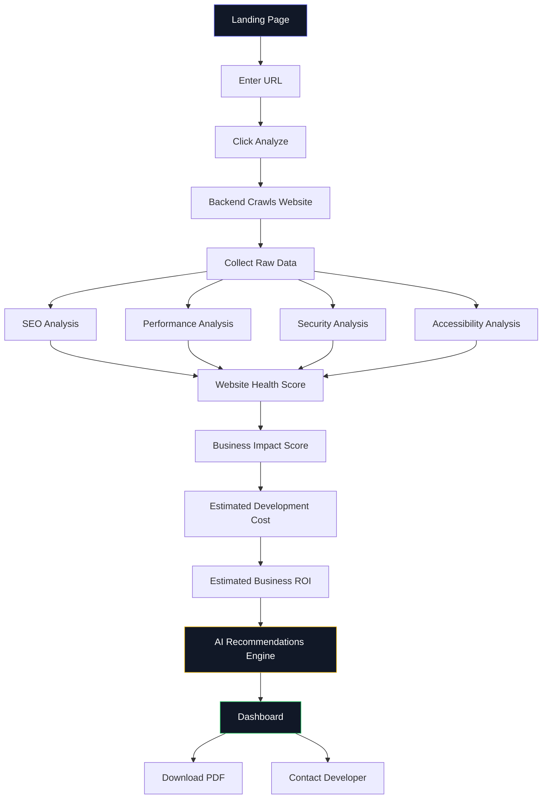

**Step-by-step narrative:**

1. **Landing Page** — value proposition, URL input, social proof, sample report link.
2. **Enter URL** — client-side validation (format, protocol).
3. **Analyze** — triggers `POST /analyze`, returns a `report_id` and redirects to a loading/progress screen.
4. **Crawl & Collect** — backend fetches HTML, headers, and runs Lighthouse/PageSpeed.
5. **Four parallel analyses** — SEO, Performance, Security, Accessibility run concurrently against the collected data.
6. **Scoring** — raw findings are converted into a 0–100 Website Health Score (overall + per-category).
7. **Business Impact Score** — each finding is mapped to a business-impact weight.
8. **Cost & ROI Estimation** — every issue gets an effort estimate and expected benefit.
9. **AI Recommendations** — LLM call converts structured findings into business-friendly narrative + prioritized action list.
10. **Dashboard** — full interactive report.
11. **PDF Export / Contact Developer** — terminal actions.

---

## 9. Core Features

### 9.1 Website URL Input

| Requirement | Detail |
|---|---|
| Format validation | Must be a syntactically valid URL (regex + `urllib.parse`) |
| Protocol handling | Auto-prepend `https://` if missing; allow `http://` fallback |
| Reachability check | `HEAD` request with 5s timeout before full crawl begins |
| HTTPS detection | Flag if site is not served over HTTPS |
| Disallowed targets | Block localhost, private IP ranges, link-local addresses (SSRF protection — see [Security](#17-security)) |

> [!TIP]
> Perform the reachability + SSRF check **before** enqueuing any expensive job (Lighthouse, Playwright). Fail fast and cheap.

---

### 9.2 Website Overview

Basic metadata surfaced at the top of every report:

| Field | Source |
|---|---|
| Website Title | `<title>` tag |
| Meta Description | `<meta name="description">` |
| Status Code | HTTP response code |
| HTTPS | TLS certificate presence + validity |
| Favicon | `<link rel="icon">` or `/favicon.ico` fallback |
| Server Information | `Server` and `X-Powered-By` response headers (best-effort, often absent) |

---

### 9.3 Website Health Score

A single 0–100 composite score plus five category sub-scores:

| Category | Weight in Overall Score |
|---|---|
| SEO | 25% |
| Performance | 30% |
| Security | 20% |
| Accessibility | 15% |
| Best Practices | 10% |

**Scoring methodology:**

- Each category starts at 100 points.
- Every failed check deducts points based on a pre-defined **severity weight** (Critical = -20, High = -12, Medium = -6, Low = -2), floored at 0.
- Category score = `max(0, 100 - sum(deductions))`.
- Overall score = weighted average of category scores (table above).

> [!NOTE]
> Scoring weights must live in a single config file (`scoring_config.json`) — not hardcoded — so they can be tuned post-launch without a redeploy of analysis logic.

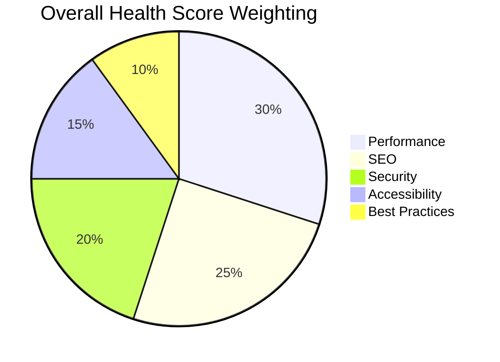

---

### 9.4 SEO Analysis

| Check | What It Verifies |
|---|---|
| Title Tag | Present, unique, 10–60 characters |
| Meta Description | Present, unique, 50–160 characters |
| Canonical Tag | Present and self-referencing or correctly pointed |
| Robots Meta / robots.txt | Not accidentally blocking indexing |
| Sitemap.xml | Present and reachable at `/sitemap.xml` |
| Open Graph Tags | `og:title`, `og:description`, `og:image` present |
| Twitter Card Tags | `twitter:card`, `twitter:title` present |
| Schema.org Markup | Valid JSON-LD structured data detected |
| Heading Structure | Single `<h1>`, logical `<h2>`–`<h6>` nesting |
| Image ALT Tags | Percentage of `` tags with non-empty `alt` |
| Broken Links | Internal links returning 4xx/5xx |
| Duplicate Metadata | Title/description duplicated across crawled pages |
| Missing Metadata | Any of the above entirely absent |

**Every check returns:**
```json
{
  "check": "meta_description",
  "status": "fail",
  "found": null,
  "expected": "50-160 character meta description",
  "explanation": "A meta description is the snippet shown under your title in Google search results. Without one, Google writes its own — usually a random sentence from your page — which reduces click-through rate.",
  "severity": "high",
  "confidence": 100
}
```

> [!NOTE]
> Every issue in the report must include a **Confidence Score** (0–100). Deterministic checks (e.g., missing meta description, broken link) score near 100%. Heuristic checks (e.g., potential accessibility issues) score lower. See [§24 Confidence Score](#24-confidence-score).

---

### 9.5 Performance Analysis

Integrates with **Google Lighthouse** (via Playwright-driven local run) and **Google PageSpeed Insights API** (field + lab data).

| Metric | Definition | Good | Needs Improvement | Poor |
|---|---|---|---|---|
| FCP (First Contentful Paint) | Time to first visible content | ≤ 1.8s | 1.8–3s | > 3s |
| LCP (Largest Contentful Paint) | Time to largest visible element | ≤ 2.5s | 2.5–4s | > 4s |
| CLS (Cumulative Layout Shift) | Visual stability score | ≤ 0.1 | 0.1–0.25 | > 0.25 |
| TTFB (Time to First Byte) | Server response latency | ≤ 0.8s | 0.8–1.8s | > 1.8s |
| Speed Index | How quickly content is visually populated | ≤ 3.4s | 3.4–5.8s | > 5.8s |
| Total Blocking Time | Main-thread blocking time | ≤ 200ms | 200–600ms | > 600ms |
| Performance Score | Lighthouse composite 0–100 | ≥ 90 | 50–89 | < 50 |

> [!NOTE]
> Each metric ships with a one-paragraph plain-English explanation template so the AI layer doesn't have to invent definitions — it only needs to contextualize the *number* to this *specific site*.

---

### 9.6 Security Analysis

| Check | Detail |
|---|---|
| HTTPS | Site is served over TLS |
| SSL Certificate | Valid, not expired, correct domain match |
| Mixed Content | HTTPS page loading HTTP sub-resources |
| Redirect Chain | HTTP → HTTPS redirect present and single-hop |
| Security Headers | `Strict-Transport-Security`, `X-Content-Type-Options`, `Referrer-Policy` |
| Content-Security-Policy | Presence and basic validity |
| X-Frame-Options | Present (clickjacking protection) |
| Strict-Transport-Security | Present with reasonable `max-age` |

---

### 9.7 Accessibility Analysis

| Check | Standard Reference |
|---|---|
| Heading Hierarchy | WCAG 1.3.1 |
| Color Contrast | WCAG 1.4.3 (AA, 4.5:1 minimum for body text) |
| Form Labels | WCAG 1.3.1 / 4.1.2 |
| Image ALT Text | WCAG 1.1.1 |
| ARIA Attributes | Valid roles/attributes, no conflicting ARIA |
| Keyboard Navigation | Focus order, no keyboard traps (best-effort static check) |

---

### 9.8 AI Recommendations

For every detected issue, the AI layer generates a structured recommendation object:

```json
{
  "issue": "Missing Meta Description",
  "business_explanation": "Search engines are writing their own snippet for your page, which usually looks less compelling than a crafted one — this can lower how many people click through from Google.",
  "technical_explanation": "No <meta name='description'> tag was found in the <head> of the page.",
  "recommended_fix": "Add a unique, 50-160 character meta description summarizing the page's value proposition.",
  "estimated_effort": "Easy (5 minutes)",
  "priority": "High",
  "expected_improvement": "Improved click-through rate from search results",
  "confidence": 100
}
```

> [!WARNING]
> The AI must never invent metrics it cannot back up (e.g., "+34% traffic guaranteed"). All benefit language must be qualitative or ranged, framed as *potential*, never promised. See [Estimated Business ROI](#911-estimated-business-roi).

---

### 9.9 Priority Matrix

Every issue is bucketed into exactly one priority tier, computed from `severity × business_impact_weight`:

| Priority | Criteria | Visual Treatment |
|---|---|---|
| 🔴 Critical | Blocks core functionality or major SEO/security risk | Red badge, pinned to top |
| 🟠 High | Significant business impact, low-to-medium effort | Orange badge |
| 🟡 Medium | Moderate impact or higher effort | Yellow badge |
| 🟢 Low | Minor polish, nice-to-have | Green badge |

---

### 9.10 Business Impact Score

This is a **major feature** — the core translation layer of the product. Every single issue in the report must include the following fields:

| Field | Example |
|---|---|
| Issue | Missing Meta Description |
| Business Impact | Lower CTR from Search |
| Expected Outcome | Improved search snippet quality → potential CTR improvement |
| Difficulty | Easy |
| Estimated Time | 5 minutes |
| Priority | High |
| Confidence Score | 100% |

**Rendered example (table row in the report UI):**

| Issue | Business Impact | Expected Outcome | Difficulty | Est. Time | Priority | Confidence |
|---|---|---|---|---|---|---|
| Missing Meta Description | Lower CTR from Search | Improved snippet quality in search results | Easy | 5 min | 🟠 High | 100% |
| LCP > 4s on mobile | Higher bounce rate on mobile visitors | Faster perceived load, potential drop in bounce rate | Medium | 3–5 hrs | 🔴 Critical | 100% |
| No HTTPS redirect | Security warning shown to visitors, SEO penalty | Improved trust signal and rankings | Easy | 15 min | 🔴 Critical | 100% |
| Potential Accessibility Issue | Risk of excluding users / WCAG gap | Clearer accessibility compliance path | Medium | 2–4 hrs | 🟡 Medium | 74% |

---

### 9.11 Estimated Business ROI

For every issue, the AI generates a **potential business benefit** statement. Approved benefit categories (do not fabricate outside this list without qualitative hedging):

- Faster website
- Better user experience
- Potential SEO improvements
- Improved crawlability
- Reduced bounce rate

> [!WARNING]
> **Never state guaranteed outcomes or specific percentage lifts as fact.** Use hedged, directional language: *"can help reduce,"* *"is likely to improve,"* *"may contribute to."* This is a legal/trust requirement, not a style preference.

**Executive Summary generation:** the AI produces a 3–5 sentence summary at the top of the report, e.g.:

> *"yoursite.com scores 62/100 overall. The biggest opportunity is Performance (48/100) — slow mobile load times are likely costing you visitors before they see your content. Fixing the top 3 Critical issues is estimated at 4–7 hours of developer time and could meaningfully improve both user experience and search visibility."*

---

### 9.12 Estimated Development Cost

Every issue is tagged with a difficulty tier and a time range:

| Difficulty | Time Range | Typical Examples |
|---|---|---|
| Easy | 5 min – 1 hr | Meta tags, alt text, header tweaks |
| Medium | 1 hr – 1 day | Image optimization, CLS fixes, CSP setup |
| Hard | 1 day+ | Render-blocking JS refactor, framework migration |

The report calculates:

```
Total Estimated Implementation Effort = Σ (estimated_time per issue)
```

Displayed as a range, e.g., **"14–22 hours (Medium Complexity)"**, with a breakdown by category shown as a stacked bar chart.

---

### 9.13 PDF Report

| Requirement | Detail |
|---|---|
| Engine | ReportLab (server-side, Python) |
| Branding | Company logo placeholder (uploadable in future; static placeholder for MVP) |
| Sections | Executive Summary, Health Score, Category Breakdowns, Issues Table, Charts, Recommendations, Contact CTA |
| Charts | Score gauges + priority breakdown bar chart, rendered server-side as images and embedded |
| Format | A4, print-optimized, max 8–12 pages |

---

### 9.14 Contact Developer

Static CTA block rendered at the end of every report and PDF:

> **Need help implementing these recommendations?**
> [Book a Consultation] · [View Portfolio] · [Email Us]

| Field | Source |
|---|---|
| Booking Link | Config value (e.g., Calendly URL) |
| Portfolio Link | Config value |
| Contact Email | Config value |

---

## 10. Functional Requirements

### 10.1 Frontend

- URL input form with client-side validation
- Real-time analysis progress screen (polling or WebSocket-based status updates)
- Dashboard with tabbed sections: Overview / SEO / Performance / Security / Accessibility / Recommendations
- Score gauges (radial charts) per category
- Sortable/filterable issues table (by priority, category, difficulty)
- PDF download trigger
- Shareable report URL (`/report/{id}`)
- Responsive layout (mobile-first)
- Dark theme by default

### 10.2 Backend

- Accept analysis requests, validate and sanitize input URL
- Orchestrate crawl + audit pipeline (async job queue)
- Persist raw findings and generated report to database
- Expose REST API for frontend consumption
- Rate limit incoming requests per IP
- Cache repeated analyses for a configurable TTL (default: 24h)

### 10.3 API

- RESTful, JSON over HTTPS
- Stateless authentication-free access for MVP (rate-limited by IP)
- Consistent error envelope across all endpoints
- Versioned under `/api/v1/`

### 10.4 AI

- Structured-input, structured-output LLM calls (JSON mode)
- Prompt templates stored and versioned separately from application code
- Fallback to rule-based templated explanations if the AI provider call fails or times out
- No hallucinated metrics — AI only reasons over data explicitly passed to it

### 10.5 PDF

- Generate PDF from the same structured report JSON used by the dashboard (single source of truth — no separate PDF-specific data model)
- Async generation with polling endpoint for large reports
- Store generated PDF in object storage with a signed, expiring download URL

---

## 11. Non-Functional Requirements

| Category | Requirement |
|---|---|
| **Performance** | Full analysis completes in ≤ 45s for a typical marketing site (p95) |
| **Security** | All external requests validated against SSRF blocklist; no arbitrary file access; secrets in env vars only |
| **Scalability** | Analysis jobs run on a horizontally scalable worker pool; stateless API layer |
| **Reliability** | 99% successful completion rate for reachable, standards-compliant websites; graceful degradation if Lighthouse/AI provider is unavailable |
| **Maintainability** | Scoring weights and AI prompts externalized from code; typed schemas (Pydantic) shared across services |
| **Accessibility** | The product's own UI must meet WCAG 2.1 AA — we shouldn't ship an accessibility auditor with an inaccessible UI |

---

## 12. System Architecture

### 12.1 High-Level System Architecture

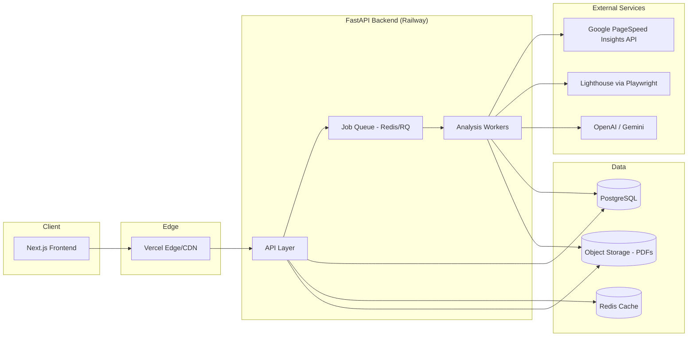

### 12.2 Component Diagram

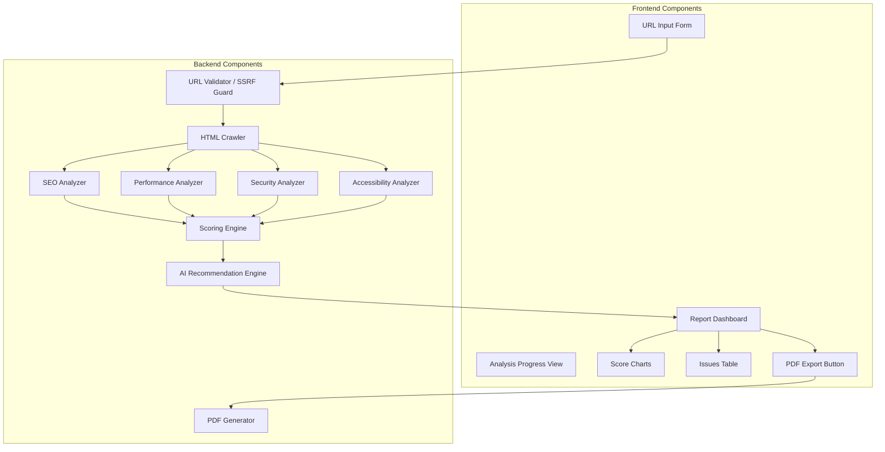

### 12.3 Sequence Diagram — Analysis Request

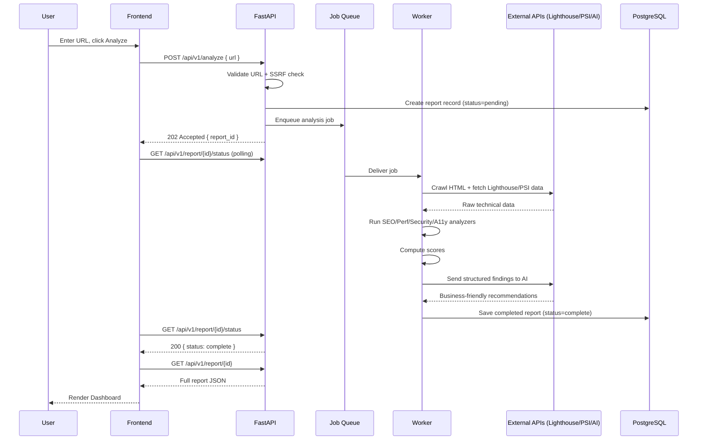

### 12.4 API Flow

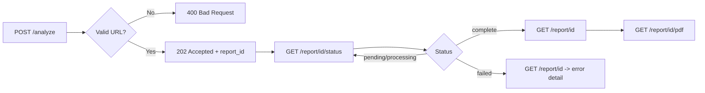

### 12.5 Deployment Diagram

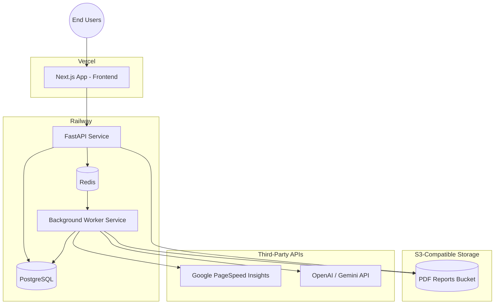

---

## 13. Tech Stack

### 13.1 Frontend

| Layer | Technology | Purpose |
|---|---|---|
| Framework | Next.js (App Router) | SSR/SSG, routing, API proxy |
| Styling | Tailwind CSS | Utility-first styling |
| Components | Shadcn/UI | Accessible, composable base components |
| Animation | Framer Motion | Progress transitions, micro-interactions |
| Charts | Recharts | Score gauges, priority breakdown charts |

### 13.2 Backend

| Layer | Technology | Purpose |
|---|---|---|
| Framework | FastAPI (Python) | REST API, async request handling |
| HTML Parsing | BeautifulSoup + LXML | DOM parsing, metadata extraction |
| HTTP Client | Requests / httpx | Fetching pages, headers, robots.txt, sitemap |
| Browser Automation | Playwright | Lighthouse execution, rendered DOM checks |
| Job Queue | Redis + RQ/Celery | Async analysis job processing |
| Database | PostgreSQL | Report + job persistence |

### 13.3 AI

| Provider | Role |
|---|---|
| OpenAI | Primary recommendation generation (JSON-mode structured output) |
| Gemini | Secondary/fallback provider for redundancy |

### 13.4 Performance Data

| Service | Role |
|---|---|
| Google PageSpeed Insights API | Field + lab performance data (Core Web Vitals) |
| Lighthouse (via Playwright) | Local audit run for SEO/Perf/A11y/Best Practices scoring |

### 13.5 PDF Generation

| Technology | Role |
|---|---|
| ReportLab | Server-side PDF composition (Python) |

### 13.6 Deployment

| Layer | Platform |
|---|---|
| Frontend | Vercel |
| Backend (API + Workers) | Railway |
| Database | Railway PostgreSQL (managed) |
| Cache/Queue | Railway Redis (managed) |

---

## 14. API Design

Base URL: `https://api.sitepilot.ai/api/v1`

### 14.1 `POST /analyze`

Triggers a new website analysis.

**Request**

```json
{
  "url": "https://example.com"
}
```

**Response — 202 Accepted**

```json
{
  "report_id": "rep_9f3ac21e",
  "status": "pending",
  "created_at": "2026-07-11T10:15:00Z"
}
```

**Response — 400 Bad Request**

```json
{
  "error": {
    "code": "INVALID_URL",
    "message": "The provided URL is not reachable or is not a valid public website."
  }
}
```

**Response — 429 Too Many Requests**

```json
{
  "error": {
    "code": "RATE_LIMITED",
    "message": "Too many analysis requests from this IP. Try again in 60 seconds.",
    "retry_after": 60
  }
}
```

---

### 14.2 `GET /report/{id}/status`

Polls the status of an in-progress analysis.

**Response — 200 OK**

```json
{
  "report_id": "rep_9f3ac21e",
  "status": "processing",
  "progress": 62,
  "current_step": "performance_analysis"
}
```

Possible `status` values: `pending`, `processing`, `complete`, `failed`.

---

### 14.3 `GET /report/{id}`

Fetches the full structured report.

**Response — 200 OK (truncated example)**

```json
{
  "report_id": "rep_9f3ac21e",
  "url": "https://example.com",
  "status": "complete",
  "overview": {
    "title": "Example Domain",
    "meta_description": null,
    "status_code": 200,
    "https": true,
    "favicon": "https://example.com/favicon.ico"
  },
  "scores": {
    "overall": 62,
    "seo": 55,
    "performance": 48,
    "security": 80,
    "accessibility": 70,
    "best_practices": 75
  },
  "executive_summary": "example.com scores 62/100 overall...",
  "issues": [
    {
      "id": "iss_001",
      "category": "seo",
      "issue": "Missing Meta Description",
      "business_impact": "Lower CTR from Search",
      "expected_outcome": "Improved snippet quality in search results",
      "difficulty": "Easy",
      "estimated_time": "5 minutes",
      "priority": "High",
      "confidence": 100,
      "technical_explanation": "No <meta name='description'> tag found in <head>.",
      "recommended_fix": "Add a unique 50-160 character meta description."
    },
    {
      "id": "iss_002",
      "category": "seo",
      "issue": "Broken Link",
      "business_impact": "Dead ends for visitors and crawlers",
      "expected_outcome": "Improved crawlability and user trust",
      "difficulty": "Easy",
      "estimated_time": "15–30 minutes",
      "priority": "High",
      "confidence": 100,
      "technical_explanation": "Internal link returned HTTP 404.",
      "recommended_fix": "Update or remove the broken link target."
    },
    {
      "id": "iss_003",
      "category": "accessibility",
      "issue": "Potential Accessibility Issue",
      "business_impact": "Risk of excluding users / WCAG gap",
      "expected_outcome": "Clearer accessibility compliance path",
      "difficulty": "Medium",
      "estimated_time": "2–4 hours",
      "priority": "Medium",
      "confidence": 74,
      "technical_explanation": "Heuristic contrast analysis flagged possible AA failure on secondary text.",
      "recommended_fix": "Verify contrast ratios manually and adjust theme tokens if needed."
    }
  ],
  "estimated_total_effort": "14-22 hours",
  "pdf_url": null
}
```

**Response — 404 Not Found**

```json
{
  "error": {
    "code": "REPORT_NOT_FOUND",
    "message": "No report exists with the given ID."
  }
}
```

---

### 14.4 `GET /report/{id}/pdf`

Triggers or fetches the PDF for a completed report.

**Response — 200 OK**

```json
{
  "report_id": "rep_9f3ac21e",
  "pdf_url": "https://storage.sitepilot.ai/reports/rep_9f3ac21e.pdf",
  "expires_at": "2026-07-12T10:15:00Z"
}
```

---

### 14.5 `GET /health`

Service liveness/readiness check.

**Response — 200 OK**

```json
{
  "status": "ok",
  "version": "1.0.0",
  "uptime_seconds": 183921
}
```

---

### 14.6 Standard Error Envelope

All non-2xx responses conform to:

```json
{
  "error": {
    "code": "STRING_ERROR_CODE",
    "message": "Human-readable explanation",
    "retry_after": 60
  }
}
```

| HTTP Status | Code | Meaning |
|---|---|---|
| 400 | `INVALID_URL` | URL failed validation or reachability check |
| 404 | `REPORT_NOT_FOUND` | Report ID does not exist |
| 409 | `ANALYSIS_IN_PROGRESS` | Duplicate analysis request for same URL within TTL |
| 422 | `VALIDATION_ERROR` | Malformed request body |
| 429 | `RATE_LIMITED` | Too many requests |
| 500 | `INTERNAL_ERROR` | Unhandled server error |
| 503 | `UPSTREAM_UNAVAILABLE` | Lighthouse/PSI/AI provider unreachable |

---

## 15. Data Flow

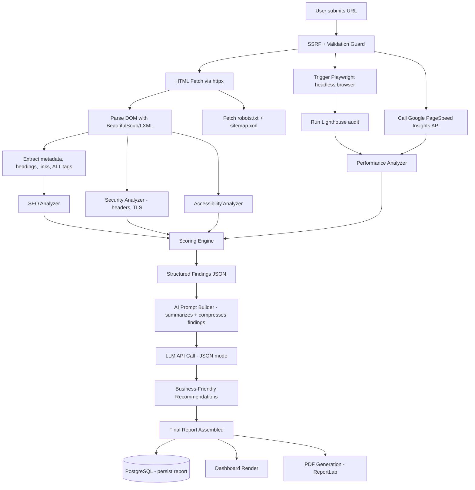

**Narrative breakdown:**

1. **Collection** — the backend fetches the raw HTML via `httpx`, plus `robots.txt` and `sitemap.xml`, and separately spins up a headless Playwright browser to run a full Lighthouse audit (captures rendered-DOM behavior that a static fetch cannot).
2. **Parsing** — `BeautifulSoup` + `LXML` parse the static HTML into a DOM tree for metadata, heading structure, link, and ALT-tag extraction.
3. **Fetching Lighthouse Data** — Playwright drives a headless Chromium instance; Lighthouse runs against it and returns Core Web Vitals + category scores. Google PageSpeed Insights API is called in parallel for field-data corroboration.
4. **Analysis** — four analyzer modules (SEO, Performance, Security, Accessibility) each consume the parsed/collected data and emit a list of typed `Finding` objects.
5. **Scoring** — the Scoring Engine reduces findings into category scores and an overall score per the weighting in [§9.3](#93-website-health-score).
6. **AI Summarization** — findings are compressed into a compact structured payload (not raw HTML) and sent to the LLM with a strict JSON-mode prompt, requesting business explanation, recommended fix, effort, and priority for each finding.
7. **Assembly** — the final report JSON (scores + findings + AI recommendations + executive summary) is persisted to PostgreSQL as the single source of truth.
8. **Delivery** — the same JSON powers both the interactive Dashboard and the ReportLab-generated PDF — no divergent data models.

> [!TIP]
> Never send raw HTML to the LLM. Always pre-compress findings into a small structured JSON payload. This keeps token costs predictable and prevents the model from being distracted by irrelevant markup.

---

## 16. Folder Structure

The repository is an enterprise monorepo (`sitepilot-ai/`) managed with Turborepo and pnpm workspaces.

```text
sitepilot-ai/
├── apps/
│   ├── web/                          # Next.js frontend (Feature-Sliced Design)
│   └── api/                          # FastAPI backend
│
├── packages/
│   ├── ui/                           # Design system / UI primitives
│   ├── config/                       # Shared tooling & runtime config
│   ├── types/                        # Shared TypeScript / schema types
│   └── utils/                        # Shared utilities
│
├── docs/                             # Product, architecture, and process docs
│
├── infrastructure/                   # Docker, Nginx, Terraform definitions
│
├── scripts/                          # Developer and CI helper scripts
│
├── assets/                           # Brand logos, icons, images, mockups
│
├── .github/                          # CI and release pipelines
│
├── turbo.json
├── package.json
├── pnpm-workspace.yaml
├── docker-compose.yml
├── .env.example
└── README.md
```

### 16.1 `apps/web` — Feature-Sliced Design

The frontend follows **Feature-Sliced Design (FSD)**. Imports flow downward only: `app → widgets → features → entities → shared`.

```text
apps/web/
├── app/                              # Next.js App Router — routes & composition only
│   ├── page.tsx                      # Landing
│   ├── audit/
│   ├── report/
│   ├── dashboard/
│   ├── pricing/
│   ├── about/
│   ├── contact/
│   ├── privacy/
│   ├── terms/
│   └── docs/
│
├── features/                         # User-facing product capabilities
│   ├── landing/
│   ├── audit/
│   ├── report/
│   ├── dashboard/
│   ├── contact/
│   ├── health-score/
│   ├── business-impact/
│   └── recommendations/
│
├── entities/                         # Core business domain models
│   ├── website/
│   ├── audit/
│   └── report/
│
├── widgets/                          # Composite UI blocks
│   ├── hero/
│   ├── navbar/
│   ├── footer/
│   ├── audit-dashboard/
│   ├── report-view/
│   └── charts/
│
├── shared/                           # Cross-cutting primitives
│   ├── ui/
│   ├── hooks/
│   ├── services/
│   ├── lib/
│   ├── config/
│   ├── constants/
│   ├── providers/
│   ├── utils/
│   └── types/
│
├── styles/                           # globals.css, variables.css
├── public/                           # logos/, icons/, illustrations/
├── middleware/                       # Edge middleware concerns
└── README.md
```

| Layer | Responsibility |
|---|---|
| `app/` | Route segments and page composition shells. No business logic. |
| `features/` | Isolated product capabilities (audit flow, health score, recommendations). |
| `entities/` | Domain models and entity-level adapters (website, audit, report). |
| `widgets/` | Large reusable page sections composed from features and entities. |
| `shared/` | Hooks, services, config, types, utils, providers, UI primitives. |
| `styles/` | Global CSS and design tokens. |
| `public/` | Static assets served as-is. |
| `middleware/` | Auth, redirects, headers, and other edge concerns. |

### 16.2 `apps/api` — Backend Layout

```text
apps/api/
├── app/
│   ├── main.py
│   ├── api/v1/
│   │   ├── analyze.py
│   │   ├── report.py
│   │   └── health.py
│   ├── core/
│   │   ├── config.py
│   │   ├── security.py               # SSRF guard, rate limiting
│   │   └── scoring_config.json
│   ├── engines/                      # Independent analysis engines (see §22)
│   │   ├── crawler/
│   │   ├── seo/
│   │   ├── performance/
│   │   ├── security/
│   │   ├── accessibility/
│   │   ├── health_score/
│   │   ├── business_impact/
│   │   ├── roi/
│   │   ├── recommendations/
│   │   ├── report/
│   │   └── pdf/
│   ├── models/
│   ├── db/
│   ├── workers/
│   └── schemas/
├── tests/
└── requirements.txt
```

> [!NOTE]
> Backend engines under `apps/api/app/engines/` map 1:1 to the [System Engines](#22-system-engines) defined in this PRD. Each engine must remain independently testable with clearly defined inputs and outputs.

---

## 17. Security

| Control | Implementation |
|---|---|
| **SSRF Prevention** | Resolve hostname before request; block private/reserved IP ranges (`10.0.0.0/8`, `172.16.0.0/12`, `192.168.0.0/16`, `127.0.0.0/8`, `169.254.0.0/16`, IPv6 equivalents); block `localhost`, `.local`, cloud metadata endpoints (`169.254.169.254`) |
| **URL Validation** | Enforce `http(s)://` scheme only; reject `file://`, `ftp://`, `data:` schemes |
| **Rate Limiting** | Per-IP sliding window limit (e.g., 5 analyses / 10 minutes) at the API gateway layer |
| **Caching** | Identical URL analyzed within 24h returns cached report instead of re-crawling (protects both target sites and our infra cost) |
| **Timeout Handling** | Hard timeout on crawl (10s), Lighthouse run (30s), and AI call (20s); job fails gracefully past these bounds |
| **Error Handling** | No stack traces or internal paths ever returned in API responses; all errors mapped to the standard error envelope |
| **Input Validation** | Pydantic schemas validate every request body; reject anything with unexpected fields (`extra="forbid"`) |
| **Secrets Management** | All API keys (OpenAI, PSI) stored in environment variables / platform secret manager, never in source |
| **Outbound Request Limits** | Max response size cap (e.g., 10MB) when fetching target site HTML to prevent resource exhaustion |

> [!WARNING]
> SSRF protection is not optional and not a "nice to have." This product's entire function is fetching arbitrary user-supplied URLs server-side — this is a textbook SSRF attack surface. The validation guard in `core/security.py` must run on **every** outbound request the worker makes, not just the initial crawl.

---

## 18. UI/UX

**Design language:** Modern SaaS, dark theme by default, generous whitespace, data-forward.

| Principle | Application |
|---|---|
| **Dark Theme** | Default `bg-zinc-950` base, high-contrast text, accent color for scores/priority |
| **Responsive** | Mobile-first; dashboard collapses to stacked cards below `768px` |
| **Animations** | Framer Motion for progress step transitions, score gauge fill animation, card entrance stagger |
| **Charts** | Radial gauges per category score; horizontal bar chart for priority breakdown; stacked bar for effort-by-category |
| **Progress Indicators** | Multi-step progress bar during analysis (Crawling → SEO → Performance → Security → Accessibility → AI Recommendations → Done) |
| **Professional Dashboard** | Tabbed navigation (Overview / SEO / Performance / Security / Accessibility / Recommendations), sticky summary header with overall score |

**Key screens:**

1. **Landing Page** — hero, URL input, "Analyze My Website" CTA, example report link, trust logos.
2. **Analyzing Screen** — animated multi-step progress, estimated time remaining, light copy explaining what's happening ("Checking Core Web Vitals...").
3. **Report Dashboard** — sticky header with overall score gauge, tabbed detail sections, filterable/sortable issues table, floating "Download PDF" and "Contact Developer" CTAs.
4. **PDF** — print-safe, branded, condensed version of the dashboard.

> [!TIP]
> Use skeleton loaders — not spinners — on the Dashboard while report sections stream in. It reinforces the "AI is actively working" feel and reduces perceived wait time.

---

## 19. Success Metrics

### 19.1 Technical KPIs

| Metric | Target |
|---|---|
| Analysis success rate | ≥ 99% for valid, reachable URLs |
| P95 analysis completion time | ≤ 45 seconds |
| API uptime | ≥ 99.5% monthly |
| AI recommendation generation failure rate | ≤ 1% (with graceful fallback) |
| PDF generation success rate | ≥ 99% |

### 19.2 Business KPIs

| Metric | Target (Post-Launch, 90 days) |
|---|---|
| Unique websites analyzed | 5,000+ |
| Report → PDF download conversion rate | ≥ 15% |
| Report → "Contact Developer" click-through rate | ≥ 5% |
| Returning users (re-analyzing same or new site) | ≥ 10% |
| Average session time on Dashboard | ≥ 2 minutes |

---

## 20. Roadmap

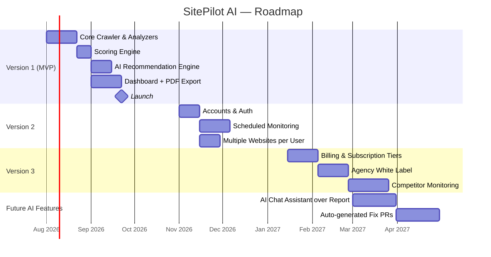

| Version | Theme | Key Deliverables |
|---|---|---|
| **V1 (MVP)** | Prove the core loop | URL → Crawl → Analyze → Score → AI Recommendations → Dashboard → PDF |
| **V2** | Retention infrastructure | Accounts, scheduled re-scans, multi-site tracking |
| **V3** | Monetization | Billing, tiered plans, agency white-label |
| **Future AI** | Assistant layer | Conversational report Q&A, auto-generated code fixes/PRs |

---

## 21. Monetization

> [!NOTE]
> Monetization is explicitly **out of scope for MVP build** (see [Non-Goals](#7-non-goals-out-of-scope-for-mvp)) but is documented here for roadmap alignment and future billing schema design.

| Plan | Price (Indicative) | Includes |
|---|---|---|
| **Free** | $0 | 3 analyses/month, dashboard access, watermarked PDF |
| **Pro** | $19/mo | Unlimited analyses, full PDF export, no watermark, priority AI processing |
| **Agency** | $79/mo | White-label PDF, multiple client sites, scheduled re-scans, client-shareable dashboards |
| **Enterprise** | Custom | SSO, dedicated support, custom scoring weights, API access, SLA |

---

## 22. System Engines

SitePilot AI is composed of **independent engines**. Each engine owns a single responsibility, exposes a typed input/output contract, and can be developed, tested, and scaled without coupling to sibling engines. The API worker orchestrates engines in a pipeline; engines do not call each other directly except through the orchestrator and shared typed payloads.

| Engine | Responsibility |
|---|---|
| **Crawler Engine** | Fetches HTML, headers, `robots.txt`, and `sitemap.xml`; performs SSRF-safe outbound requests; emits a normalized crawl artifact for downstream engines |
| **SEO Intelligence Engine** | Evaluates title, meta, canonical, headings, structured data, Open Graph, broken links, and related SEO checks; emits typed SEO findings |
| **Performance Engine** | Runs Lighthouse / PageSpeed Insights collection; normalizes Core Web Vitals and performance scores into typed findings |
| **Security Engine** | Checks HTTPS/TLS, redirect chains, mixed content, and security headers; emits security findings with severity |
| **Accessibility Engine** | Evaluates WCAG-oriented checks (headings, contrast, labels, ALT, ARIA); emits accessibility findings with confidence |
| **Health Score Engine** | Aggregates category findings into 0–100 category scores and a weighted overall Website Health Score |
| **Business Impact Engine** | Maps each technical finding to business impact, expected outcome, difficulty, and priority framing |
| **ROI Engine** | Estimates directional business benefit and contributes to executive ROI language (hedged, never guaranteed) |
| **AI Recommendation Engine** | Converts structured findings into plain-language explanations and actionable recommended fixes via LLM JSON mode (with rule-based fallback) |
| **Report Engine** | Assembles the single source-of-truth report JSON (scores, issues, summary, confidence) for dashboard and export consumers |
| **PDF Engine** | Renders the assembled report JSON into a branded PDF via ReportLab and stores a signed download URL |

> [!TIP]
> Treat the **Business Impact Engine**, **ROI Engine**, and **AI Recommendation Engine** as the product differentiator. Raw audit engines (SEO, Performance, Security, Accessibility) are necessary but not sufficient for SitePilot AI's value proposition.

### 22.1 Engine Pipeline

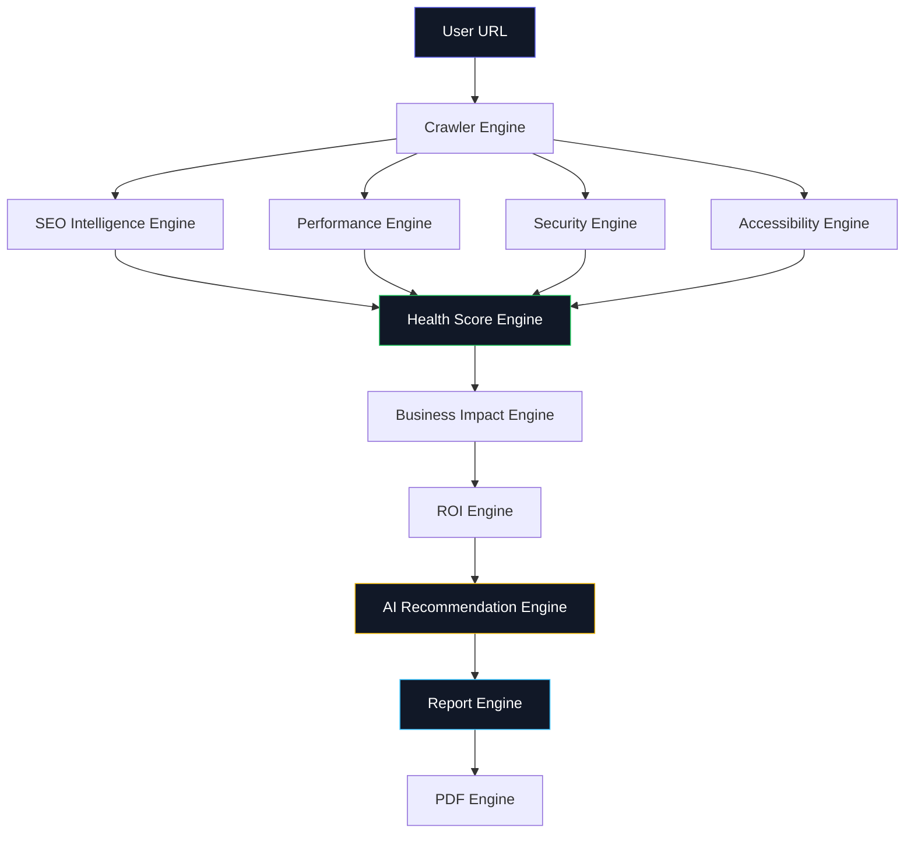

**Linear narrative (orchestration order):**

User URL → Crawler Engine → SEO Engine → Performance Engine → Security Engine → Accessibility Engine → Health Score Engine → Business Impact Engine → ROI Engine → AI Recommendation Engine → Report Engine → PDF Engine

SEO / Performance / Security / Accessibility may execute concurrently after the crawl artifact is ready; the Health Score Engine waits for all four before scoring.

### 22.2 Health Score Engine

#### Purpose

Produce a single, trustworthy **Website Health Score** (0–100) plus category sub-scores so a non-technical user can instantly understand overall site quality — without reading every finding first.

#### Inputs

| Input | Source |
|---|---|
| SEO findings | SEO Intelligence Engine |
| Performance findings | Performance Engine |
| Security findings | Security Engine |
| Accessibility findings | Accessibility Engine |
| Best-practices findings | Derived from Lighthouse / analyzer modules |
| Scoring configuration | `scoring_config.json` (weights + penalty table) |

#### Outputs

| Output | Description |
|---|---|
| `scores.overall` | Weighted 0–100 composite |
| `scores.seo` / `performance` / `security` / `accessibility` / `best_practices` | Category scores 0–100 |
| Score metadata | Config version, penalty totals per category |

#### Weighting System

| Category | Weight in Overall Score |
|---|---|
| SEO | 25% |
| Performance | 30% |
| Security | 20% |
| Accessibility | 15% |
| Best Practices | 10% |

#### Penalty System

Each category starts at **100**. Failed checks deduct points by severity:

| Severity | Penalty |
|---|---|
| Critical | −20 |
| High | −12 |
| Medium | −6 |
| Low | −2 |

Category score is floored at 0.

#### Score Calculation Formula

```
category_score = max(0, 100 - Σ penalty(finding))

overall_score =
    0.25 * seo
  + 0.30 * performance
  + 0.20 * security
  + 0.15 * accessibility
  + 0.10 * best_practices
```

Round `overall_score` to the nearest integer for display.

**Example:**

| Category | Penalties Applied | Category Score |
|---|---|---|
| SEO | High (−12) + Medium (−6) | 82 |
| Performance | Critical (−20) + High (−12) | 68 |
| Security | Medium (−6) | 94 |
| Accessibility | High (−12) + Low (−2) | 86 |
| Best Practices | Low (−2) | 98 |

```
overall = 0.25(82) + 0.30(68) + 0.20(94) + 0.15(86) + 0.10(98)
        = 20.5 + 20.4 + 18.8 + 12.9 + 9.8
        = 82.4 → 82
```

#### Configuration

- All weights and penalty values live in `scoring_config.json` (see §9.3).
- Config must be versioned so historical reports can explain which scoring rules produced them.
- Engineers must not hardcode weights inside analyzer modules.

#### Future Improvements

- Segment-aware weighting (e.g., e-commerce vs brochure sites).
- Confidence-weighted penalties (heuristic findings contribute less than deterministic ones).
- Trend scoring across scheduled re-scans (V2).
- Industry benchmark percentiles on the dashboard.

---

## 23. Business Impact Engine

### Purpose

Translate every technical finding into business language a founder, marketer, or agency client can act on. This engine answers: *What does this issue cost us in business terms, and what should we do first?*

### Input

| Input | Description |
|---|---|
| Typed findings | From SEO, Performance, Security, Accessibility engines (post Health Score enrichment) |
| Category + severity | From analyzer output |
| Confidence Score | From originating engine |
| Effort heuristics | Rule table mapping check IDs → difficulty / time ranges |

### Output

For each issue:

| Field | Description |
|---|---|
| Issue | Plain-language issue title |
| Business Impact | Business consequence label |
| Expected Outcome | Directional upside if fixed |
| Difficulty | Easy / Medium / Hard |
| Estimated Time | Time range |
| Priority | Critical / High / Medium / Low |
| Confidence Score | Pass-through from originating engine |

### Algorithm

1. Receive finding with `check_id`, `severity`, `category`, `confidence`.
2. Look up business mapping template for `check_id` (deterministic table first).
3. Compute priority from `severity × business_impact_weight` (see §9.9).
4. Attach difficulty / estimated time from effort heuristics.
5. Emit structured business-impact object; do **not** invent metrics outside approved ROI categories (see §9.11).
6. Hand off to ROI Engine and AI Recommendation Engine for narrative enrichment.

### Priority Assignment

| Priority | Criteria |
|---|---|
| 🔴 Critical | Blocks core functionality or major SEO/security risk |
| 🟠 High | Significant business impact, low-to-medium effort |
| 🟡 Medium | Moderate impact or higher effort |
| 🟢 Low | Minor polish, nice-to-have |

### Business Mapping

| Technical Finding | Business Impact | Expected Outcome |
|---|---|---|
| Missing Meta Description | Lower CTR from Search | Improved snippet quality in search results |
| LCP > 4s on mobile | Higher bounce rate on mobile visitors | Faster perceived load, potential drop in bounce rate |
| No HTTPS redirect | Trust / SEO penalty risk | Improved trust signal and rankings |
| Broken Link | Dead ends for visitors and crawlers | Improved crawlability and user trust |
| Potential Accessibility Issue | Risk of excluding users / WCAG gap | Clearer accessibility compliance path |

### Examples

**Missing Meta Description**

- What is wrong: No meta description tag on the page
- Why it matters: Search engines invent their own snippet
- Business impact: Lower CTR from Search
- Estimated effort: Easy (5 minutes)
- How to fix: Add a unique 50–160 character meta description
- Confidence: 100%

**LCP > 4s on mobile**

- What is wrong: Largest Contentful Paint exceeds the "poor" threshold on mobile
- Why it matters: Users abandon slow pages before content appears
- Business impact: Higher bounce rate on mobile visitors
- Estimated effort: Medium (3–5 hours)
- How to fix: Optimize hero media, reduce render-blocking resources, improve server TTFB
- Confidence: 100%

---

## 24. Confidence Score

Every issue in the report **must** include a **Confidence Score** (0–100, displayed as a percentage). Confidence tells the reader how certain SitePilot AI is that the finding is real and correctly classified.

### Why Confidence Exists

Not all checks are equal:

- **Deterministic issues** are binary facts derived from exact observations (tag missing, HTTP 404, header absent). Confidence is **100%** (or near 100%).
- **Heuristic issues** rely on approximation, sampling, or best-effort static analysis (e.g., potential contrast failures without full rendered context). Confidence is **lower** and must be surfaced so users do not over-trust soft signals.

### Examples

| Issue | Confidence | Rationale |
|---|---|---|
| Missing Meta Description | **100%** | Exact DOM absence of `<meta name="description">` |
| Broken Link | **100%** | Observed HTTP 4xx/5xx on a crawled internal link |
| Potential Accessibility Issue | **74%** | Heuristic contrast / ARIA analysis without full interactive audit |

### Rules

- Deterministic checks default to `confidence: 100`.
- Heuristic checks must publish a confidence below 100 and include language such as "potential" or "likely" in the issue title or explanation.
- AI Recommendation Engine **must not** inflate confidence. It may only explain findings; confidence is owned by the originating analyzer engine.
- Dashboard and PDF must display confidence alongside priority so agencies can triage review effort.

> [!WARNING]
> Never present a heuristic finding as a hard fact. If confidence is below 90, UI copy should make the uncertainty visible.

---

## 25. Engineering Principles

These principles govern how SitePilot AI is designed and implemented across engines, APIs, and UI.

### Business before Technology

Technical findings are an input, not the product. Every shipped issue must be understandable to a non-technical business owner.

### Every issue must explain

For every issue in the report, SitePilot AI must answer:

- **What is wrong**
- **Why it matters**
- **Business impact**
- **Estimated effort**
- **How to fix**

If any of these dimensions is missing, the issue is incomplete and must not ship in the report payload.

### AI explains. AI never invents.

- The AI layer explains and prioritizes using structured inputs it was given.
- The AI must not invent metrics, guarantee percentage lifts, or fabricate checks that analyzers did not emit.
- If the LLM call fails, fall back to rule-based templates — never to hallucinated data.

### Each engine should be independent

- Engines communicate through typed contracts and the orchestrator only.
- No engine may import another engine's private internals.
- Engines can be replaced or versioned independently (e.g., swap PSI provider without rewriting SEO).

### Every engine should be testable

- Unit tests with fixture crawl artifacts / findings.
- Contract tests for input/output schemas.
- Golden-file tests for scoring and business-mapping tables.

### Every engine should have clearly defined inputs and outputs

- Documented in code (Pydantic / shared types) and in this PRD.
- Versioned where scoring or mapping rules can change over time.
- Observable in worker logs (`engine`, `duration_ms`, `finding_count`, `status`).

---

## 26. Engineering Implementation Plan

Implementation proceeds in phased vertical slices. Each phase should leave the system in a demonstrable state and avoid coupling unfinished engines to production UX.

| Phase | Focus | Outcome |
|---|---|---|
| **Phase 1** | Repository Setup | Monorepo (`apps/`, `packages/`, Turborepo, pnpm, CI scaffolding) |
| **Phase 2** | Frontend Architecture | FSD structure under `apps/web` (routes, features, entities, widgets, shared) |
| **Phase 3** | Backend Architecture | FastAPI app shell, config, security guard, job queue, DB models |
| **Phase 4** | Crawler Engine | SSRF-safe fetch, HTML/headers/robots/sitemap artifacts |
| **Phase 5** | SEO Engine | Deterministic SEO checks + confidence |
| **Phase 6** | Performance Engine | Lighthouse / PSI integration + normalized metrics |
| **Phase 7** | Security Engine | TLS, redirects, headers, mixed content |
| **Phase 8** | Accessibility Engine | WCAG-oriented checks with heuristic confidence |
| **Phase 9** | Health Score Engine | Configurable weights, penalties, overall score |
| **Phase 10** | Business Impact Engine | Business mapping, priority, effort fields |
| **Phase 11** | AI Recommendation Engine | JSON-mode recommendations + rule-based fallback |
| **Phase 12** | Dashboard | Interactive report UI consuming report JSON |
| **Phase 13** | PDF Generation | ReportLab PDF Engine + signed download URLs |
| **Phase 14** | Deployment | Vercel + Railway (or equivalent) production wiring |

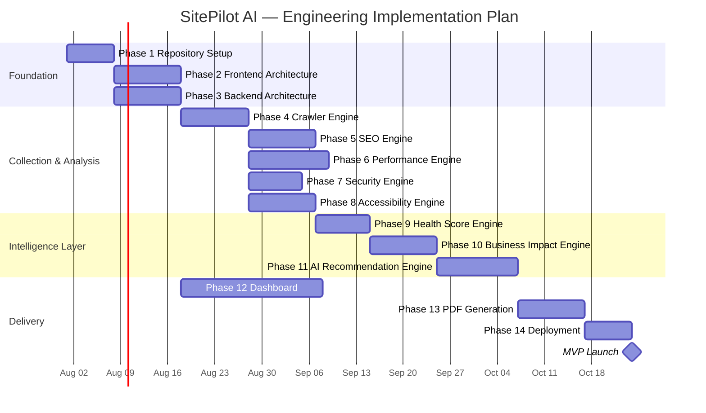

> [!NOTE]
> Phases 5–8 can proceed in parallel after Phase 4. Phase 12 (Dashboard) may begin against mock report JSON in parallel with engine work, but must not invent fields outside the report contract defined in §14.3.

---

## 27. Appendix


### 27.1 Glossary

| Term | Definition |
|---|---|
| **LCP** | Largest Contentful Paint — time until the largest visible element renders |
| **CLS** | Cumulative Layout Shift — measure of unexpected visual movement during load |
| **TTFB** | Time to First Byte — server response latency |
| **SSRF** | Server-Side Request Forgery — an attack where a server is tricked into making unintended requests |
| **JSON Mode** | LLM API mode that constrains output to valid, schema-conformant JSON |

### 27.2 Open Questions for Engineering Kickoff

- [ ] Confirm final LLM provider (OpenAI vs Gemini) as primary for V1 pricing/latency trade-off.
- [ ] Confirm object storage provider for PDF hosting (S3 vs Railway volume vs Cloudflare R2).
- [ ] Define exact cache TTL and invalidation strategy for repeated URL analyses.
- [ ] Decide whether crawler follows internal links (multi-page audit) or single-page only for V1 — **recommendation: single-page only for MVP** to keep analysis time predictable.

### 27.3 Change Log

| Version | Date | Change |
|---|---|---|
| 1.0.0 | 2026-07-11 | Initial PRD draft, ready for engineering kickoff |
| 1.1.0 | 2026-07-11 | Rebrand to SitePilot AI; monorepo/FSD structure; System Engines; Health Score & Business Impact engine specs; Confidence Score; Engineering Principles; Implementation Plan |

---

<p align="center">
  <sub>SitePilot AI — Internal Product Requirements Document — Confidential</sub>
</p>
