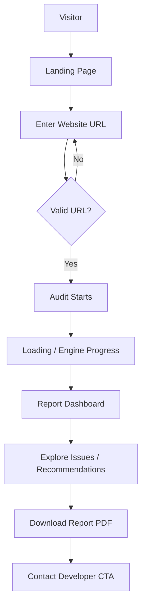
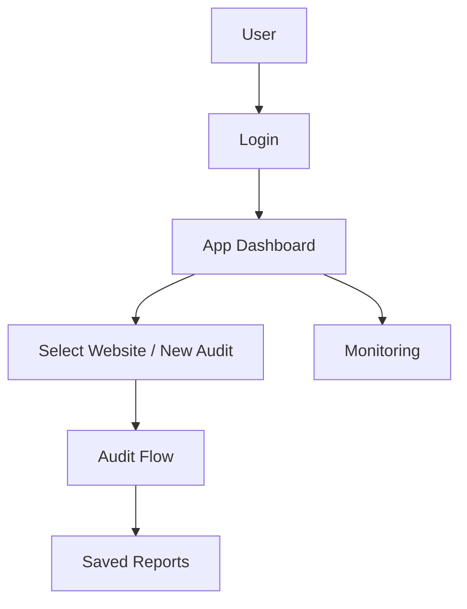
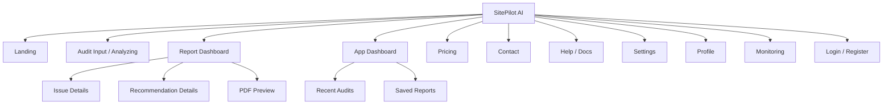
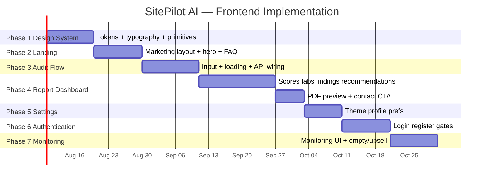

# SitePilot AI — UI / Screen Specification

**Your AI-powered Website Intelligence Platform.**

| | |
|---|---|
| **Document Type** | UI/UX Screen & Design System Specification |
| **Product** | SitePilot AI |
| **Document** | `UI_SCREEN_SPEC.md` |
| **Version** | 1.0.0 |
| **Status** | `Draft — Design Authority` |
| **Owner** | Product Design + Frontend Architecture |
| **Audience** | Product Designers, UI/UX, Frontend Engineers, PMs |
| **Last Updated** | 2026-07-12 |
| **Companion Docs** | [PRD.md](./PRD.md), [ARCHITECTURE.md](./ARCHITECTURE.md), [API_SPEC.md](./API_SPEC.md), [DOMAIN_MODEL.md](./DOMAIN_MODEL.md), [UI_GUIDELINES.md](./UI_GUIDELINES.md), apps/web FSD README |

> [!NOTE]
> This document is the **frontend blueprint authority**. Engineers should be able to implement screens from this spec without additional design clarification. Visual tokens may be refined in Figma, but **structure, hierarchy, states, and behavior** are defined here.

> [!WARNING]
> Do not invent UI that contradicts Domain language (Audit Run, Finding, Recommendation, Health Score, Confidence). Do not recompute scores in the client — render API Report truth.

---

## Table of Contents

1. [Product Design Philosophy](#1-product-design-philosophy)
2. [Design Principles](#2-design-principles)
3. [User Journeys](#3-user-journeys)
4. [Information Architecture](#4-information-architecture)
5. [Navigation](#5-navigation)
6. [Design System](#6-design-system)
7. [Component Library](#7-component-library)
8. [Screen Specifications](#8-screen-specifications)
9. [Responsive Design](#9-responsive-design)
10. [Micro Interactions](#10-micro-interactions)
11. [Animations](#11-animations)
12. [Accessibility](#12-accessibility)
13. [Empty States](#13-empty-states)
14. [Error States](#14-error-states)
15. [Loading States](#15-loading-states)
16. [Dashboard Layout](#16-dashboard-layout)
17. [Future Features](#17-future-features)
18. [Frontend Implementation Plan](#18-frontend-implementation-plan)
19. [Design Best Practices](#19-design-best-practices)

---

## 1. Product Design Philosophy

### 1.1 Product Feel

SitePilot AI must feel:

| Attribute | Manifestation |
|---|---|
| **Premium** | Restrained palette, precise typography, deliberate motion — not decorative clutter |
| **Fast** | Optimistic UI, skeletons, instant local validation, progressive report reveal |
| **Modern** | App-like density where useful; editorial calm on marketing |
| **Minimal** | One job per section; no competing CTAs in the first viewport |
| **Intelligent** | Confidence, priority, and business framing visible — AI as explainer, not spectacle |
| **Professional** | Agency-ready reports; print/PDF parity with dashboard truth |

### 1.2 Design Inspiration (Why)

| Reference | Borrow | Do not copy blindly |
|---|---|---|
| **Linear** | Keyboard-first density, issue lists, priority clarity | Issue-tracker chrome on marketing |
| **Vercel** | Product clarity, deploy-status calm, monospace accents sparingly | Dashboard-as-landing |
| **Notion** | Progressive disclosure, soft empty states | Endless nested pages in audit flow |
| **GitHub** | Diff/evidence patterns, status badges | Developer-only jargon in primary copy |
| **Raycast** | Command velocity, focused input | Overuse of command palette on day one |
| **Arc Browser** | Spatial hierarchy, tasteful motion | Novelty UI that hurts scanability |

### 1.3 Brand Presence Rule (Marketing)

On landing/promotional surfaces:

- Brand name is a **hero-level signal**, not nav-only
- First viewport: brand, one headline, one supporting sentence, one CTA group, one dominant visual plane
- No stats strips, schedule cards, or promo chips in the hero
- No floating badges over hero media
- Default: **no cards in the hero**

---

## 2. Design Principles

| Principle | Application |
|---|---|
| **Visual Hierarchy** | Score → Priority → Issue title → Business impact → Effort |
| **Whitespace** | Prefer breathing room over borders; section rhythm 64–120px marketing, 24–40px app |
| **Accessibility** | WCAG 2.2 AA; never ship an a11y auditor with an inaccessible UI |
| **Consistency** | Shared tokens + components; same Finding row everywhere |
| **Minimalism** | Remove chrome that doesn’t aid a decision |
| **Actionable UI** | Every Finding leads to “what / why / impact / effort / how” |
| **Progressive Disclosure** | Summary first; details in drawers/routes |
| **Feedback** | Immediate validation, toast on async success/fail, live engine steps |
| **Responsive Design** | Mobile-first CSS; desktop enrichment |
| **Dark-first Design** | Product default dark; marketing may use atmospheric dark gradient + light sections carefully |

> [!TIP]
> Prefer **skeleton loaders** over spinners for report surfaces — reinforces “intelligence is assembling,” reduces perceived wait.

---

## 3. User Journeys

### 3.1 Primary Journey — First Audit



### 3.2 Returning User Journey



### 3.3 Journey Narrative

1. **Landing** — understand value; brand-forward hero; single primary CTA  
2. **URL input** — validate client-side; show examples  
3. **Start audit** — `POST /audits` → navigate to loading with `audit_id`  
4. **Loading** — poll status; show engine steps  
5. **Report** — executive summary + scores + issues  
6. **PDF** — entitlement-aware download  
7. **Contact** — agency/freelancer conversion  

---

## 4. Information Architecture

### 4.1 Site Map



| Area | Routes (App Router) | Auth |
|---|---|---|
| Landing | `/` | Public |
| Audit | `/audit`, `/audit/[id]` (loading) | Public (rate-limited) |
| Report | `/report/[id]` | Public by id / auth later |
| Dashboard | `/dashboard` | Auth (V2; scaffold now) |
| Pricing | `/pricing` | Public |
| Contact | `/contact` | Public |
| Settings | `/settings` | Auth |
| Profile | `/profile` | Auth |
| Monitoring | `/monitoring` | Auth + entitlement |
| Help | `/docs` | Public |
| Legal | `/privacy`, `/terms` | Public |
| About | `/about` | Public |

---

## 5. Navigation

### 5.1 Desktop Navigation (Marketing)

| Item | Behavior |
|---|---|
| Logo / wordmark | Home |
| Product | Anchor or `/#how-it-works` |
| Pricing | `/pricing` |
| Docs | `/docs` |
| Contact | `/contact` |
| Primary CTA | “Analyze my website” → focus audit input / `/audit` |

Sticky translucent bar on scroll; high contrast links.

### 5.2 Desktop Navigation (App)

Top bar: Logo · Workspace switcher · Search (future) · New Audit · User menu  

Optional **left sidebar** on Dashboard/Monitoring/Settings:

- Overview  
- Websites  
- Reports  
- Monitoring  
- Settings  

### 5.3 Mobile Navigation

- Marketing: hamburger + full-screen sheet  
- App: bottom tab bar (Overview, Audit, Reports, Settings) **or** top bar + drawer — pick one per release; MVP recommends **top bar + drawer** to reduce scope  

### 5.4 Breadcrumbs

Use on deep report views:

`Reports / example.com / Audit 12 Jul / Issues / Missing Meta Description`

### 5.5 Footer Navigation

Product, Company, Legal, Social. Compact; no dense link farms.

---

## 6. Design System

### 6.1 Colors (Dark-first tokens)

Define CSS variables in `styles/variables.css`. Avoid purple-on-white cliché and cream/terracotta defaults.

| Token | Role | Guidance |
|---|---|---|
| `--bg` | App background | Near zinc/neutral-950 |
| `--bg-elevated` | Panels | Slightly lighter than bg |
| `--fg` | Primary text | High contrast off-white |
| `--fg-muted` | Secondary text | ~70% contrast |
| `--border` | Hairlines | Low-contrast neutral |
| `--accent` | Primary CTA / focus | Single brand accent (not purple default) — e.g. cool teal or sharp lime tested for AA |
| `--danger` | Critical | Red tone AA on bg |
| `--warning` | High/Medium cues | Amber |
| `--success` | Pass / healthy | Green |
| `--score-good` / `--score-mid` / `--score-poor` | Score semantics | ≥90 / 50–89 / <50 |

Light theme: invert surfaces carefully; keep accent identical for brand continuity.

### 6.2 Typography

| Role | Guidance |
|---|---|
| Display / Brand | Expressive sans or modern grotesque — **not** Inter/Roboto/Arial as brand face |
| UI / Body | Readable grotesque for dense tables |
| Mono | Evidence snippets, URLs, finding ids |

Scale example: 12 / 14 / 16 / 18 / 24 / 32 / 40 / 56  

### 6.3 Spacing

4px base grid: 4, 8, 12, 16, 24, 32, 40, 48, 64, 96, 120

### 6.4 Radius / Elevation

| Token | Use |
|---|---|
| `--radius-sm` 6px | Inputs, badges |
| `--radius-md` 10px | Interactive panels |
| `--radius-lg` 16px | Modals |
| Elevation | Prefer border + subtle background shift over heavy multi-shadow |

### 6.5 Grid & Breakpoints

| Name | Width |
|---|---|
| Mobile | 390px ref |
| Tablet | 768px |
| Laptop | 1024px |
| Desktop | 1440px+ |

Content max width marketing: ~1120–1200px. App shell: fluid with sidebar.

### 6.6 Icons & Illustrations

- Outline icons, 1.5–2px stroke, consistent set  
- Illustrations: product/atmosphere photography or restrained abstract — not emoji  
- Logos in `public/logos`  

### 6.7 Empty / Dark / Light

Empty states: one illustration or glyph, one sentence, one CTA.  
Dark default for app; theme toggle in Settings.

---

## 7. Component Library

Each component: Purpose · Variants · States · A11y · Usage.

### 7.1 Buttons

| | |
|---|---|
| **Purpose** | Primary actions |
| **Variants** | `primary`, `secondary`, `ghost`, `danger`, `link` |
| **States** | default, hover, focus-visible, active, disabled, loading |
| **A11y** | `disabled` + `aria-busy` when loading; focus ring 2px accent |
| **Usage** | One primary per view region |

### 7.2 Inputs / Search Bars

URL input is hero of audit flow — large, monospace-friendly value, clear error text below.  
Search (dashboard): filters audits by host.

States: default, focus, error, success, disabled.

### 7.3 Cards (App only)

Allowed for **interactive containers** (issue row expanding, metric tiles).  
Marketing: avoid card grids in hero; use sections.

Variants: `metric`, `issue`, `recommendation`, `plain`.

### 7.4 Progress Rings / Score Gauges

Health Score radial; category mini-gauges. Animate value on mount (Framer Motion).  
Announce score via `aria-label="Health score 82 of 100"`.

### 7.5 Charts

Recharts: priority breakdown bars, effort stack. Provide table fallback for SR.

### 7.6 Tables

Findings table: Issue · Category · Priority · Confidence · Impact · Effort · Status.  
Sortable headers; sticky header; row click → details.

### 7.7 Tabs

Report: Overview · SEO · Performance · Security · Accessibility · Recommendations.  
Keyboard: arrows; `aria-controls`.

### 7.8 Accordions / Dialogs / Drawers

Issue details prefer **right drawer** on desktop, **full-screen sheet** on mobile.  
Modals for confirm destructive actions only.

### 7.9 Badges / Alerts / Tooltips

Priority badges: Critical / High / Medium / Low (color + text, not color alone).  
Confidence badge: `100%` / `74%`.  
Alerts for `complete_with_warnings`.

### 7.10 Dropdowns / Breadcrumbs / Pagination / Nav

Standard patterns; pagination keyset (“Load more” acceptable for audits list).

### 7.11 Loaders / Skeletons / Toasts / Status

Skeleton for dashboard modules.  
Toast: success PDF ready; error network.  
Status dots: pending / running / complete / failed.

### 7.12 Domain Cards

| Component | Content |
|---|---|
| **Metric Card** | Label, value, delta optional |
| **Issue Card** | Title, priority, confidence, impact one-liner |
| **Recommendation Card** | Action, difficulty, effort, model/fallback flag |
| **Health Score Card** | Overall ring + category row |
| **Business Impact Card** | Domain + impact statement |
| **ROI Card** | Band (quick win / strategic), effort, hedged value |

---

## 8. Screen Specifications

---

### SCREEN 1 — Landing Page (`/`)

#### Purpose

Convert visitors into first audit; establish premium brand.

#### Layout (Desktop wireframe)

```text
┌──────────────────────────────────────────────────────────┐
│ NAV: Brand                         Links        [CTA]    │
├──────────────────────────────────────────────────────────┤
│                                                          │
│  SITEPILOT AI                                            │
│  Headline (one line)                                     │
│  Supporting sentence                                     │
│  [ Analyze my website ]  [ View sample ]                 │
│                                                          │
│  ============ full-bleed atmospheric visual ============ │
│                                                          │
├──────────────────────────────────────────────────────────┤
│ How it works (3 steps, not card spam)                    │
├──────────────────────────────────────────────────────────┤
│ Features (one job each)                                  │
├──────────────────────────────────────────────────────────┤
│ Benefits                                                 │
├──────────────────────────────────────────────────────────┤
│ Social proof (restrained)                                │
├──────────────────────────────────────────────────────────┤
│ FAQ                                                      │
├──────────────────────────────────────────────────────────┤
│ Closing CTA                                              │
├──────────────────────────────────────────────────────────┤
│ Footer                                                   │
└──────────────────────────────────────────────────────────┘
```

#### Sections

| Section | Content rules |
|---|---|
| Hero | Brand + headline + sentence + CTA group + dominant visual |
| Features | SEO/Perf/Sec/A11y → business language |
| How it Works | URL → Engines → Report |
| Benefits | Agencies, founders |
| Testimonials | Optional; no fake metrics |
| FAQ | Pricing MVP free tier, time, privacy |
| CTA | Repeat analyze |
| Footer | Legal + nav |

#### Components

Navbar, Button, Link, Accordion (FAQ), Footer. Optional URL field in hero **or** CTA scrolls/routes to Audit Input.

#### Actions

Primary: start audit. Secondary: sample report.

#### States

Static marketing; sample report may be loading skeleton.

#### Motion

Hero fade/slide (subtle); CTA hover; section reveal on scroll (2–3 intentional motions max in first fold + one later).

#### A11y

Skip link; heading order h1 once; contrast AA.

#### API

None required for static; sample may `GET /audits/{sample}/report`.

#### Responsive

Mobile: stack hero text above visual; CTA full width; reduce motion if `prefers-reduced-motion`.

---

### SCREEN 2 — Audit Input (`/audit`)

#### Purpose

Capture URL and start Audit Run.

#### Layout

```text
┌─────────────────────────────────────────────┐
│  Analyze a website                          │
│  ┌───────────────────────────────────────┐  │
│  │ https://                               │  │
│  └───────────────────────────────────────┘  │
│  [ Run audit ]                              │
│  Validation message                         │
│  Examples: example.com · vercel.com         │
│  Recent (localStorage, optional)            │
└─────────────────────────────────────────────┘
```

#### Components

Input, Button, Badge (examples), List (recent).

#### Actions

Submit → validate → `POST /audits` → navigate `/audit/[id]`.

#### States

| State | UI |
|---|---|
| Idle | Empty input |
| Invalid | Inline error |
| Submitting | Button loading |
| Rate limited | Alert + retry_after |
| SSRF/invalid URL | Clear safe message |

#### API

`POST /api/v1/audits`

---

### SCREEN 3 — Audit Loading (`/audit/[id]`)

#### Purpose

Communicate progress while engines run.

#### Layout

```text
┌────────────────────────────────────────────────┐
│  Analyzing example.com                         │
│  ████████████░░░░  62%                         │
│                                                │
│  ✓ URL Validation                              │
│  ✓ Crawler                                     │
│  ✓ Parser                                      │
│  ● Performance (current)                       │
│  ○ Security                                    │
│  ○ …                                           │
│                                                │
│  Est. time remaining · Tip carousel            │
└────────────────────────────────────────────────┘
```

#### Components

Progress bar, Step list, Status indicators, Tip text, Skeleton preview optional.

#### Actions

Cancel (optional); wait; auto-redirect on `complete`.

#### States

processing / failed (error panel + retry) / complete (redirect).

#### Motion

Step check animations; indeterminate pulse on current engine.

#### API

Poll `GET /api/v1/audits/{id}` every 1.5–2s (backoff).

---

### SCREEN 4 — Audit / Report Dashboard (`/report/[id]`)

#### Purpose

Primary product surface — understand health and act.

#### Layout (Desktop)

```text
┌─ Sticky header ──────────────────────────────────────────┐
│ example.com · Health 82 · [PDF] [Contact] [Share]        │
├──────────────┬───────────────────────────────────────────┤
│ Tabs         │ Executive Summary                         │
│ Overview     │ ┌─────┐ ┌────┐ ┌────┐ ┌────┐ ┌────┐     │
│ SEO          │ │ 82  │ │SEO │ │Perf│ │Sec │ │A11y│     │
│ Performance  │ └─────┘ └────┘ └────┘ └────┘ └────┘     │
│ Security     │ Issue summary table / cards               │
│ Accessibility│ Recommendations preview                   │
│ Recommendations│ Business Impact · ROI panels            │
└──────────────┴───────────────────────────────────────────┘
```

#### Components

Health Score Card, Metric Cards, Tabs, Findings Table, Recommendation Cards, Alerts (warnings), Buttons.

#### Actions

Filter/sort issues; open issue drawer; download PDF; contact; switch tabs.

#### States

| State | UI |
|---|---|
| Loading | Skeletons for header + modules |
| Ready | Full report |
| `complete_with_warnings` | Banner listing gaps (e.g., performance unavailable) |
| Failed audit | Error page with reason |
| Empty issues | Rare success empty — celebrate + monitoring CTA |

#### Motion

Score ring fill; staggered card entrance; tab crossfade.

#### API

`GET /audits/{id}/report`; PDF endpoint; findings filters optional.

---

### SCREEN 5 — Issue Details (Drawer / `/report/[id]/issues/[findingId]`)

#### Purpose

Deep dive one Finding.

#### Content blocks

1. Issue title + Priority + Confidence  
2. What is wrong (technical)  
3. Why it matters / Business Impact  
4. How to fix  
5. Examples / evidence  
6. Estimated effort + difficulty  
7. Linked Recommendation  

#### Components

Drawer, Badges, Code/evidence block, Button (“Mark resolved” auth).

#### API

Finding from report payload or `GET .../findings`; `PATCH` resolution.

---

### SCREEN 6 — Recommendation Details

#### Purpose

Show AI/fallback recommendation clearly.

#### Content

AI Recommendation text · Priority · Difficulty · Confidence · Expected improvement (hedged) · Prompt/model footnote if fallback · Link to Finding  

#### States

Fallback template badge; regenerating skeleton.

#### API

Recommendations list; regenerate POST.

---

### SCREEN 7 — PDF Preview

#### Purpose

Preview before download/share/print.

#### Layout

Document viewer frame; toolbar: Download · Share link · Print.

#### States

Generating (progress); ready; failed retry.

#### API

`GET .../report/pdf`

---

### SCREEN 8 — App Dashboard (`/dashboard`)

#### Purpose

Authenticated home — recent work and quick actions.

#### Modules

Recent Audits · Saved Reports · Monitoring snapshot · Statistics (counts) · Quick Action “New Audit”

#### Empty

“Run your first audit” CTA.

#### API

`GET /audits`, websites list.

---

### SCREEN 9 — Monitoring (`/monitoring`)

#### Purpose

Scheduled audits management.

#### Modules

Job list (frequency, next run, status) · Notifications prefs · History of triggered audits  

#### Empty

Upsell Agency plan if entitlement missing.

#### API

Monitoring job CRUD.

---

### SCREEN 10 — Pricing (`/pricing`)

#### Purpose

Explain Free / Pro / Business / Agency / Enterprise.

#### Layout

Plan columns (interactive choice — cards OK here as selection UI) · FAQ · CTA  

Copy must match PRD monetization; no fake guarantees.

---

### SCREEN 11 — Settings (`/settings`)

#### Sections

Profile · Theme · API Keys · Notifications · Preferences  

#### Components

Forms, toggles, API key create modal (secret once), tables.

---

### SCREEN 12 — Authentication

#### Screens

Login · Register · Forgot Password  

Minimal chrome; brand mark; link to legal.

#### API

`/auth/login`, `/auth/register`, refresh.

---

### SCREEN 13 — Profile (`/profile`)

#### Content

User info · Organizations · Projects · Subscription summary · Links to billing portal (future)

---

## 9. Responsive Design

| Breakpoint | Shell changes |
|---|---|
| **1440px+** | Sidebar + wide report grid; dual column summary |
| **1024px** | Collapse sidebar to icons or top nav; tabs scroll |
| **768px** | Single column; drawers → sheets; tables → stacked issue cards |
| **390px** | Full-width CTAs; sticky PDF/Contact bar; hide secondary charts |

Wireframe note — mobile report:

```text
[Score 82]
[Summary text]
[Segmented tabs]
[Issue cards]
[Sticky: PDF | Contact]
```

---

## 10. Micro Interactions

| Interaction | Spec |
|---|---|
| Hover | 150ms ease; elevate border/contrast, not huge shadow |
| Focus | Visible 2px ring; never remove outline without replacement |
| Click | 100ms press scale ≤ 0.98 on buttons |
| Loading | Button spinner + disabled |
| Transitions | Tab content fade 200ms |
| Success | Toast + optional confetti **forbidden** (keep professional) |
| Failure | Toast + inline alert |
| Toast | 4s desktop; swipe dismiss mobile |

---

## 11. Animations (Framer Motion)

| Animation | Where | Notes |
|---|---|---|
| Page transition | Route change | Opacity + 8px Y; respect reduced motion |
| Card hover | Dashboard tiles | TranslateY -2px |
| Progress bars | Loading | Width interpolate |
| Charts | Report | Data animation once |
| Skeleton shimmer | Loading | Subtle |
| Modal/Drawer | Details | Spring soft; focus trap |

Ship **2–3 intentional motions** on marketing; more functional motion in app is OK if subtle.

---

## 12. Accessibility (WCAG 2.2 AA)

| Requirement | Implementation |
|---|---|
| Keyboard | All actions reachable; drawers Esc closes |
| Screen readers | Live region for audit progress; score labels |
| Contrast | Text/icon AA; priority not color-only |
| Focus | Always visible |
| ARIA | Tabs, dialogs, progressbars (`aria-valuenow`) |
| Motions | `prefers-reduced-motion: reduce` |

---

## 13. Empty States

| Surface | Copy direction | CTA |
|---|---|---|
| Dashboard audits | “No audits yet” | Run audit |
| Findings | “No issues in this category” | View other tabs |
| Monitoring | “No schedules” | Create job / Upgrade |
| API keys | “No keys” | Create key |
| Search | “No matches” | Clear filters |

---

## 14. Error States

| Type | UI |
|---|---|
| Validation | Inline under field |
| Network | Banner + retry |
| Rate limit | Message with retry_after |
| Unexpected | Generic + request id |
| Audit failed | Full page reason from API `failure_message` |

Never show stack traces.

---

## 15. Loading States

| Pattern | Use |
|---|---|
| Skeleton screens | Dashboard, report modules |
| Progress indicators | Audit loading % + steps |
| Engine progress | Named engine list with status |
| Button loading | Submits |
| PDF generating | Toolbar progress |

---

## 16. Dashboard Layout

### 16.1 Wireframe (App Dashboard)

```text
┌ Sidebar ────┬───────────────────────────────────────────┐
│ Overview    │ Hello · [New Audit]                       │
│ Websites    │ ┌ Stat ┐ ┌ Stat ┐ ┌ Stat ┐                │
│ Reports     │ └──────┘ └──────┘ └──────┘                │
│ Monitoring  │ Recent Audits (table/list)                │
│ Settings    │ Saved Reports                             │
└─────────────┴───────────────────────────────────────────┘
```

### 16.2 Component Tree

```text
DashboardPage
├── AppShell
│   ├── SidebarNav
│   └── TopBar
├── QuickActions
├── StatsRow
│   ├── MetricCard (audits)
│   ├── MetricCard (avg score)
│   └── MetricCard (open critical)
├── RecentAuditsTable
└── SavedReportsList
```

### 16.3 Card Hierarchy

1. Primary action  
2. Health/stats  
3. Lists  
4. Secondary upsell (monitoring)  

---

## 17. Future Features (UI placeholders)

| Feature | UI entry |
|---|---|
| AI Chat Assistant | Report right rail chat, grounded citations to Findings |
| Competitor Comparison | Compare route; dual score view |
| Website Monitoring | `/monitoring` (Screen 9) |
| Keyword Tracking | New nav item under Insights |
| White-label Reports | Agency settings branding upload |
| Browser Extension | Marketing download + connected status in Settings |

Do not build into MVP navigation until backend ready — keep IA hooks only.

---

## 18. Frontend Implementation Plan



| Phase | Deliverable | Exit criteria |
|---|---|---|
| 1 | Design system in `shared/ui` + tokens | Storybook or demo page |
| 2 | Landing | Lighthouse a11y pass basics |
| 3 | Audit flow | URL → loading → redirect |
| 4 | Report | Matches report JSON fields |
| 5 | Settings | Theme persists |
| 6 | Auth | Protected dashboard |
| 7 | Monitoring | Entitlement-aware empty |

**FSD mapping:** features `landing`, `audit`, `report`, `dashboard`, `contact`, `health-score`, `business-impact`, `recommendations`; widgets `hero`, `navbar`, `footer`, `audit-dashboard`, `report-view`, `charts`.

---

## 19. Design Best Practices

| Area | Practice |
|---|---|
| **Consistency** | One Finding row component everywhere |
| **Performance** | Lazy charts; avoid layout shift on score fonts |
| **Accessibility** | AA; test with keyboard weekly |
| **Scalability** | Tokens before one-off hex |
| **Maintainability** | Screens documented here; FSD ownership clear |
| **Content** | Hedged ROI language; no fake % lifts |
| **Trust** | Show Confidence; label AI fallback |

### Engineer checklist

- [ ] Uses design tokens  
- [ ] Implements loading/empty/error  
- [ ] Polling cleaned up on unmount  
- [ ] No client-side rescoring  
- [ ] Drawer/sheet accessible  
- [ ] Matches Domain labels  

> [!NOTE]
> **North star:** SitePilot AI UI makes website intelligence feel calm, fast, and decisive — brand-forward on marketing, density-smart in the report, always actionable.

---

<p align="center">
  <sub>SitePilot AI — UI Screen Specification — Design Authority — Confidential</sub>
</p>
